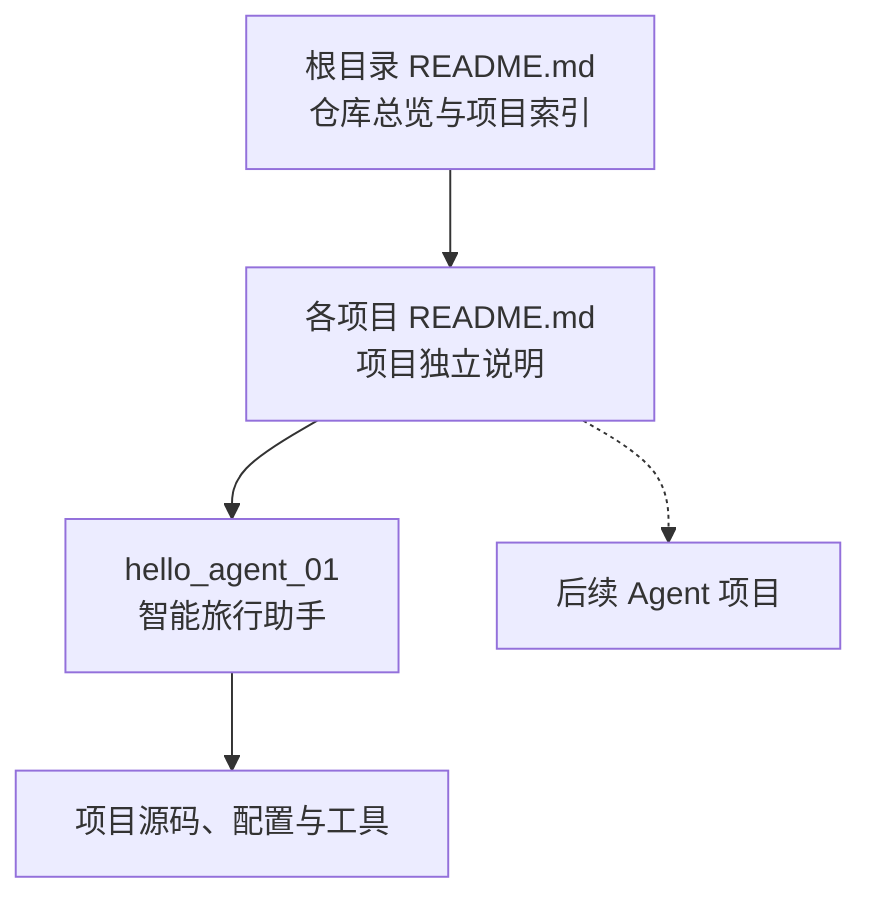

# Hello Agent：从零构建智能体实践集


这是一个面向智能体初学者的 Python 实践仓库，用于记录从基础 Agent Loop 到工具调用、记忆、规划和多智能体协作的学习过程。

仓库以 Datawhale [Hello-Agents](https://github.com/datawhalechina/hello-agents) 教程为主要学习参考，将章节中的核心示例整理为结构清晰、可以独立运行的项目。每个项目均配有单独的 Markdown 文档，介绍其学习目标、工作原理、代码结构、配置方法、运行示例和常见问题。

> [!NOTE]
> 本仓库是个人学习与工程实践项目，不是 Hello-Agents 官方代码仓库。当前已完成项目 01 的基础版和增强版，后续内容将随着学习进度持续补充。

## 文档导航

- [仓库定位](#仓库定位)
- [项目列表](#项目列表)
- [项目 01 简介](#项目-01-简介)
- [整体学习路径](#整体学习路径)
- [仓库结构](#仓库结构)
- [快速开始](#快速开始)
- [文档组织规范](#文档组织规范)
- [开发与贡献](#开发与贡献)
- [密钥安全](#密钥安全)
- [参考与许可](#参考与许可)

## 仓库定位

本仓库关注“从原理到代码”的智能体学习过程，主要目标包括：

- 理解智能体的感知、思考、行动和观察循环。
- 掌握大语言模型与外部工具之间的协作方式。
- 将教程中的单文件示例重构为职责清晰的 Python 模块。
- 记录不同模型服务、工具接口和运行环境中的实践问题。
- 逐步积累可以复用的 Agent 组件与项目模板。

文档分为两个层级：



## 项目列表

| 编号 | 项目 | 核心内容 | 状态 | 独立文档 |
| --- | --- | --- | --- | --- |
| 01 | 智能旅行助手 | Agent Loop、Thought–Action–Observation、工具调用、OpenAI 兼容接口 | ✅ 已完成 | [查看项目 01 文档](hello_agent_01/README.md) |
| 01 Pro | 增强版智能旅行助手 | 偏好记忆、票务售罄回退、连续拒绝反思、流程门控 | ✅ 已完成 | [查看项目 01 Pro 文档](hello_agent_01_pro/README.md) |

后续项目将在完成实现和验证后加入此表，避免提前列出尚未完成的功能。

## 项目 01 简介

### 智能旅行助手

第一个项目实现了一个能够自主完成分步任务的旅行助手。用户提出旅行问题后，Agent 会判断当前缺少哪些信息，依次调用天气工具和景点搜索工具，最后综合所有观察结果生成自然语言建议。

项目默认任务如下：

```text
查询西安今天的天气，并根据天气推荐一个合适的旅游景点。
```

Agent 的主要执行流程：

```text
用户请求
  ↓
Thought：分析当前信息并规划下一步
  ↓
Action：调用 get_weather
  ↓
Observation：获得实时天气
  ↓
Thought：根据天气选择后续工具
  ↓
Action：调用 get_attraction
  ↓
Observation：获得景点搜索结果
  ↓
Finish：生成最终旅行建议
```

项目 01 涉及的主要技术：

- Python 3.10+
- OpenAI 兼容 Chat Completions API
- Tavily Search API
- wttr.in 天气服务
- Prompt Engineering
- Thought–Action–Observation 交互协议
- Python AST 动作解析
- 工具注册与白名单调用

完整的安装、配置、架构和运行说明请阅读：

> [项目 01：基于 Thought–Action–Observation 的智能旅行助手](hello_agent_01/README.md)

### 项目 01 Pro：增强版旅行助手

增强版在同一教学任务上继续实现三个能力：

- 使用 JSON 长期记忆保存用户兴趣和预算。
- 查询票务状态，售罄时自动排除并搜索备选景点。
- 连续拒绝三个推荐后，强制反思并改变推荐策略。

> [项目 01 Pro：记忆、票务回退与反思](hello_agent_01_pro/README.md)

## 整体学习路径

当前学习路径从最小可运行 Agent 开始，后续逐步扩展复杂能力：

1. **基础 Agent Loop**：理解感知、思考、行动和观察闭环。
2. **工具调用**：让模型查询外部实时信息并处理工具结果。
3. **提示词与动作协议**：约束模型输出为可解析的结构。
4. **上下文与记忆**：维护多轮任务状态和历史信息。
5. **规划与反思**：处理更复杂的多步骤任务并修正执行策略。
6. **多智能体协作**：让不同角色的 Agent 分工完成任务。
7. **评估与工程化**：增加测试、日志、监控和质量评估。

其中只有已实现并验证的内容才会登记为正式项目。

## 仓库结构

```text
hello-agent/
├── README.md                              # 整个实践仓库的总览
├── .gitignore                             # 仓库级 Git 忽略规则
├── hello_agent_01/
    ├── README.md                          # 项目 01 独立文档
    ├── requirements.txt                   # 项目 01 Python 依赖
    ├── .gitignore                         # 项目 01 忽略规则
    └── travel_agent/
        ├── 01.py                          # 项目 01 命令行入口
        ├── __init__.py                    # 包导出
        ├── agent.py                       # Agent 循环与动作解析
        ├── config.py                      # 本地配置，不上传 Git
        ├── config.example.py              # 可公开上传的配置模板
        ├── llm_client.py                  # OpenAI 兼容客户端
        ├── prompts.py                     # 系统提示词
        └── tools/
            ├── __init__.py                # 工具注册
            ├── weather.py                 # 天气查询
            └── attractions.py             # 景点搜索
└── hello_agent_01_pro/                    # 项目 01 增强版
    ├── README.md                          # 增强版独立文档
    ├── main.py                            # 交互式入口
    ├── data/                              # 模拟票务与运行时记忆
    ├── tests/                             # 核心行为测试
    └── travel_agent_pro/                  # 增强版源码包
```

## 快速开始

进入第一个项目：

```powershell
cd G:\AI\hello-agent\hello_agent_01
```

创建虚拟环境并安装依赖：

```powershell
py -3.10 -m venv .venv
.\.venv\Scripts\python.exe -m pip install --upgrade pip
.\.venv\Scripts\python.exe -m pip install -r requirements.txt
```

首次运行时，复制公开配置模板：

```powershell
Copy-Item .\travel_agent\config.example.py .\travel_agent\config.py
```

然后在本地 `travel_agent/config.py` 中填写模型服务与 Tavily 配置：

```python
API_KEY = "你的模型服务 API Key"
BASE_URL = "模型服务的 OpenAI 兼容地址"
MODEL_ID = "模型 ID"
TAVILY_API_KEY = "你的 Tavily API Key"
MAX_STEPS = 5
```

运行默认任务：

```powershell
.\.venv\Scripts\python.exe -m travel_agent.01
```

运行自定义任务：

```powershell
.\.venv\Scripts\python.exe -m travel_agent.01 "查询上海天气并推荐一个适合当前天气的景点"
```

更完整的配置说明和错误排查请查看[项目 01 独立文档](hello_agent_01/README.md)。

## 文档组织规范

为了让后续项目保持一致，文档采用以下规则：

- 根目录 `README.md` 只负责介绍整个仓库、维护学习路径和项目索引。
- 每个项目使用独立目录，例如 `hello_agent_01/`、`hello_agent_02/`。
- 每个项目目录包含自己的 `README.md`、依赖、配置模板和源码。
- 每份项目文档至少包含项目背景、目标、架构、目录、安装、配置、运行、示例、FAQ 和参考来源。
- 总览文档与项目文档之间保留双向链接，方便在 GitHub 中浏览。
- 只有已经实现并验证的项目才加入根目录项目列表。

建议后续项目文档沿用以下模板：

```text
# 项目编号：项目名称

## 项目简介
## 学习目标
## 工作原理
## 项目结构
## 安装与配置
## 运行方法
## 运行示例
## 核心模块
## 常见问题
## 参考资料
```

## 开发与贡献

欢迎通过 Issue 或 Pull Request 提交改进，包括但不限于：

- 修复代码和文档问题。
- 增加单元测试和日志功能。
- 优化 Agent 动作解析和异常处理。
- 增加新的工具或模型服务适配。
- 提交新的独立 Agent 项目。
- 补充运行示例和问题排查记录。

新增项目时，请同步完成以下事项：

1. 添加可以独立运行的源码。
2. 编写项目独立 `README.md`。
3. 在根目录 README 的项目列表中增加索引。
4. 确认代码中不包含真实 API Key。
5. 完成基本语法检查和核心流程验证。

## 密钥安全

> [!CAUTION]
> 不要将真实 API Key 上传到公开 GitHub 仓库。

各项目可以在本地源码 `config.py` 中填写密钥，但该文件必须被 `.gitignore` 排除。GitHub 中只保留不含真实密钥的 `config.example.py`。

提交前请运行：

```powershell
git status
```

确认待提交列表中不包含：

- 任意项目的 `config.py`
- `.venv/`
- `__pycache__/`
- `.idea/`
- 包含真实密钥的日志或截图

如果密钥曾经进入 Git 历史或公开页面，应立即在对应服务商控制台撤销并重新生成。

## 参考与许可

主要学习参考：

- [Datawhale / Hello-Agents](https://github.com/datawhalechina/hello-agents)
- [第一章：初识智能体](https://github.com/datawhalechina/hello-agents/blob/main/docs/chapter1/%E7%AC%AC%E4%B8%80%E7%AB%A0%20%E5%88%9D%E8%AF%86%E6%99%BA%E8%83%BD%E4%BD%93.md)
- [OpenAI Python SDK](https://github.com/openai/openai-python)
- [Tavily Python SDK](https://docs.tavily.com/sdk/python/quick-start)

本仓库中源自或改编自 Hello-Agents 的内容，按照上游项目采用的 [知识共享署名—非商业性使用—相同方式共享 4.0 国际许可协议（CC BY-NC-SA 4.0）](https://creativecommons.org/licenses/by-nc-sa/4.0/deed.zh-hans) 使用与分享。

使用、修改或再发布相关内容时，请保留对 Datawhale Hello-Agents 项目及原作者的署名，并遵守上游 [LICENSE.txt](https://github.com/datawhalechina/hello-agents/blob/main/LICENSE.txt) 中的许可要求。
