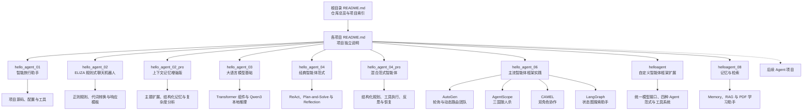

# Hello Agent：从零构建智能体实践集


这是一个面向智能体初学者的 Python 实践仓库，用于记录从基础 Agent Loop 到工具调用、记忆、规划和多智能体协作的学习过程。

仓库以 Datawhale [Hello-Agents](https://github.com/datawhalechina/hello-agents) 教程为主要学习参考，将章节中的核心示例整理为结构清晰、可以独立运行的项目。每个项目均配有单独的 Markdown 文档，介绍其学习目标、工作原理、代码结构、配置方法、运行示例和常见问题。

> [!NOTE]
> 本仓库是个人学习与工程实践项目，不是 Hello-Agents 官方代码仓库。当前已整理项目 01、项目 02 及其增强版本、项目 03 的 Transformer 与本地模型实践、项目 04 的经典智能体范式及增强实现、项目 06 的 AutoGen、AgentScope、CAMEL 与 LangGraph 框架实践、项目 07 的 HelloAgents 自定义框架扩展，以及项目 08 的记忆、RAG 与 PDF 学习助手。后续内容将随着学习进度持续补充。

## 文档导航

- [仓库定位](#仓库定位)
- [项目列表](#项目列表)
- [项目 01 简介](#项目-01-简介)
- [项目 02 简介](#项目-02-简介)
- [项目 03 简介](#项目-03-简介)
- [项目 04 简介](#项目-04-简介)
- [项目 06 简介](#项目-06-简介)
- [项目 07 简介](#项目-07-简介)
- [项目 08 简介](#项目-08-简介)
- [整体学习路径](#整体学习路径)
- [仓库结构](#仓库结构)
- [快速开始](#快速开始)
- [文档组织规范](#文档组织规范)
- [开发与贡献](#开发与贡献)
- [密钥安全](#密钥安全)
- [参考与许可](#参考与许可)

## 仓库定位

本仓库关注“从原理到代码”的智能体学习过程，主要目标包括：

- 理解智能体的感知、思考、行动和观察循环。
- 掌握大语言模型与外部工具之间的协作方式。
- 将教程中的单文件示例重构为职责清晰的 Python 模块。
- 记录不同模型服务、工具接口和运行环境中的实践问题。
- 逐步积累可以复用的 Agent 组件与项目模板。

文档分为两个层级：



## 项目列表

| 编号 | 项目 | 核心内容 | 状态 | 独立文档 |
| --- | --- | --- | --- | --- |
| 01 | 智能旅行助手 | Agent Loop、Thought–Action–Observation、工具调用、OpenAI 兼容接口 | ✅ 已完成 | [查看项目 01 文档](hello_agent_01/README.md) |
| 01 Pro | 增强版智能旅行助手 | 偏好记忆、票务售罄回退、连续拒绝反思、流程门控 | ✅ 已完成 | [查看项目 01 Pro 文档](hello_agent_01_pro/README.md) |
| 02 | ELIZA 规则式聊天机器人 | 符号主义、正则模式匹配、代词转换、随机响应模板 | ✅ 已完成 | [查看项目 02 文档](hello_agent_02/README.md) |
| 02 Pro | 增强版 ELIZA | 工作/学习/爱好等主题规则、会话记忆、组合爆炸分析 | ✅ 已完成 | [查看项目 02 Pro 文档](hello_agent_02_pro/README.md) |
| 03 | Transformer 与 Qwen3 本地推理 | 位置编码、多头注意力、前馈网络、Qwen3-0.6B 推理 | 🟡 教学实现 | [查看项目 03 文档](hello_agent_03/README.md) |
| 04 | 经典智能体范式 | ReAct、Plan-and-Solve、Reflection、工具调用与短期轨迹 | ✅ 已完成 | [查看项目 04 文档](hello_agent_04/README.md) |
| 04 Pro | 混合范式智能体 | 结构化规划、逐步 ReAct、步骤反思、重试、重规划与安全降级 | ✅ 离线流程已验证 | [查看项目 04 Pro 文档](hello_agent_04_pro/README.md) |
| 06 | 框架开发实践 | AutoGen、AgentScope、CAMEL、LangGraph、多智能体协作与状态图编排 | 🟡 代码与离线检查已完成 | [查看项目 06 文档索引](#项目-06-简介) |
| 07 | 自定义智能体框架扩展 | HelloAgentsLLM、SimpleAgent、ReAct、Reflection、Plan-and-Solve 与工具注册 | 🟡 教学实现与离线检查已完成 | [查看项目 07 文档](helloagent/README.md) |
| 08 | 记忆与检索 | MemoryTool、RAGTool、Qdrant、Neo4j、MQE、HyDE 与 PDF 学习助手 | 🟡 语法与界面构建已验证 | [查看项目 08 文档](helloagent_08/README.md) |

后续项目将在具备可审阅代码和独立文档后加入此表；状态栏会区分完整实现与仍含待补全部分的教学实现。

## 项目 01 简介

### 智能旅行助手

第一个项目实现了一个能够自主完成分步任务的旅行助手。用户提出旅行问题后，Agent 会判断当前缺少哪些信息，依次调用天气工具和景点搜索工具，最后综合所有观察结果生成自然语言建议。

项目默认任务如下：

```text
查询西安今天的天气，并根据天气推荐一个合适的旅游景点。
```

Agent 的主要执行流程：

```text
用户请求
  ↓
Thought：分析当前信息并规划下一步
  ↓
Action：调用 get_weather
  ↓
Observation：获得实时天气
  ↓
Thought：根据天气选择后续工具
  ↓
Action：调用 get_attraction
  ↓
Observation：获得景点搜索结果
  ↓
Finish：生成最终旅行建议
```

项目 01 涉及的主要技术：

- Python 3.10+
- OpenAI 兼容 Chat Completions API
- Tavily Search API
- wttr.in 天气服务
- Prompt Engineering
- Thought–Action–Observation 交互协议
- Python AST 动作解析
- 工具注册与白名单调用

完整的安装、配置、架构和运行说明请阅读：

> [项目 01：基于 Thought–Action–Observation 的智能旅行助手](hello_agent_01/README.md)

### 项目 01 Pro：增强版旅行助手

增强版在同一教学任务上继续实现三个能力：

- 使用 JSON 长期记忆保存用户兴趣和预算。
- 查询票务状态，售罄时自动排除并搜索备选景点。
- 连续拒绝三个推荐后，强制反思并改变推荐策略。

> [项目 01 Pro：记忆、票务回退与反思](hello_agent_01_pro/README.md)

## 项目 02 简介

### ELIZA 规则式聊天机器人

第二个项目复现了早期规则式聊天机器人 ELIZA 的核心机制。系统不调用大语言模型，而是按照预先定义的正则表达式匹配用户输入，提取文本片段，完成简单的第一、第二人称转换，再从候选模板中随机生成响应。

项目 02 主要展示：

- 符号主义人工智能的规则驱动思想。
- 正则表达式的模式匹配与捕获机制。
- 分解规则、代词转换和重组模板之间的协作。
- 规则顺序所形成的隐式优先级。
- 通配规则对未知输入的兜底处理。
- 无状态系统在语义理解、上下文记忆和规则扩展方面的局限。

该项目仅使用 Python 标准库，不需要安装第三方依赖，也不需要配置 API Key。

> [项目 02：基于规则与模式匹配的 ELIZA 聊天机器人](hello_agent_02/README.md)

### 项目 02 Pro：主题扩展与上下文记忆

增强版在基础 ELIZA 上新增工作、学习、爱好、压力和未来目标五类场景规则，并使用结构化会话记忆保存用户明确提到的姓名、年龄和职业。用户可以在后续对话中询问这些信息，主题响应也能够引用姓名或职业上下文。

项目同时通过对话状态的笛卡尔积、自然语言序列空间和规则两两冲突数量，说明纯规则方法在开放域对话中为何面临组合爆炸和维护困难，并从能力来源、语义处理、上下文、输出空间和维护方式等维度与 ChatGPT 进行对比。

> [项目 02 Pro：具备主题扩展与上下文记忆的 ELIZA](hello_agent_02_pro/README.md)

## 项目 03 简介

### Transformer 核心组件与 Qwen3-0.6B 本地推理

第三个项目从底层结构与实际推理两个角度理解大语言模型：

- 使用 PyTorch 实现正弦位置编码。
- 实现缩放点积多头注意力及其张量变换。
- 实现带 ReLU 和 Dropout 的位置前馈网络。
- 展示编码器层和解码器层中的残差连接、层归一化与交叉注意力结构。
- 通过 ModelScope 加载 `Qwen/Qwen3-0.6B`。
- 使用聊天模板、分词器和 `generate()` 完成本地文本生成。
- 区分 Qwen3 的思考内容与最终回答。

当前 `transformer.py` 的三个独立核心组件已经实现，但 `EncoderLayer` 和 `DecoderLayer` 的内部构造参数仍待补齐；Qwen3 脚本需要先安装 PyTorch、ModelScope、Transformers 和 Accelerate，并在首次运行时下载模型权重。

> [项目 03：Transformer 核心组件与 Qwen3-0.6B 本地推理](hello_agent_03/README.md)

## 项目 04 简介

### ReAct、Plan-and-Solve 与 Reflection

第四个项目对应 Hello-Agents 第四章“智能体经典范式构建”，分别实现三种经典工作流：

- **ReAct**：在 Thought、Action 和 Observation 之间循环，并通过 SerpApi 获取外部实时信息。
- **Plan-and-Solve**：先把复杂问题拆成结构化步骤，再结合历史结果逐步执行。
- **Reflection**：保存初始代码和评审反馈，通过“执行—反思—优化”循环改进算法。

三个示例共享 OpenAI 兼容模型客户端，能够直观比较反应式执行、全局规划和事后修正
三种策略的职责边界。项目文档还记录了模型 404、解释器依赖不一致、SerpApi 导入、
输出截断和 Action 解析失败等常见问题。

> [项目 04：ReAct、Plan-and-Solve 与 Reflection 经典智能体范式](hello_agent_04/README.md)

### 项目 04 Pro：混合范式智能体

增强版将三种范式组合为共享状态的闭环架构：

```text
Plan-and-Solve 生成并验证计划
        ↓
ReAct 逐步骤调用工具
        ↓
Reflection 决定通过、重试、重规划或阻断
        ↓
答案综合与最终审查
```

示例任务是制定西安历史文化主题两日行程。系统需要查询动态门票和预约信息、控制预算、
组织地点顺序，并为售罄、闭馆和查询不到等情况准备备选方案。

Pro 版本增加 JSON 格式修复、计划验证、工具与 LLM 调用预算、跨重试 Observation
复用、同一地点两次无结果后自动跳过，以及任务阻断时保留已完成结果等工程机制。

> [项目 04 Pro：ReAct、Plan-and-Solve 与 Reflection 混合范式智能体](hello_agent_04_pro/README.md)

## 项目 06 简介

### 主流智能体框架开发实践

第六个项目围绕不同智能体框架的设计理念和编排方式展开，包括五个可独立阅读的示例：

| 示例 | 协作/控制方式 | 应用场景 | 文档 |
| --- | --- | --- | --- |
| AutoGen | `RoundRobinGroupChat` 固定轮询 | 产品经理、工程师、审查员和用户代理协作开发 | [AutoGen 基础版](hello_agent_06/AUTOGEN.md) |
| AutoGen Pro | `SelectorGroupChat` 与确定性动态路由 | 需求回退、代码修复、自动 QA 和对话监控 | [AutoGen 增强版](hello_agent_06/AUTOGEN_PRO.md) |
| AgentScope | 消息中心、顺序/并行流水线和结构化动作 | 六人三国狼人杀多智能体模拟 | [AgentScope](hello_agent_06/AGENTSCOPE.md) |
| CAMEL | 双智能体角色扮演 | 心理学家与作家协作创作电子书 | [CAMEL](hello_agent_06/CAMEL.md) |
| LangGraph | 显式状态、节点和有向边 | 理解—搜索—回答三阶段智能搜索 | [LangGraph](hello_agent_06/LANGGRAPH.md) |

这些实现体现了三类不同的编排思想：

```text
对话驱动：AutoGen、CAMEL
消息与多智能体工程：AgentScope
显式状态图控制：LangGraph
```

AutoGen Pro 在章节基础案例之上进一步实现动态回退机制：审查员发现需求变更时返回产品
经理，发现代码缺陷时返回工程师，审查通过后进入独立 QA；质量监控员则负责检测偏题、
重复循环和非法路由。

项目 06 需要配置 OpenAI 兼容模型服务，其中 LangGraph 还需要 Tavily 密钥。所有 `.env`
均为本地配置，不应上传 GitHub。

## 项目 07 简介

### 基于 HelloAgents 的自定义智能体框架扩展

第七个项目对应 Hello-Agents 第七章“构建你的智能体框架”。当前实现基于
`hello-agents==0.1.1` 提供的核心接口，通过继承和方法重写完成以下扩展：

- 为 ModelScope 增加独立的模型配置分支，并保留其他提供商的父类逻辑。
- 实现支持历史记录、流式输出和文本协议工具调用的 `MySimpleAgent`。
- 将 ReAct、Reflection 和 Plan-and-Solve 组织到统一的 Agent 接口下。
- 使用 `ToolRegistry` 注册 AST 计算器与 Tavily/SerpApi 多源搜索工具。
- 为计划解析增加安全字面量解析、非空校验和最大步骤数限制。

该目录是对已安装 HelloAgents 基础设施的扩展练习，不是完整框架源码的重复实现。
FunctionCallAgent、工具链和异步执行器等第七章后续能力尚未包含在当前项目中。语法编译和
计算器离线冒烟测试已经通过；涉及 LLM 与搜索服务的脚本仍需要本地密钥和网络环境。

> [项目 07：基于 HelloAgents 的自定义智能体框架扩展](helloagent/README.md)

## 项目 08 简介

### 记忆系统、RAG 与智能 PDF 学习助手

第八个项目对应 Hello-Agents 第八章“记忆与检索”，为智能体补充长期记忆和外部知识
检索能力。当前目录包含 Memory、RAG 和组合 Agent 的最小示例，并实现了一个基于
Gradio 的 PDF 学习助手：

- 使用 `MemoryTool` 添加、搜索和汇总工作记忆、情景记忆与语义记忆。
- 使用 `RAGTool` 写入文本或 PDF，完成向量搜索、文档问答和知识库统计。
- 使用 Qdrant 保存向量索引，使用 Neo4j 支持语义关系存储。
- 通过 MQE 多查询扩展与 HyDE 假设文档嵌入增强检索。
- 通过 `user_id` 和 RAG 命名空间隔离不同用户的数据。
- 在 Gradio 页面中提供 PDF 上传、智能问答、学习笔记、历史回顾和报告生成。

四个源码文件已通过语法检查，Gradio 界面已完成无服务启动的构建验证；真实 Memory、
RAG 和 PDF 问答仍依赖本地配置的模型、Embedding、Qdrant、Neo4j 与网络环境。

> [项目 08：记忆系统、RAG 与智能 PDF 学习助手](helloagent_08/README.md)

## 整体学习路径

当前学习路径从最小可运行 Agent 开始，后续逐步扩展复杂能力：

1. **基础 Agent Loop**：理解感知、思考、行动和观察闭环。
2. **工具调用**：让模型查询外部实时信息并处理工具结果。
3. **提示词与动作协议**：约束模型输出为可解析的结构。
4. **上下文与基础记忆**：维护多轮任务状态和历史信息。
5. **规划与反思**：处理更复杂的多步骤任务并修正执行策略。
6. **多智能体协作**：让不同角色的 Agent 分工完成任务。
7. **自建框架与接口扩展**：统一模型、Agent 和工具接口，并通过继承实现定制能力。
8. **长期记忆与 RAG**：持久化用户经历，并从外部知识库检索证据增强回答。
9. **评估与工程化**：增加测试、日志、监控和质量评估。

项目列表只登记已经提供可审阅代码与独立文档的实践，并通过状态栏如实标记完整性和验证范围。

## 仓库结构

```text
hello-agent/
├── README.md                              # 整个实践仓库的总览
├── .gitignore                             # 仓库级 Git 忽略规则
├── hello_agent_01/
    ├── README.md                          # 项目 01 独立文档
    ├── requirements.txt                   # 项目 01 Python 依赖
    ├── .gitignore                         # 项目 01 忽略规则
    └── travel_agent/
        ├── 01.py                          # 项目 01 命令行入口
        ├── __init__.py                    # 包导出
        ├── agent.py                       # Agent 循环与动作解析
        ├── config.py                      # 本地配置，不上传 Git
        ├── config.example.py              # 可公开上传的配置模板
        ├── llm_client.py                  # OpenAI 兼容客户端
        ├── prompts.py                     # 系统提示词
        └── tools/
            ├── __init__.py                # 工具注册
            ├── weather.py                 # 天气查询
            └── attractions.py             # 景点搜索
├── hello_agent_01_pro/                    # 项目 01 增强版
    ├── README.md                          # 增强版独立文档
    ├── main.py                            # 交互式入口
    ├── data/                              # 模拟票务与运行时记忆
    ├── tests/                             # 核心行为测试
    └── travel_agent_pro/                  # 增强版源码包
├── hello_agent_02/
    ├── README.md                          # 项目 02 独立文档
    ├── img.png                            # 基础版运行截图
    └── ELIZA.py                           # ELIZA 规则式聊天程序
├── hello_agent_02_pro/
    ├── README.md                          # 增强版原理与复杂度分析
    ├── ELIZA_pro.py                       # 主题规则与会话记忆
    └── tests/
        └── test_eliza_pro.py              # 核心行为测试
├── hello_agent_03/
    ├── README.md                          # LLM 原理、安装与运行说明
    ├── transformer.py                     # Transformer 核心组件
    └── qwen3-0.6B.py                      # Qwen3-0.6B 本地推理
├── hello_agent_04/
│   ├── README.md                          # 三种经典范式的独立文档
│   ├── HelloAgentsLLM.py                  # OpenAI 兼容模型客户端
│   ├── React.py                           # ReAct 与 SerpApi 搜索
│   ├── Plan-and-solve.py                  # 先规划、后执行
│   └── Reflection.py                      # 执行、反思与优化
├── hello_agent_04_pro/
    ├── README.md                          # 混合架构主文档
    ├── HYBRID_AGENT_USAGE.md              # 实现与迁移补充说明
    ├── HybridAgent.py                     # 混合智能体编排器
    └── hybrid_travel_demo.py              # 西安两日旅行示例
├── hello_agent_06/
    ├── AUTOGEN.md                         # AutoGen 固定轮询团队文档
    ├── AUTOGEN_PRO.md                     # 动态回退与 QA 增强版文档
    ├── AGENTSCOPE.md                      # AgentScope 三国狼人杀文档
    ├── CAMEL.md                           # CAMEL 双角色协作文档
    ├── LANGGRAPH.md                       # LangGraph 搜索工作流文档
    ├── AutoGen.py                         # AutoGen 基础软件团队
    ├── AutoGen_pro.py                     # 动态路由增强团队
    ├── Camel.py                           # 心理学家与作家角色扮演
    ├── LangGraph.py                       # 三节点智能搜索助手
    └── AgentScope/
        ├── main_cn.py                     # 三国狼人杀入口
        ├── game_roles.py                  # 游戏角色配置
        ├── prompt_cn.py                   # 中文角色提示词
        ├── structured_output_cn.py        # Pydantic 结构化动作
        └── utils_cn.py                    # 主持人和游戏工具
├── helloagent/
    ├── README.md                          # 项目 07 架构、配置与运行说明
    ├── helloagentLLM.py                   # 原生 HelloAgents 快速体验
    ├── main.py                            # 自定义 LLM 调用模板
    ├── my_llm.py                          # ModelScope 提供商扩展
    ├── my_simple_agent.py                 # 工具增强 SimpleAgent
    ├── my_react_agent.py                  # ReAct 范式
    ├── my_reflection_agent.py             # Reflection 范式
    ├── my_plan_solve_agent.py             # Plan-and-Solve 范式
    ├── my_calculator_tool.py              # AST 计算工具
    └── my_advanced_search.py              # Tavily/SerpApi 多源搜索
└── helloagent_08/
    ├── README.md                          # 项目 08 记忆、RAG 与应用说明
    ├── memory.py                          # Memory + RAG Agent 示例
    ├── memory_eg.py                       # MemoryTool 基础示例
    ├── RAG_eg.py                          # RAGTool 基础示例
    └── QA_Assistant.py                    # Gradio PDF 学习助手
```

## 快速开始

进入第一个项目：

```powershell
cd G:\AI\hello-agent\hello_agent_01
```

创建虚拟环境并安装依赖：

```powershell
py -3.10 -m venv .venv
.\.venv\Scripts\python.exe -m pip install --upgrade pip
.\.venv\Scripts\python.exe -m pip install -r requirements.txt
```

首次运行时，复制公开配置模板：

```powershell
Copy-Item .\travel_agent\config.example.py .\travel_agent\config.py
```

然后在本地 `travel_agent/config.py` 中填写模型服务与 Tavily 配置：

```python
API_KEY = "你的模型服务 API Key"
BASE_URL = "模型服务的 OpenAI 兼容地址"
MODEL_ID = "模型 ID"
TAVILY_API_KEY = "你的 Tavily API Key"
MAX_STEPS = 5
```

运行默认任务：

```powershell
.\.venv\Scripts\python.exe -m travel_agent.01
```

运行自定义任务：

```powershell
.\.venv\Scripts\python.exe -m travel_agent.01 "查询上海天气并推荐一个适合当前天气的景点"
```

更完整的配置说明和错误排查请查看[项目 01 独立文档](hello_agent_01/README.md)。

运行项目 02：

```powershell
cd G:\AI\hello-agent\hello_agent_02
python .\ELIZA.py
```

项目 02 不需要第三方依赖或 API Key，详细说明请查看[项目 02 独立文档](hello_agent_02/README.md)。

运行项目 02 Pro：

```powershell
cd G:\AI\hello-agent\hello_agent_02_pro
python .\ELIZA_pro.py
```

查看记忆输入 `/memory`，清空记忆输入 `/clear-memory`，退出输入 `quit`。完整设计、测试和数学分析请查看[项目 02 Pro 独立文档](hello_agent_02_pro/README.md)。

项目 03 包含需要安装深度学习依赖的本地模型实践：

```powershell
cd G:\AI\hello-agent\hello_agent_03
py -3.10 -m venv .venv
.\.venv\Scripts\python.exe -m pip install --upgrade pip
.\.venv\Scripts\python.exe -m pip install "torch>=2.6" modelscope "transformers>=4.51.0" accelerate safetensors
```

建议首次运行前将 `qwen3-0.6B.py` 中的 `max_new_tokens` 从 `32768` 调低到 `512`。完整的组件状态、硬件说明和错误排查请查看[项目 03 独立文档](hello_agent_03/README.md)。

运行项目 04 前，安装模型和搜索依赖，并在本地 `hello_agent_04/.env` 中配置模型服务与
SerpApi：

```powershell
cd G:\AI\hello-agent\hello_agent_04
G:\conda_envs\agent\python.exe -m pip install --upgrade openai python-dotenv serpapi
G:\conda_envs\agent\python.exe .\React.py
G:\conda_envs\agent\python.exe .\Plan-and-solve.py
G:\conda_envs\agent\python.exe .\Reflection.py
```

完整配置、运行方法和三种范式对比请查看[项目 04 独立文档](hello_agent_04/README.md)。

项目 04 Pro 当前复用基础项目中的模型客户端和搜索函数。从仓库根目录运行：

```powershell
cd G:\AI\hello-agent
$env:PYTHONPATH = "$PWD\hello_agent_04;$PWD\hello_agent_04_pro"
G:\conda_envs\agent\python.exe .\hello_agent_04_pro\hybrid_travel_demo.py
```

完整架构、降级规则、运行统计与问题排查请查看
[项目 04 Pro 独立文档](hello_agent_04_pro/README.md)。

运行项目 06 前，建议使用项目当前验证过的依赖版本：

```powershell
cd G:\AI\hello-agent\hello_agent_06
G:\conda_envs\agent\python.exe -m pip install `
  "autogen-agentchat==0.7.5" `
  "autogen-ext[openai]==0.7.5" `
  "agentscope==1.0.21" `
  "camel-ai==0.2.75" `
  "langgraph==1.0.0a3" `
  "langchain-openai==0.3.33" `
  "tavily-python==0.7.26" `
  "python-dotenv>=1.0.0" `
  "colorama>=0.4.6"
```

在 `hello_agent_06/.env` 配置 AutoGen、CAMEL 和 LangGraph 所需变量；AgentScope 使用
`hello_agent_06/AgentScope/.env`：

```dotenv
LLM_MODEL_ID=模型ID
LLM_API_KEY=你的模型API密钥
LLM_BASE_URL=OpenAI兼容接口地址
TAVILY_API_KEY=你的Tavily密钥
```

分别运行：

```powershell
G:\conda_envs\agent\python.exe .\AutoGen.py
G:\conda_envs\agent\python.exe .\AutoGen_pro.py
G:\conda_envs\agent\python.exe .\Camel.py
G:\conda_envs\agent\python.exe .\LangGraph.py
G:\conda_envs\agent\python.exe .\AgentScope\main_cn.py
```

详细角色、工作流、版本兼容性和错误排查请查看[项目 06 简介](#项目-06-简介)中的五份
独立文档。

运行项目 07 前，安装与第七章代码对应的框架版本：

```powershell
cd G:\AI\hello-agent\helloagent
G:\conda_envs\agent\python.exe -m pip install `
  "hello-agents==0.1.1" `
  "openai>=1.0.0" `
  "python-dotenv>=1.0.0"
```

在本地 `helloagent/.env` 中配置模型服务后，可以运行四种 Agent 示例：

```powershell
G:\conda_envs\agent\python.exe .\test_simple_agent.py
G:\conda_envs\agent\python.exe .\test_react_agent.py
G:\conda_envs\agent\python.exe .\test_reflection_agent.py
G:\conda_envs\agent\python.exe .\test_plan_solve_agent.py
```

完整的架构、配置、工具说明、验证范围和上传检查请查看
[项目 07 独立文档](helloagent/README.md)。

运行项目 08 前，安装本章对应的记忆、检索和界面依赖：

```powershell
cd G:\AI\hello-agent\helloagent_08
G:\conda_envs\agent\python.exe -m pip install `
  "hello-agents[all]==0.2.8" `
  "gradio==4.44.1" `
  "python-dotenv>=1.0.0"
```

在本地 `helloagent_08/.env` 配置 LLM、Embedding、Qdrant 和 Neo4j。基础示例与综合
应用的运行命令如下：

```powershell
G:\conda_envs\agent\python.exe .\memory_eg.py
G:\conda_envs\agent\python.exe .\RAG_eg.py
G:\conda_envs\agent\python.exe .\memory.py
G:\conda_envs\agent\python.exe .\QA_Assistant.py
```

Web 应用默认访问 `http://127.0.0.1:7860`。完整的架构、数据库配置、使用流程、验证
范围和上传清单请查看[项目 08 独立文档](helloagent_08/README.md)。

## 文档组织规范

为了让后续项目保持一致，文档采用以下规则：

- 根目录 `README.md` 只负责介绍整个仓库、维护学习路径和项目索引。
- 每个项目使用独立目录，例如 `hello_agent_01/`、`hello_agent_02/`。
- 每个项目目录包含自己的 `README.md`、依赖、配置模板和源码。
- 每份项目文档至少包含项目背景、目标、架构、目录、安装、配置、运行、示例、FAQ 和参考来源。
- 总览文档与项目文档之间保留双向链接，方便在 GitHub 中浏览。
- 只有具备可审阅代码和独立文档的项目才加入根目录项目列表，并如实标记实现与验证状态。

建议后续项目文档沿用以下模板：

```text
# 项目编号：项目名称

## 项目简介
## 学习目标
## 工作原理
## 项目结构
## 安装与配置
## 运行方法
## 运行示例
## 核心模块
## 常见问题
## 参考资料
```

## 开发与贡献

欢迎通过 Issue 或 Pull Request 提交改进，包括但不限于：

- 修复代码和文档问题。
- 增加单元测试和日志功能。
- 优化 Agent 动作解析和异常处理。
- 增加新的工具或模型服务适配。
- 提交新的独立 Agent 项目。
- 补充运行示例和问题排查记录。

新增项目时，请同步完成以下事项：

1. 添加可以独立运行的源码。
2. 编写项目独立 `README.md`。
3. 在根目录 README 的项目列表中增加索引。
4. 确认代码中不包含真实 API Key。
5. 完成基本语法检查和核心流程验证。

## 密钥安全

> [!CAUTION]
> 不要将真实 API Key 上传到公开 GitHub 仓库。

项目 01 使用本地 `config.py` 保存密钥，项目 04、项目 06、项目 07 和项目 08 使用本地 `.env`
保存密钥；这些文件都必须被 `.gitignore` 排除。GitHub 中只保留不含真实密钥的配置
模板或 README 配置说明。

提交前请运行：

```powershell
git status
```

确认待提交列表中不包含：

- 任意项目的 `config.py`
- 任意项目的 `.env`
- `.venv/`
- `__pycache__/`
- `.idea/`
- 包含真实密钥的日志或截图
- `memory_data/`、`*.db` 和学习报告等运行数据

如果密钥曾经进入 Git 历史或公开页面，应立即在对应服务商控制台撤销并重新生成。

## 参考与许可

主要学习参考：

- [Datawhale / Hello-Agents](https://github.com/datawhalechina/hello-agents)
- [第一章：初识智能体](https://github.com/datawhalechina/hello-agents/blob/main/docs/chapter1/%E7%AC%AC%E4%B8%80%E7%AB%A0%20%E5%88%9D%E8%AF%86%E6%99%BA%E8%83%BD%E4%BD%93.md)
- [第二章：智能体发展史](https://github.com/datawhalechina/hello-agents/blob/main/docs/chapter2/%E7%AC%AC%E4%BA%8C%E7%AB%A0%20%E6%99%BA%E8%83%BD%E4%BD%93%E5%8F%91%E5%B1%95%E5%8F%B2.md)
- [第三章：大语言模型基础](https://github.com/datawhalechina/hello-agents/blob/main/docs/chapter3/%E7%AC%AC%E4%B8%89%E7%AB%A0%20%E5%A4%A7%E8%AF%AD%E8%A8%80%E6%A8%A1%E5%9E%8B%E5%9F%BA%E7%A1%80.md)
- [第四章：智能体经典范式构建](https://github.com/datawhalechina/hello-agents/blob/main/docs/chapter4/%E7%AC%AC%E5%9B%9B%E7%AB%A0%20%E6%99%BA%E8%83%BD%E4%BD%93%E7%BB%8F%E5%85%B8%E8%8C%83%E5%BC%8F%E6%9E%84%E5%BB%BA.md)
- [第六章：框架开发实践](https://github.com/datawhalechina/hello-agents/blob/main/docs/chapter6/%E7%AC%AC%E5%85%AD%E7%AB%A0%20%E6%A1%86%E6%9E%B6%E5%BC%80%E5%8F%91%E5%AE%9E%E8%B7%B5.md)
- [第七章：构建你的智能体框架](https://github.com/datawhalechina/hello-agents/blob/main/docs/chapter7/%E7%AC%AC%E4%B8%83%E7%AB%A0%20%E6%9E%84%E5%BB%BA%E4%BD%A0%E7%9A%84Agent%E6%A1%86%E6%9E%B6.md)
- [第八章：记忆与检索](https://github.com/datawhalechina/hello-agents/blob/main/docs/chapter8/%E7%AC%AC%E5%85%AB%E7%AB%A0%20%E8%AE%B0%E5%BF%86%E4%B8%8E%E6%A3%80%E7%B4%A2.md)
- [OpenAI Python SDK](https://github.com/openai/openai-python)
- [Tavily Python SDK](https://docs.tavily.com/sdk/python/quick-start)

本仓库中源自或改编自 Hello-Agents 的内容，按照上游项目采用的 [知识共享署名—非商业性使用—相同方式共享 4.0 国际许可协议（CC BY-NC-SA 4.0）](https://creativecommons.org/licenses/by-nc-sa/4.0/deed.zh-hans) 使用与分享。

使用、修改或再发布相关内容时，请保留对 Datawhale Hello-Agents 项目及原作者的署名，并遵守上游 [LICENSE.txt](https://github.com/datawhalechina/hello-agents/blob/main/LICENSE.txt) 中的许可要求。
