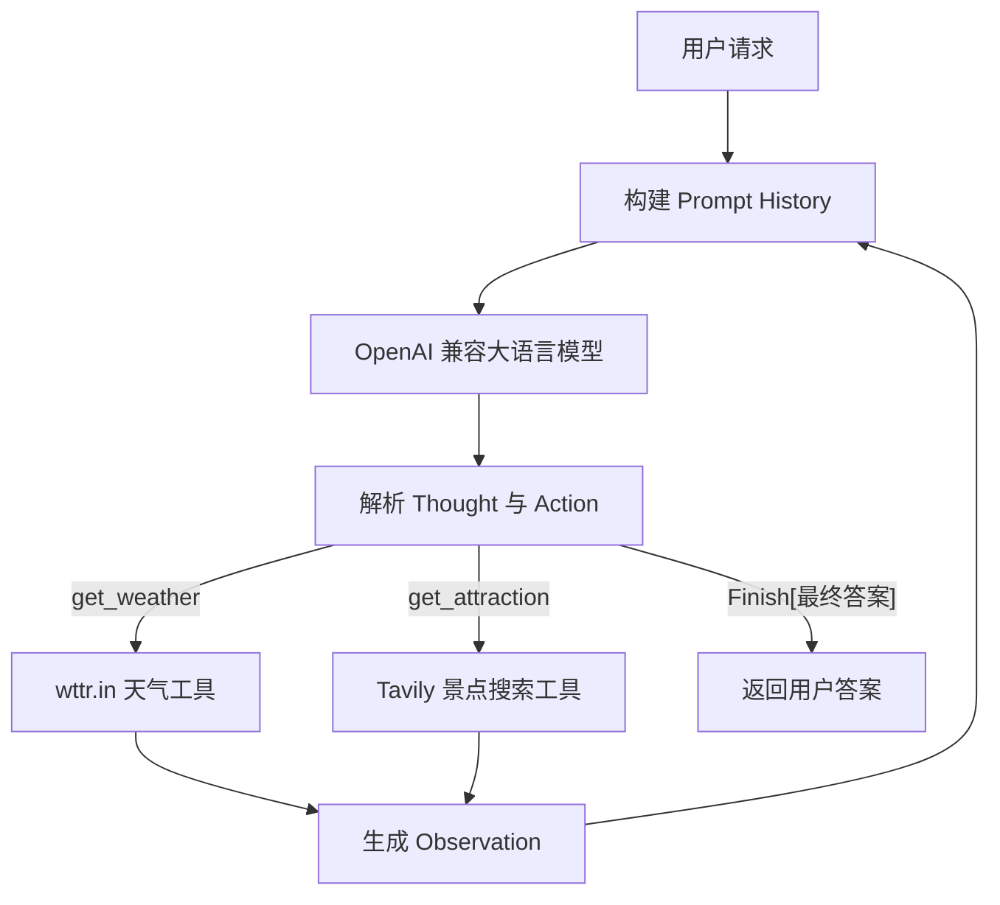

# 项目 01：基于 Thought–Action–Observation 的智能旅行助手


[← 返回 Hello Agent 项目总览](../README.md)

一个轻量、可阅读、可扩展的 Python 智能体示例。项目使用 OpenAI 兼容接口连接大语言模型，通过 `Thought → Action → Observation` 循环自主查询实时天气，并结合 Tavily 搜索结果推荐合适的旅游景点。

本项目基于 Datawhale [Hello-Agents](https://github.com/datawhalechina/hello-agents) 第一章的旅行助手示例进行模块化重构，适合用于理解 Agent Loop、工具调用、提示词设计和动作解析等基础概念。

> [!NOTE]
> 这是一个用于学习智能体运行机制的教学项目，不是面向生产环境的完整旅行规划系统。

## 目录

- [项目特性](#项目特性)
- [工作原理](#工作原理)
- [项目结构](#项目结构)
- [快速开始](#快速开始)
- [配置说明](#配置说明)
- [运行项目](#运行项目)
- [运行示例](#运行示例)
- [模块说明](#模块说明)
- [常见问题](#常见问题)
- [密钥安全](#密钥安全)
- [参考与致谢](#参考与致谢)
- [开源许可](#开源许可)

## 项目特性

- 使用 OpenAI 兼容的 Chat Completions 接口，可连接 OpenAI、云端模型服务或本地兼容服务。
- 使用 [wttr.in](https://wttr.in/) 获取实时天气，无需单独申请天气 API Key。
- 使用 [Tavily](https://www.tavily.com/) 搜索与天气条件相关的旅游景点。
- 完整展示 `Thought–Action–Observation` 智能体循环。
- 通过工具白名单限制模型只能调用已注册函数。
- 使用 Python AST 解析动作，不直接执行模型生成的代码。
- 对配置缺失、格式错误、工具参数错误、网络异常和循环超限提供明确提示。
- 支持从命令行传入任意旅行问题。

## 工作原理



一次完整任务通常包含三个阶段：

1. 模型判断需要先获取目的地天气，并调用 `get_weather`。
2. 天气结果以 `Observation` 形式反馈给模型，模型再调用 `get_attraction`。
3. 模型综合用户请求和两次工具结果，通过 `Finish[...]` 输出最终建议。

## 项目结构

```text
hello_agent_01/
├── README.md                          # 项目 01 独立文档
├── requirements.txt                   # Python 依赖
├── .gitignore                         # Git 忽略规则
└── travel_agent/
    ├── 01.py                          # 命令行入口
    ├── __init__.py                    # 包导出
    ├── agent.py                       # Agent 循环与动作解析
    ├── config.py                      # 本地配置，不上传 Git
    ├── config.example.py              # 可公开上传的配置模板
    ├── llm_client.py                  # OpenAI 兼容客户端
    ├── prompts.py                     # 系统提示词
    └── tools/
        ├── __init__.py                # 工具注册入口
        ├── weather.py                 # 天气查询工具
        └── attractions.py             # 景点搜索工具
```

## 快速开始

### 1. 环境要求

- Python 3.10 或更高版本
- 一个支持 Chat Completions 的 OpenAI 兼容模型服务
- 一个 Tavily API Key
- 可以访问模型服务、wttr.in 和 Tavily 的网络环境

### 2. 获取项目

```bash
git clone <你的仓库地址>
cd hello-agent/hello_agent_01
```

如果尚未上传 GitHub，也可以直接进入当前项目目录：

```powershell
cd G:\AI\hello-agent\hello_agent_01
```

### 3. 创建虚拟环境并安装依赖

Windows PowerShell：

```powershell
py -3.10 -m venv .venv
.\.venv\Scripts\python.exe -m pip install --upgrade pip
.\.venv\Scripts\python.exe -m pip install -r requirements.txt
```

macOS 或 Linux：

```bash
python3 -m venv .venv
source .venv/bin/activate
python -m pip install --upgrade pip
python -m pip install -r requirements.txt
```

项目依赖如下：

| 依赖 | 用途 |
| --- | --- |
| `openai` | 调用 OpenAI 兼容大语言模型 |
| `requests` | 请求 wttr.in 天气接口 |
| `tavily-python` | 搜索旅游景点信息 |

## 配置说明

### 1. 创建本地配置

为了允许在源码中填写密钥，同时防止 GitHub 泄露密钥，项目采用“本地配置 + 公开模板”的方式。

克隆项目后复制配置模板：

Windows PowerShell：

```powershell
Copy-Item .\travel_agent\config.example.py .\travel_agent\config.py
```

macOS 或 Linux：

```bash
cp travel_agent/config.example.py travel_agent/config.py
```

当前目录已经存在 `travel_agent/config.py` 时，无需再次复制。

### 2. 填写服务配置

打开 `travel_agent/config.py`，修改文件顶部的配置：

```python
API_KEY = "你的模型服务 API Key"
BASE_URL = "模型服务的 OpenAI 兼容地址"
MODEL_ID = "模型 ID"
TAVILY_API_KEY = "你的 Tavily API Key"
MAX_STEPS = 5
```

配置字段说明：

| 字段 | 是否必填 | 说明 |
| --- | --- | --- |
| `API_KEY` | 是 | 大语言模型服务的 API Key |
| `BASE_URL` | 是 | OpenAI 兼容 API 的根地址，通常以 `/v1` 结尾 |
| `MODEL_ID` | 是 | 服务商提供的准确模型名称 |
| `TAVILY_API_KEY` | 是 | Tavily 搜索服务密钥 |
| `MAX_STEPS` | 否 | Agent 最大循环次数，默认为 `5` |

> [!IMPORTANT]
> 模型服务必须兼容 `/chat/completions`。如果服务商只支持其他 API 格式，需要同步修改 `travel_agent/llm_client.py`。

## 运行项目

### 使用默认任务

默认任务是查询西安天气并推荐景点：

Windows：

```powershell
.\.venv\Scripts\python.exe -m travel_agent.01
```

macOS 或 Linux：

```bash
python -m travel_agent.01
```

### 输入自定义任务

```powershell
.\.venv\Scripts\python.exe -m travel_agent.01 "查询上海今天的天气，并推荐一个适合当前天气的室内或室外景点"
```

其他示例：

```powershell
.\.venv\Scripts\python.exe -m travel_agent.01 "查询杭州天气并推荐一个适合拍照的景点"
.\.venv\Scripts\python.exe -m travel_agent.01 "查看深圳天气，根据天气推荐亲子旅游地点"
```

## 运行示例

以下输出经过简化，不同模型和实时天气会产生不同结果：

```text
用户输入: 查询北京天气并推荐一个景点
========================================
--- 循环 1 ---

模型输出:
Thought: 我需要先查询北京当前的天气。
Action: get_weather(city="北京")

Observation: 北京当前天气：Sunny，气温26摄氏度
========================================
--- 循环 2 ---

模型输出:
Thought: 已获得天气信息，现在搜索适合晴天游览的景点。
Action: get_attraction(city="北京", weather="Sunny，26摄氏度")

Observation: 晴天适合游览颐和园，可欣赏湖景和古典园林建筑。
========================================
--- 循环 3 ---

模型输出:
Thought: 信息已经充足，可以生成最终建议。
Action: Finish[北京今天天气晴朗，建议前往颐和园游览。]

任务完成，最终答案: 北京今天天气晴朗，建议前往颐和园游览。
```

## 模块说明

| 模块 | 职责 |
| --- | --- |
| `travel_agent/01.py` | 加载配置、初始化组件、接收命令行问题并启动 Agent |
| `travel_agent/config.py` | 保存本地模型与 Tavily 配置，并校验必填项 |
| `travel_agent/prompts.py` | 定义模型角色、工具说明和输出协议 |
| `travel_agent/llm_client.py` | 封装 OpenAI 兼容 Chat Completions 调用 |
| `travel_agent/agent.py` | 管理历史记录、解析 Action、执行工具并回传 Observation |
| `travel_agent/tools/weather.py` | 调用 wttr.in 并将 JSON 天气信息转为自然语言 |
| `travel_agent/tools/attractions.py` | 调用 Tavily 搜索并整理景点推荐结果 |

### 动作协议

模型每轮必须输出一组 `Thought` 和 `Action`：

```text
Thought: 简要说明下一步计划
Action: get_weather(city="北京")
```

支持的动作包括：

```text
Action: get_weather(city="城市名")
Action: get_attraction(city="城市名", weather="天气描述")
Action: Finish[最终答案]
```

工具调用由 `agent.py` 使用 AST 解析，仅支持直接函数调用、具名参数和字符串参数。解析后的函数名还必须存在于工具白名单中。

## 常见问题

### 1. 提示缺少配置

```text
配置错误：请在 travel_agent/config.py 中配置：API_KEY, BASE_URL, MODEL_ID, TAVILY_API_KEY
```

请确认已经创建 `config.py`，并替换其中所有 `YOUR_...` 占位符。

### 2. 出现 `ModuleNotFoundError`

请确保使用运行项目的同一个 Python 环境安装依赖：

```powershell
.\.venv\Scripts\python.exe -m pip install -r requirements.txt
```

### 3. 模型接口返回 401 或 403

常见原因包括：

- `API_KEY` 无效、过期或没有相应权限。
- 模型服务账户余额不足。
- `BASE_URL` 与 API Key 不属于同一个服务商。

### 4. 提示模型不存在或返回 404

检查 `MODEL_ID` 是否与服务商控制台显示的模型名称完全一致，并确认 `BASE_URL` 是否包含服务商要求的路径。

### 5. 模型输出无法解析

不同模型对格式指令的遵循能力不同。可以检查模型输出是否包含：

```text
Thought: ...
Action: ...
```

也可以在 `prompts.py` 中进一步强调 Action 必须位于单独一行，且参数必须使用双引号。

### 6. 天气查询超时

确认当前网络能够访问 `https://wttr.in/`。天气请求默认设置了 15 秒超时，网络异常时会以 Observation 形式返回给模型。

### 7. PowerShell 显示中文乱码

确保源文件以 UTF-8 保存，并可在当前终端执行：

```powershell
chcp 65001
```

## 密钥安全

> [!CAUTION]
> 不要将包含真实 API Key 的 `travel_agent/config.py` 上传到公开仓库。项目的 `.gitignore` 已忽略该文件，请勿使用 `git add -f` 强制添加。

推荐的 GitHub 提交流程：

1. 只提交不包含真实密钥的 `config.example.py`。
2. 在本地复制生成 `config.py`，并在其中填写密钥。
3. 提交前运行 `git status`，确认 `config.py` 和 `__pycache__` 不在待提交列表中。
4. 如果密钥曾进入 Git 历史或公开页面，应立即在服务商控制台撤销并重新生成；仅删除最新提交中的密钥并不足以消除泄露。

## 参考与致谢

本项目的原始教学思路与示例来源于：

- [Datawhale / Hello-Agents](https://github.com/datawhalechina/hello-agents)
- [第一章：初识智能体](https://github.com/datawhalechina/hello-agents/blob/main/docs/chapter1/%E7%AC%AC%E4%B8%80%E7%AB%A0%20%E5%88%9D%E8%AF%86%E6%99%BA%E8%83%BD%E4%BD%93.md)
- [Tavily Python SDK](https://docs.tavily.com/sdk/python/quick-start)
- [OpenAI Python SDK](https://github.com/openai/openai-python)

感谢 Datawhale 与 Hello-Agents 项目贡献者提供系统化的智能体学习资料。本仓库在原始单文件示例基础上进行了模块化拆分、配置校验、动作解析加固、命令行参数支持及异常处理完善。

## 开源许可

本项目源自并改编自 Hello-Agents 教学内容。相关内容按照上游项目采用的 [知识共享署名—非商业性使用—相同方式共享 4.0 国际许可协议（CC BY-NC-SA 4.0）](https://creativecommons.org/licenses/by-nc-sa/4.0/deed.zh-hans) 使用与分享。

使用、修改或再发布时，请保留对 Datawhale Hello-Agents 项目及原作者的署名，并遵守非商业性使用和相同方式共享要求。详细条款请参阅上游项目的 [LICENSE.txt](https://github.com/datawhalechina/hello-agents/blob/main/LICENSE.txt)。

## 参与改进

欢迎通过 Issue 或 Pull Request 提交问题与改进建议，例如：

- 增加更多天气或地图服务。
- 使用原生 Function Calling 替代文本动作协议。
- 增加单元测试和日志系统。
- 支持多轮用户交互和对话记忆。
- 增加行程规划、酒店、交通等工具。
