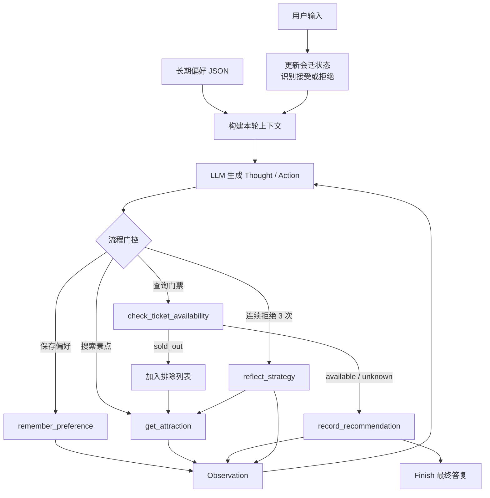

# 项目 01 Pro：具备记忆、票务回退与反思能力的智能旅行助手


[← 返回 Hello Agent 项目总览](../README.md) · [查看基础版项目](../hello_agent_01/README.md)

这是基础智能旅行助手的增强版本。在原有 `Thought–Action–Observation` 循环上，新增了用户偏好记忆、票务状态检查、售罄自动回退以及连续拒绝后的策略反思能力。

项目重点不只是增加工具，而是通过状态管理和流程门控修改 Agent Loop，使关键约束不再完全依赖模型自觉遵守。

> [!NOTE]
> 项目自带的票务数据是用于演示回退逻辑的本地模拟库存，不代表真实景区票务状态。接入生产环境时应替换为官方或授权票务 API。

## 功能概览

| 功能 | 实现方式 | TAO 循环中的变化 |
| --- | --- | --- |
| 用户偏好记忆 | JSON 持久化 + `remember_preference` 工具 | 每轮推理前把长期记忆注入 Prompt |
| 售罄自动备选 | `check_ticket_availability` + 排除列表 | 售罄 Observation 强制返回景点搜索阶段 |
| 连续拒绝反思 | 拒绝计数 + `reflect_strategy` 门控 | 第三次拒绝后禁止继续推荐，必须先反思 |
| 避免重复推荐 | 会话级拒绝/售罄排除集合 | 搜索工具自动携带排除条件 |
| 推荐完整性校验 | `record_recommendation` 完成门控 | 未搜索、未查票或未记录时禁止 Finish |

## 为什么需要修改 Agent Loop

基础版的循环是：

```text
Thought → Action → Observation → Thought → ... → Finish
```

增强版在循环前后加入记忆和状态，并在关键节点设置门控：



### 1. 记忆如何进入循环

用户表达长期偏好时，模型必须先调用：

```text
Action: remember_preference(category="兴趣", value="喜欢历史文化景点")
Action: remember_preference(category="预算", value="每人200元以内")
```

工具把偏好写入 `data/user_memory.json`。之后每一轮都会把记忆摘要放入模型上下文：

```text
长期偏好记忆:
- 兴趣: 喜欢历史文化景点
- 预算: 每人200元以内
```

因此，即使程序重新启动，用户偏好仍可继续生效。

### 2. 售罄如何触发自动回退

模型选出候选景点后不能直接回答，必须先查询票务：

```text
Action: check_ticket_availability(attraction="秦始皇帝陵博物院")
```

如果结果为售罄：

```text
Observation: ticket_status=sold_out；门票已售罄。该景点已加入排除列表，必须搜索备选方案。
```

系统会执行两项操作：

1. 把景点加入 `sold_out_attractions`。
2. 禁止 `record_recommendation` 接受该景点。

下一次 `get_attraction` 会自动携带排除列表，从而避免再次推荐同一景点。

### 3. 三次拒绝如何触发反思

交互模式会记录最近一次推荐。当用户输入“换一个”“不喜欢”“不合适”等反馈时，系统会：

1. 把上一景点加入拒绝列表。
2. 增加连续拒绝计数。
3. 在下一轮搜索时排除已拒绝景点。

第三次连续拒绝后，系统进入反思门控：

```text
Observation: 用户已连续拒绝3个推荐，下一步必须调用 reflect_strategy。
```

此时模型只能执行：

```text
Action: reflect_strategy(
    reason="前三个景点都过于热门且超出预算",
    new_strategy="改为推荐低预算、小众、历史文化类街区或遗址公园"
)
```

反思完成后，新策略会写入会话状态，并参与后续景点搜索。

## 项目结构

```text
hello_agent_01_pro/
├── main.py                              # 交互式命令行入口
├── README.md                            # 增强版项目文档
├── requirements.txt                     # Python 依赖
├── .gitignore                           # 密钥、记忆和缓存忽略规则
├── data/
│   └── ticket_inventory.json            # 教学用模拟票务库存
├── tests/
│   └── test_core.py                     # 记忆、回退、反思和解析测试
└── travel_agent_pro/
    ├── __init__.py
    ├── agent.py                         # TAO 循环与流程门控
    ├── config.py                        # 本地密钥配置，不上传 Git
    ├── config.example.py                # 公开配置模板
    ├── llm_client.py                    # OpenAI 兼容客户端
    ├── memory.py                        # JSON 长期偏好记忆
    ├── prompts.py                       # 增强版系统提示词
    ├── state.py                         # 拒绝计数、排除列表和策略状态
    ├── tickets.py                       # 可替换的票务接口
    └── tools/
        ├── __init__.py
        ├── agent_tools.py               # 工具注册与运行时依赖绑定
        ├── attractions.py               # 带偏好和排除条件的景点搜索
        └── weather.py                   # 实时天气查询
```

## 安装

进入增强版项目：

```powershell
cd G:\AI\hello-agent\hello_agent_01_pro
```

创建虚拟环境并安装依赖：

```powershell
py -3.10 -m venv .venv
.\.venv\Scripts\python.exe -m pip install --upgrade pip
.\.venv\Scripts\python.exe -m pip install -r requirements.txt
```

## 配置

复制配置模板：

```powershell
Copy-Item .\travel_agent_pro\config.example.py .\travel_agent_pro\config.py
```

编辑 `travel_agent_pro/config.py`：

```python
API_KEY = "你的模型服务 API Key"
BASE_URL = "模型服务的 OpenAI 兼容地址"
MODEL_ID = "模型 ID"
TAVILY_API_KEY = "你的 Tavily API Key"
MAX_STEPS = 12
```

模型服务必须兼容 Chat Completions 接口。`MAX_STEPS` 比基础版更大，因为票务检查、备选搜索和反思会增加循环次数。

## 运行

### 交互模式

```powershell
.\.venv\Scripts\python.exe .\main.py
```

推荐使用交互模式测试跨轮记忆和连续拒绝：

```text
你> 我喜欢历史文化景点，预算每人200元，请推荐西安景点
你> 不喜欢这个，换一个
你> 这个也不合适，换一个
你> 还是不满意，换一个
```

第三次拒绝后，可以在终端输出中观察 `reflect_strategy` 动作及推荐策略变化。

### 单次任务

```powershell
.\.venv\Scripts\python.exe .\main.py "我喜欢历史文化景点，预算每人200元，请推荐西安景点"
```

单次模式适合测试记忆保存和基本推荐；连续拒绝必须使用交互模式，因为会话状态只在当前程序运行期间保留。

## 交互命令

| 命令 | 功能 |
| --- | --- |
| `/memory` | 查看已持久化的用户偏好 |
| `/state` | 查看最近推荐、拒绝次数、排除列表和当前策略 |
| `/clear-memory` | 删除全部长期偏好记忆 |
| `/quit` | 退出程序 |

## 模拟票务数据

`data/ticket_inventory.json` 包含教学用状态：

```json
{
  "秦始皇帝陵博物院": "sold_out",
  "陕西历史博物馆": "sold_out",
  "西安城墙": "available"
}
```

支持三种状态：

| 状态 | 含义 | Agent 行为 |
| --- | --- | --- |
| `available` | 模拟库存显示有票 | 可以记录并推荐 |
| `sold_out` | 模拟库存显示售罄 | 自动排除并搜索备选 |
| `unknown` | 没有票务数据 | 可推荐，但必须提醒用户官方复核 |

### 接入真实票务 API

真实票务服务只需保持与 `TicketInventory.check()` 相同的返回语义：

```python
TicketResult(
    attraction="景点名称",
    status="available",  # available / sold_out / unknown
    source="official_ticket_api",
)
```

建议生产实现同时加入游览日期、票种、人数、缓存时间、超时和限流参数。

## 测试

测试不调用模型、Tavily 或天气接口：

```powershell
.\.venv\Scripts\python.exe -m unittest discover -s tests -v
```

当前覆盖：

- 偏好写入后可跨实例重新加载。
- 售罄景点自动进入排除列表且不能成为最终推荐。
- 连续拒绝三次后必须反思，反思后策略更新并清零计数。
- Thought/Action 工具动作与 Finish 动作解析。

## 核心设计选择

### 长期记忆与会话状态分离

- `PreferenceMemory` 保存兴趣、预算等长期偏好，并跨程序运行保留。
- `ConversationState` 保存最近推荐、连续拒绝计数和当前策略，只在本次会话生效。

这样可以避免把临时反馈永久写入用户画像。

### Prompt 约束与代码门控结合

仅靠 Prompt 不能保证模型始终遵循流程，因此 `TravelAgentPro` 还会在代码层验证：

- 用户表达偏好后，未保存记忆不能 Finish。
- 需要推荐时，未完成票务检查和推荐记录不能 Finish。
- 连续拒绝三次后，未执行反思不能调用其他工具。
- 售罄景点不能通过 `record_recommendation`。

### 不直接执行模型生成代码

动作使用 Python AST 解析，只接受：

- 直接函数调用。
- 具名参数。
- 字符串常量。
- 工具白名单中的函数名称。

## 已知边界

- Tavily 搜索返回的是自然语言候选，景点名称仍由模型提取。
- 模拟票务数据不会自动更新，不能用于真实购票判断。
- 偏好抽取依赖模型调用 `remember_preference`，目前未增加独立信息抽取模型。
- 连续拒绝状态只保留在当前交互会话，程序重启后重新计数。
- 这是教学用文本动作协议；生产系统更适合使用原生 Function Calling 和结构化输出。

## 密钥安全

不要上传 `travel_agent_pro/config.py`。GitHub 中只保留 `config.example.py`。

以下运行时文件也不应上传：

```text
data/user_memory.json
__pycache__/
.venv/
.idea/
```

## 参考与许可

本项目是在基础旅行助手上的自主增强实现，原始教学思路参考：

- [Datawhale / Hello-Agents](https://github.com/datawhalechina/hello-agents)
- [第一章：初识智能体](https://github.com/datawhalechina/hello-agents/blob/main/docs/chapter1/%E7%AC%AC%E4%B8%80%E7%AB%A0%20%E5%88%9D%E8%AF%86%E6%99%BA%E8%83%BD%E4%BD%93.md)

相关改编内容遵循上游项目采用的 [CC BY-NC-SA 4.0](https://creativecommons.org/licenses/by-nc-sa/4.0/deed.zh-hans) 许可要求。
