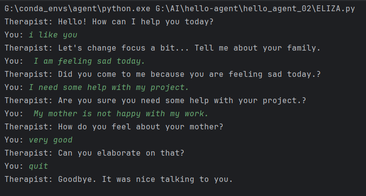
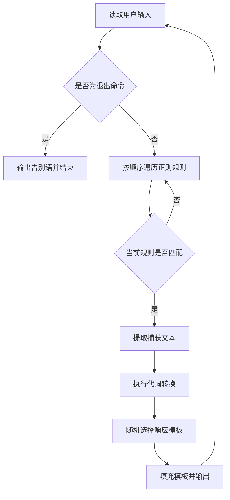

# 项目 02：基于规则与模式匹配的 ELIZA 聊天机器人


本项目对应 Datawhale Hello-Agents 第二章“智能体发展史”中的规则式聊天机器人实践。代码复现了 ELIZA 的核心思想：使用正则表达式识别用户输入模式，捕获句子片段，进行简单的第一、第二人称转换，再从预设模板中随机选择一条回复。

项目不调用大语言模型，不需要 API Key，也不依赖第三方 Python 包。它的目的不是构建真正理解语言的对话系统，而是通过一个最小可运行示例，观察符号主义人工智能的工作方式、优势与局限。

> [!IMPORTANT]
> 本项目仅用于编程与人工智能历史学习，不具备心理评估、心理咨询、疾病诊断或危机干预能力。程序输出来自固定规则，不应被视为专业建议。

> [返回仓库总览](../README.md)

## 运行效果



## 目录

- [项目背景](#项目背景)
- [学习目标](#学习目标)
- [功能概览](#功能概览)
- [工作原理](#工作原理)
- [规则说明](#规则说明)
- [项目结构](#项目结构)
- [环境要求](#环境要求)
- [运行方法](#运行方法)
- [运行示例](#运行示例)
- [核心代码](#核心代码)
- [扩展规则](#扩展规则)
- [方法局限](#方法局限)
- [常见问题](#常见问题)
- [参考与许可](#参考与许可)

## 项目背景

早期人工智能研究的重要范式之一是符号主义（Symbolic AI）。该范式认为，智能行为可以通过符号表示、明确规则和逻辑操作实现。专家系统、SHRDLU 和 ELIZA 都体现了这种自上而下的设计思想。

ELIZA 由 Joseph Weizenbaum 于 20 世纪 60 年代开发。其中最著名的 DOCTOR 脚本通过模仿非指导式对话，将用户陈述转化为开放式问题。它并不理解输入的真实语义，却能够依靠关键词、句式转换和用户的心理投射产生近似“理解”的交互体验。这一现象后来被称为“ELIZA 效应”。

本项目实现的是教学用途的迷你版本，重点保留以下机制：

1. 使用正则表达式描述输入模式。
2. 按规则定义顺序查找第一个匹配项。
3. 捕获通配符对应的文本片段。
4. 对捕获内容执行简单代词转换。
5. 从候选响应模板中随机选择回复。
6. 使用通配规则处理未命中特定模式的输入。

## 学习目标

通过本项目可以理解：

- 符号主义与规则驱动系统的基本设计思想。
- 正则表达式在文本模式匹配中的应用。
- 分解规则与重组模板之间的协作方式。
- 简单代词转换如何增强回复的连贯性。
- 规则顺序如何隐式决定匹配优先级。
- 随机模板如何提升回复的表面多样性。
- 无状态规则系统为何缺乏语义理解与上下文记忆。

## 功能概览

- 支持 `I need ...`、`I am ...` 等英语句式。
- 支持 `mother`、`father` 家庭主题关键词。
- 支持第一、第二人称的简单转换。
- 同一规则包含多个回复模板，可随机生成不同回答。
- 未匹配特定规则时返回通用引导语。
- 输入 `quit`、`exit` 或 `bye` 可结束对话。
- 仅使用 Python 标准库，可以离线运行。

## 工作原理

程序可以抽象为一个“输入—规则匹配—文本转换—响应生成”循环：



核心流程对应以下伪代码：

```text
读取用户输入
如果输入属于退出命令：
    输出告别语并结束程序

依次遍历规则：
    如果正则表达式匹配输入：
        提取捕获组
        转换捕获组中的人称代词
        随机选择一个响应模板
        将转换后的文本填入模板
        返回响应

如果没有特定规则匹配：
    返回通用响应
```

由于规则字典按照定义顺序遍历，越靠前的规则优先级越高。最后的 `.*` 可以匹配任意输入，因此必须位于规则库末尾，否则后面的具体规则永远不会执行。

## 规则说明

当前代码包含以下规则：

| 输入模式 | 作用 | 输入示例 |
| --- | --- | --- |
| `I need (.*)` | 捕获用户表达的需求 | `I need some help` |
| `Why don't you (.*)?` | 回应用户对系统的反问 | `Why don't you listen?` |
| `Why can't I (.*)?` | 引导用户解释受限原因 | `Why can't I relax?` |
| `I am (.*)` | 捕获用户对自身状态的描述 | `I am feeling tired` |
| `.* mother .*` | 识别包含 `mother` 的家庭话题 | `My mother is worried about me` |
| `.* father .*` | 识别包含 `father` 的家庭话题 | `My father is proud of me` |
| `.*` | 为其他输入提供兜底回复 | 任意其他文本 |

规则匹配使用 `re.IGNORECASE`，因此不区分英文字母大小写。

代词转换表包括：

| 原词 | 转换结果 | 原词 | 转换结果 |
| --- | --- | --- | --- |
| `i` | `you` | `you` | `i` |
| `me` | `you` | `my` | `your` |
| `am` | `are` | `are` | `am` |
| `was` | `were` | `yours` | `mine` |
| `mine` | `yours` | `i'd` | `you would` |
| `i've` | `you have` | `i'll` | `you will` |

例如，输入：

```text
I need my friend to understand me
```

`I need (.*)` 捕获：

```text
my friend to understand me
```

代词转换后得到：

```text
your friend to understand you
```

程序再将其填入随机选中的回复模板。

## 项目结构

```text
hello_agent_02/
├── README.md       # 项目原理、运行方式与扩展说明
├── img.png         # 命令行运行效果截图
└── ELIZA.py        # 规则库、代词转换、响应生成和交互入口
```

项目没有 `requirements.txt`，因为 `re` 和 `random` 均属于 Python 标准库。

## 环境要求

- Python 3.10 或更高版本。
- Windows、macOS 或 Linux。
- 命令行终端。

无需安装模型 SDK，也无需配置任何密钥。

可以通过以下命令检查 Python：

```powershell
python --version
```

如果使用本仓库已有的 Conda 环境：

```powershell
G:\conda_envs\agent\python.exe --version
```

## 运行方法

### 使用系统 Python

```powershell
cd G:\AI\hello-agent\hello_agent_02
python .\ELIZA.py
```

### 使用已有 Conda 环境

```powershell
G:\conda_envs\agent\python.exe G:\AI\hello-agent\hello_agent_02\ELIZA.py
```

程序启动后会显示：

```text
Therapist: Hello! How can I help you today?
You:
```

在 `You:` 后输入英文句子并按 Enter。输入以下任意命令可以退出：

```text
quit
exit
bye
```

也可以按 `Ctrl+C` 强制结束程序。

## 运行示例

```text
Therapist: Hello! How can I help you today?
You: I am feeling sad today
Therapist: How long have you been feeling sad today?
You: I need my friend to understand me
Therapist: Why do you need your friend to understand you?
You: My mother is worried about me
Therapist: Tell me more about your mother.
You: quit
Therapist: Goodbye. It was nice talking to you.
```

> [!NOTE]
> 每条规则包含多个候选模板，程序通过 `random.choice()` 随机选择，因此实际输出可能与示例不同。

## 核心代码

### `rules`

`rules` 是整个系统的规则库，使用以下映射关系：

```text
正则表达式 → 候选响应模板列表
```

正则表达式负责分解输入，`{0}` 占位符负责将捕获和转换后的文本重组到响应中。

### `pronoun_swap`

`pronoun_swap` 保存人称转换关系。它让程序能够把用户的第一人称陈述转换为面向用户的第二人称问题。

### `swap_pronouns(phrase)`

该函数执行三个步骤：

1. 将捕获文本转为小写。
2. 按空格拆分单词。
3. 根据 `pronoun_swap` 逐词替换并重新拼接。

### `respond(user_input)`

该函数负责：

1. 按顺序遍历规则。
2. 使用 `re.search()` 查找匹配。
3. 读取正则表达式捕获组。
4. 调用 `swap_pronouns()` 转换人称。
5. 随机选择模板并使用 `format()` 填充。
6. 返回生成的回复。

### 主聊天循环

`if __name__ == '__main__':` 下的循环持续读取输入、判断退出命令并调用 `respond()`，构成最小的交互式聊天程序。

## 扩展规则

可以在 `rules` 中、通配规则 `r'.*'` 之前添加新的规则。例如：

```python
r'I feel (.*)': [
    "Why do you feel {0}?",
    "When did you start feeling {0}?",
    "What makes you feel {0}?"
],
```

输入：

```text
I feel nervous about tomorrow
```

可能生成：

```text
Why do you feel nervous about tomorrow?
```

添加规则时应注意：

- 将具体规则放在通用规则之前。
- 使用圆括号 `(.*)` 捕获需要复用的文本。
- 模板中的 `{0}` 对应第一个捕获组。
- 当前实现只读取第一个捕获组，不适合直接处理多个占位内容。
- Python 字典中的规则顺序就是本项目的匹配优先级。
- 应使用多组输入测试规则覆盖、冲突和兜底行为。

## 方法局限

该程序展示的是规则匹配能力，而不是真正的自然语言理解：

1. **缺乏语义理解**：系统只判断字符模式，不理解否定、讽刺、隐喻或事实关系。
2. **没有上下文记忆**：每次回复仅依赖当前输入，无法联系之前的对话。
3. **规则覆盖有限**：规则之外的表达会直接进入通用回复。
4. **扩展成本较高**：规则数量增加后容易产生覆盖、冲突和优先级问题。
5. **语言适用范围有限**：当前规则和模板面向英文输入，不能直接处理中文句式。
6. **代词转换较粗糙**：函数仅按空格分词，附着标点的单词可能无法正确转换。
7. **回复具有随机性**：相同输入可能获得不同回复，不利于直接进行确定性测试。
8. **缺少安全判断**：系统不能识别真实心理风险，也不能提供专业处置建议。

这些局限说明：流畅的表面响应并不等同于语义理解。规则系统在封闭、边界明确的场景中简单可控，但很难覆盖开放语言环境中的复杂变化。

## 与现代智能体的区别

| 对比维度 | 本项目 ELIZA | 现代大语言模型智能体 |
| --- | --- | --- |
| 核心能力来源 | 人工编写的正则规则和模板 | 大规模预训练模型与任务提示 |
| 输入理解 | 字符模式匹配 | 基于模型表示的语义处理 |
| 上下文 | 单轮、无状态 | 通常支持多轮上下文或长期记忆 |
| 规划能力 | 无 | 可进行多步骤规划与反思 |
| 工具调用 | 无 | 可接入搜索、数据库、代码执行等工具 |
| 学习能力 | 运行时不学习 | 可通过训练、微调或外部记忆扩展 |
| 可控性 | 规则明确、行为边界清晰 | 能力更强，但需要额外约束与评估 |

本项目仍然具有“接收输入—选择响应—执行输出”的基本交互结构，但它更准确地属于规则式对话程序，而不是当前以大语言模型、记忆、规划和工具使用为核心的自主智能体。

## 常见问题

### 1. 是否需要安装 OpenAI SDK？

不需要。项目只使用 Python 标准库中的 `re` 和 `random`。

### 2. 是否需要填写 API Key？

不需要。程序完全在本地运行，不会请求任何模型或网络服务。

### 3. 为什么相同输入的回复不一样？

代码使用 `random.choice()` 从候选模板中随机选择回复。这是预期行为。

### 4. 为什么输入中文后回复不相关？

当前正则表达式和响应模板均针对英文设计。中文输入通常会命中最后的 `.*` 兜底规则。

### 5. 为什么某些代词没有正确转换？

当前实现采用空格分词。例如 `me.` 会被视为包含句点的完整词，而不是 `me`，因此不会命中转换表。可以在后续版本中先分离标点，或使用更完善的分词方法。

### 6. 为什么单独输入 `mother` 没有匹配家庭规则？

当前模式是 `.* mother .*`，要求 `mother` 前后出现空格。它适合完整句子，但无法覆盖位于句首、句尾或单独出现的关键词。可以改成带单词边界的表达式：

```python
r'.*\bmother\b.*'
```

### 7. 如何退出程序？

输入 `quit`、`exit` 或 `bye`，也可以按 `Ctrl+C`。

### 8. 这是心理咨询程序吗？

不是。它只是演示规则匹配和文本替换的教学代码，不能用于心理咨询、医学诊断或风险评估。

## 后续扩展方向

- 使用带单词边界的正则表达式提高关键词匹配稳定性。
- 为规则设置显式优先级，而不是依赖字典顺序。
- 分离标点后再进行代词转换。
- 保存对话历史并增加简单上下文记忆。
- 固定随机种子并补充单元测试。
- 将规则、响应模板和程序逻辑拆分到不同模块。
- 添加中文模式、中文人称转换和中文响应模板。
- 对输入长度、空输入和异常中断进行更完整的处理。

## 参考与许可

主要学习参考：

- [Datawhale / Hello-Agents](https://github.com/datawhalechina/hello-agents)
- [第二章：智能体发展史](https://github.com/datawhalechina/hello-agents/blob/main/docs/chapter2/%E7%AC%AC%E4%BA%8C%E7%AB%A0%20%E6%99%BA%E8%83%BD%E4%BD%93%E5%8F%91%E5%B1%95%E5%8F%B2.md)
- Joseph Weizenbaum, *ELIZA—A Computer Program for the Study of Natural Language Communication Between Man and Machine*, 1966.

本项目用于人工智能学习与交流。源自或改编自 Hello-Agents 的内容，请按照上游项目的许可要求使用，并保留对 Datawhale Hello-Agents 项目及原作者的署名。
