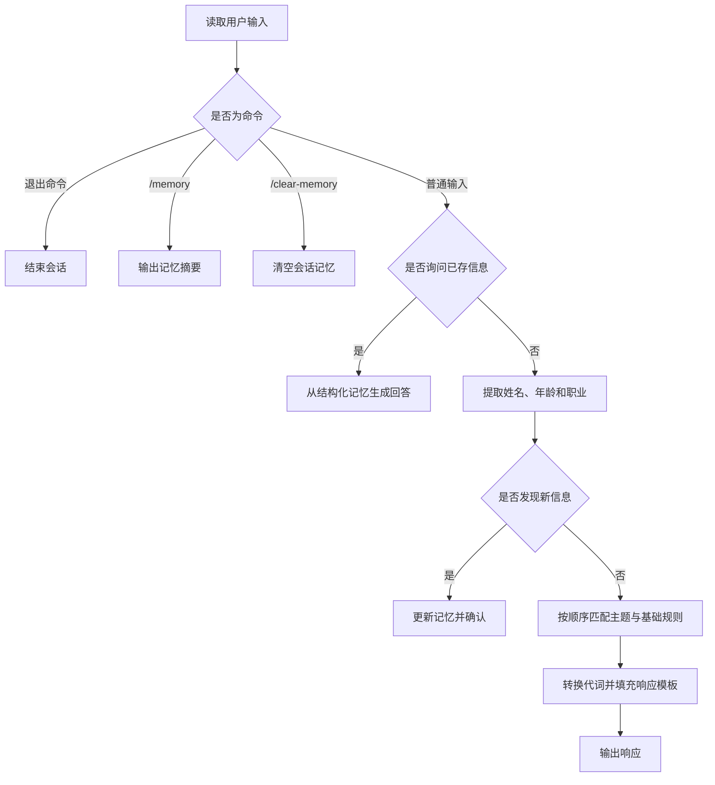

# 项目 02 Pro：具备主题扩展与上下文记忆的 ELIZA


本项目在[项目 02 基础版](../hello_agent_02/README.md)的 ELIZA 规则式聊天机器人上增加五类对话场景和一个轻量级上下文记忆模块。系统能够识别用户提到的姓名、年龄和职业，在当前会话的后续对话中查询或引用这些信息。

该实现仍然是完全可解释的规则系统：不调用大语言模型、不访问网络、不需要 API Key，也不依赖第三方 Python 包。它的目的在于展示规则式系统加入状态后能够获得哪些能力，以及为什么这种方法仍然难以扩展为开放域对话系统。

> [!IMPORTANT]
> ELIZA Pro 仅用于人工智能教学，不具备心理咨询、医学诊断或危机干预能力。程序输出来自预设规则，不能替代专业建议。

> [返回仓库总览](../README.md)

## 目录

- [增强内容](#增强内容)
- [项目结构](#项目结构)
- [处理流程](#处理流程)
- [新增主题规则](#新增主题规则)
- [上下文记忆](#上下文记忆)
- [安装与运行](#安装与运行)
- [交互示例](#交互示例)
- [测试](#测试)
- [与 ChatGPT 的本质差异](#与-chatgpt-的本质差异)
- [组合爆炸的数学说明](#组合爆炸的数学说明)
- [设计边界](#设计边界)
- [扩展方向](#扩展方向)
- [参考资料](#参考资料)

## 增强内容

相较基础版，本项目完成了以下扩展：

1. 新增工作、学习、爱好、压力和未来目标五类主题规则。
2. 使用显式模式提取姓名、年龄和职业。
3. 在当前程序运行期间保存结构化用户信息。
4. 支持查询记忆摘要及单项信息。
5. 在工作等主题回复中引用姓名或职业上下文。
6. 支持清空当前会话记忆。
7. 使用单词边界改进 `mother` 和 `father` 的匹配。
8. 改进代词转换，使 `me.` 等带标点单词也能正确处理。
9. 为记忆、主题匹配和代词转换提供自动化测试。

## 项目结构

```text
hello_agent_02_pro/
├── README.md
├── ELIZA_pro.py
└── tests/
    └── test_eliza_pro.py
```

| 文件 | 作用 |
| --- | --- |
| `ELIZA_pro.py` | 规则库、结构化记忆、响应生成与命令行入口 |
| `tests/test_eliza_pro.py` | 姓名、年龄、职业、五类主题和代词转换测试 |
| `README.md` | 设计说明、数学分析、运行方法和项目边界 |

项目不需要 `requirements.txt`，因为只使用 `random`、`re`、`dataclasses`、`pathlib` 和 `unittest` 等 Python 标准库。

## 处理流程



处理顺序体现了显式优先级：

```text
记忆查询
  > 信息提取
  > 新增主题规则
  > 基础 ELIZA 规则
  > 通配兜底规则
```

如果先执行通配规则，后续规则将永远无法触发；如果先执行基础 `I am (.*)` 规则，`I am stressed` 也可能无法进入更具体的压力主题。因此，规则顺序是系统行为的一部分。

## 新增主题规则

本项目新增五类规则：

| 主题 | 关键词示例 | 输入示例 | 响应目标 |
| --- | --- | --- | --- |
| 工作 | `work`、`job`、`career`、`boss` | `Work has been difficult.` | 引导讨论工作体验与改变方向 |
| 学习 | `study`、`course`、`exam`、`homework` | `I have an exam next week.` | 询问目标、困难与支持需求 |
| 爱好 | `hobby`、`enjoy`、`music`、`reading` | `I enjoy painting.` | 探索兴趣来源与主观体验 |
| 压力 | `stress`、`pressure`、`overwhelmed` | `I feel stressed lately.` | 询问压力来源与既往应对方式 |
| 目标 | `future`、`goal`、`plan`、`dream` | `My goal is to travel.` | 引导思考意义、步骤与阻碍 |

每个主题包含三个候选模板。命中规则后，程序使用 `random.Random.choice()` 随机选择一条，因此相同输入可能获得不同响应。

规则采用从具体到通用的顺序排列。新增主题规则位于 `I need ...`、`I am ...` 等基础规则之前，最后才是能够匹配任意文本的 `.*`。

## 上下文记忆

### 记忆的数据结构

```python
@dataclass
class ConversationMemory:
    name: str | None = None
    age: int | None = None
    profession: str | None = None
```

与保存完整聊天记录相比，结构化记忆只保留任务要求中的三个明确字段，具有以下特点：

- 数据边界清楚。
- 查询成本为常数级。
- 不需要把全部历史重新送入响应模块。
- 可以准确控制哪些信息会被引用。
- 不能表示复杂事件、关系或隐含语义。

### 支持的信息表达

姓名：

```text
My name is Alice.
Call me Alice.
```

年龄：

```text
I am 28 years old.
My age is 28.
```

职业：

```text
I work as a teacher.
My profession is software engineer.
I am a researcher.
```

单条消息也可以包含多个事实：

```text
My name is Alice, I am 28 years old, and I work as a teacher.
```

### 查询记忆

```text
What is my name?
How old am I?
What is my job?
What do you remember about me?
```

也可以使用命令：

```text
/memory
/clear-memory
```

### 记忆范围

当前记忆仅保存在 `ElizaPro` 对象中：

- 同一次程序运行的后续对话可以使用。
- 退出程序后自动消失。
- 不会写入 JSON、数据库或日志。
- 不会跨用户或跨进程共享。

这种设计满足“简单上下文记忆”的要求，同时避免把姓名、年龄和职业等个人信息写入 Git 仓库。

## 安装与运行

### 环境要求

- Python 3.10 或更高版本。
- Windows、macOS 或 Linux。
- 无第三方依赖。
- 无需 API Key。

### 使用系统 Python

```powershell
cd G:\AI\hello-agent\hello_agent_02_pro
python .\ELIZA_pro.py
```

### 使用现有 Conda 环境

```powershell
G:\conda_envs\agent\python.exe G:\AI\hello-agent\hello_agent_02_pro\ELIZA_pro.py
```

### 交互命令

| 命令 | 功能 |
| --- | --- |
| `/memory` | 查看当前会话记住的信息 |
| `/clear-memory` | 清空姓名、年龄和职业 |
| `/help` | 显示命令帮助 |
| `quit`、`exit`、`bye` | 结束对话 |

## 交互示例

```text
Therapist: Hello! I am ELIZA Pro. How can I help you today?
Therapist: I can remember your name, age, and profession in this session.
Therapist: Type /help to view commands.
You: My name is Alice, I am 28 years old, and I work as a teacher.
Therapist: I'll remember that your name is Alice, you are 28 years old, and you work as a teacher.
You: What do you remember about me?
Therapist: I remember that your name is Alice, you are 28 years old, and you work as a teacher.
You: Work has been stressful recently.
Therapist: Alice, what would you most like to change about your work?
You: I enjoy reading on weekends.
Therapist: Alice, how does that activity make you feel?
You: /clear-memory
Memory: The current session memory has been cleared.
You: What is my name?
Therapist: You have not told me your name yet.
You: quit
Therapist: Goodbye. It was nice talking to you.
```

由于响应模板随机选择，实际输出可能与示例不同。

## 测试

在项目目录中执行：

```powershell
cd G:\AI\hello-agent\hello_agent_02_pro
python -m unittest discover -s tests -v
```

测试覆盖：

- 姓名存储与查询。
- 年龄存储与查询。
- 职业存储与工作主题。
- 单条消息提取多个事实。
- 清空记忆。
- 五类新增主题匹配。
- 带标点文本的代词转换。

为了避免随机模板导致测试不稳定，测试使用固定随机种子。

## 与 ChatGPT 的本质差异

OpenAI 将 ChatGPT 描述为能够理解自然语言并生成回答、辅助思考、写作和问题求解的对话式 AI。ChatGPT 还可以在用户控制下使用保存的记忆和聊天历史，使后续响应更具相关性；具体能力和设置可能随方案、地区及产品更新而变化。

| 维度 | ELIZA Pro | ChatGPT |
| --- | --- | --- |
| 能力来源 | 开发者手写正则表达式与响应模板 | 从大规模数据训练得到的生成式模型能力 |
| 语言处理 | 字符模式和关键词匹配，不理解真实语义 | 基于上下文生成自然语言，可处理大量改写和隐含关系 |
| 知识范围 | 仅覆盖规则中编码的少量主题 | 能处理广泛主题，但回答仍可能出错，需要核验 |
| 上下文 | 仅保存姓名、年龄、职业三个字段 | 可以利用当前对话上下文；启用相关功能时还可使用受用户控制的记忆或聊天历史 |
| 输出空间 | 从有限模板中选择并填充文本 | 动态生成新文本，输出空间远大于固定模板集合 |
| 泛化方式 | 新表达通常需要新增或修改规则 | 可以基于训练所得模式处理未逐条编写的表达 |
| 可控与可解释性 | 匹配路径明确，可定位到具体规则 | 行为由模型、上下文和产品策略共同决定，难以简化为单条显式规则 |
| 维护方式 | 人工维护规则、顺序、冲突和模板 | 主要通过模型训练、系统设计、提示、评估与安全机制迭代 |

这里的“理解”是产品能力层面的概括，不意味着模型具有人类意识。ChatGPT 的生成能力更强，但并不保证所有输出都正确。

官方参考：

- [Getting started with ChatGPT](https://openai.com/academy/getting-started/)
- [Memory FAQ](https://help.openai.com/en/articles/8590148-memory-faq)

## 组合爆炸的数学说明

### 1. 对话状态的笛卡尔积

开放域对话的一条回复通常同时受到多个因素影响。可将状态抽象为：

```math
x=(t,i,s,p,r,m,c,\ell)
```

其中可以分别表示主题、意图、情绪、立场、角色、用户记忆、上下文和语言风格。假设第 \(j\) 个维度包含 \(k_j\) 种离散情况，为所有组合分别编写规则所需覆盖的状态数为：

```math
N=\prod_{j=1}^{d} k_j
```

若有 8 个维度，每个维度仅取 5 种情况：

```math
N=5^8=390\,625
```

如果每个状态准备 3 个响应模板，则理论上需要处理：

```math
3N=1\,171\,875
```

这还没有计算具体主题词、实体值和不同句式。增加一个具有 \(k\) 种取值的新维度后，规模不是增加 \(k\)，而是变为：

```math
N'=kN
```

这就是组合爆炸的乘法效应。

### 2. 自然语言序列空间

若词表大小为 \(V\)，输入最长为 \(L\) 个词，则长度不超过 \(L\) 的理论句子数量为：

```math
S(L)=\sum_{\ell=1}^{L}V^\ell
    =\frac{V^{L+1}-V}{V-1}
    =\Theta(V^L)
```

即使取 \(V=10\,000\)、\(L=10\)，长度恰为 10 的序列空间也达到：

```math
V^L=10^{40}
```

其中绝大多数序列并非自然句子，但这个数量仍说明：使用枚举规则覆盖所有词序、同义改写、否定、指代和上下文组合在计算与工程上不可行。

### 3. 规则冲突的增长

如果规则数为 \(R\)，仅检查所有规则之间的两两覆盖或优先级关系，就存在：

```math
\binom{R}{2}=\frac{R(R-1)}{2}=O(R^2)
```

个规则对。若系统包含 1,000 条规则，需要考虑的两两关系最多为：

```math
\binom{1000}{2}=499\,500
```

新增规则可能：

- 被更早的通用规则遮蔽。
- 抢先匹配原有规则。
- 与多个主题规则产生交叉覆盖。
- 在不同上下文中需要不同输出。
- 迫使测试集同步增加大量组合用例。

因此，维护成本不仅与规则数量有关，还与规则之间的相互作用有关。

### 4. 为什么开放域尤其困难

规则方法适合输入边界清楚的封闭任务，例如固定命令解析、表单校验或有限状态流程。开放域对话同时包含：

- 近乎无限的主题和实体。
- 同一意图的大量同义表达。
- 多轮指代、省略和语义依赖。
- 否定、反讽、隐喻和歧义。
- 不断变化的事实与用户目标。

每增加一种主题、句式或上下文状态，都可能与已有维度形成新的乘积组合。系统最终会出现规则数量激增、优先级脆弱、测试成本上升和局部修改引发全局回归等问题。

数学模型是对工程复杂度的简化说明，并不意味着真实系统必须逐项枚举全部组合；它揭示的是纯规则覆盖随维度增加呈乘法或指数增长的根本趋势。

## 设计边界

- 只识别明确的英文信息表达，不进行真正的实体理解。
- 姓名只支持常见拉丁字母形式。
- 年龄只接受 1–120 的整数。
- 职业自由文本可能受到歧义影响。
- 记忆只在当前进程中存在，退出后不会保留。
- 规则按定义顺序匹配，新增规则仍可能产生优先级冲突。
- 系统不保存完整对话，不能解析复杂的跨轮因果关系。
- 系统不能验证用户陈述的真实性。
- 系统不具备心理健康风险识别和专业应对能力。

## 扩展方向

- 将规则配置拆分为独立 JSON 或 YAML 文件。
- 为规则增加显式优先级和冲突检测。
- 将会话记忆扩展为可控的实体—属性存储。
- 增加“忘记单项信息”和纠正记忆的命令。
- 为中文姓名、年龄、职业和主题增加规则。
- 引入有限状态机管理多轮子任务。
- 使用意图分类模型替代部分关键词枚举。
- 构建规则与语言模型结合的混合系统。
- 增加覆盖率、冲突率和回归测试。

## 参考资料

- [Datawhale / Hello-Agents](https://github.com/datawhalechina/hello-agents)
- [第二章：智能体发展史](https://github.com/datawhalechina/hello-agents/blob/main/docs/chapter2/%E7%AC%AC%E4%BA%8C%E7%AB%A0%20%E6%99%BA%E8%83%BD%E4%BD%93%E5%8F%91%E5%B1%95%E5%8F%B2.md)
- [OpenAI：Getting started with ChatGPT](https://openai.com/academy/getting-started/)
- [OpenAI：Memory FAQ](https://help.openai.com/en/articles/8590148-memory-faq)
- Joseph Weizenbaum, *ELIZA—A Computer Program for the Study of Natural Language Communication Between Man and Machine*, 1966.

本项目用于人工智能学习与交流。源自或改编自 Hello-Agents 的内容，请按照上游项目的许可要求使用，并保留对 Datawhale Hello-Agents 项目及原作者的署名。
