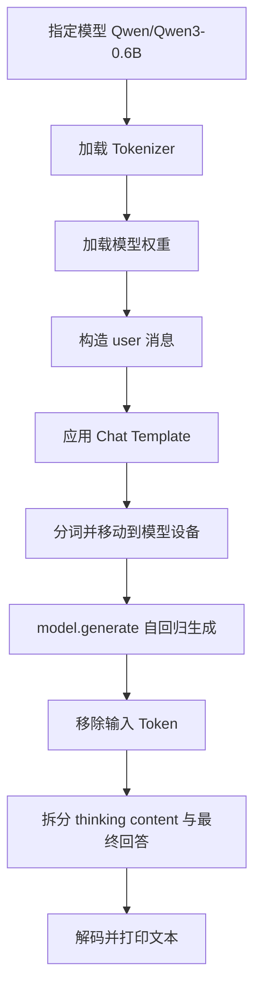

# 项目 03：Transformer 核心组件与 Qwen3-0.6B 本地推理


本项目对应 Datawhale Hello-Agents 第三章“大语言模型基础”，包含两个相互补充的教学示例：

1. `transformer.py`：使用 PyTorch 实现位置编码、多头注意力和位置前馈网络，展示 Transformer 的关键计算模块。
2. `qwen3-0.6B.py`：通过 ModelScope 加载 `Qwen/Qwen3-0.6B`，完成聊天模板构造、分词、自回归生成以及思考内容与最终回答的拆分。

项目从“理解 Transformer 内部结构”和“调用轻量开源模型”两个层面连接理论与实践。它不是完整的 Transformer 训练工程，也不是生产级模型服务。

> [!IMPORTANT]
> `transformer.py` 中的 `EncoderLayer` 和 `DecoderLayer` 仍保留待补全的构造代码，目前不能直接实例化。位置编码、多头注意力和前馈网络三个独立组件已经实现。详细说明见[当前实现状态](#当前实现状态)。

> [返回仓库总览](../README.md)

## 目录

- [学习目标](#学习目标)
- [项目结构](#项目结构)
- [当前实现状态](#当前实现状态)
- [Transformer 核心原理](#transformer-核心原理)
- [代码模块说明](#代码模块说明)
- [Qwen3 本地推理流程](#qwen3-本地推理流程)
- [环境安装](#环境安装)
- [运行方法](#运行方法)
- [参数调整](#参数调整)
- [验证状态](#验证状态)
- [常见问题](#常见问题)
- [上传 GitHub](#上传-github)
- [参考与许可](#参考与许可)

## 学习目标

通过本项目可以理解：

- 语言模型为何需要对序列中的位置信息进行编码。
- 缩放点积注意力如何根据 Query、Key 和 Value 聚合上下文。
- 多头机制如何在不同表示子空间中并行建模依赖关系。
- 位置前馈网络如何对每个词元表示进行非线性变换。
- 残差连接、层归一化和注意力模块如何组成编码器与解码器层。
- 聊天消息如何通过模板转换为模型可处理的文本。
- 分词器如何把自然语言转换为 Token ID。
- 自回归模型如何逐步生成新 Token，并将其解码为文本。
- 本地开源模型部署在隐私、成本、性能和硬件需求上的基本权衡。

## 项目结构

```text
hello_agent_03/
├── README.md          # 项目原理、安装、运行和问题排查
├── transformer.py     # Transformer 核心组件教学实现
└── qwen3-0.6B.py      # Qwen3-0.6B 本地文本生成示例
```

两个脚本的定位不同：

| 文件 | 目标 | 是否训练模型 | 是否下载权重 |
| --- | --- | --- | --- |
| `transformer.py` | 理解 Transformer 的底层组件 | 否 | 否 |
| `qwen3-0.6B.py` | 运行已有的 Qwen3-0.6B 模型 | 否 | 首次运行需要 |

## 当前实现状态

### 已完成组件

| 组件 | 类名 | 状态 | 输入与输出 |
| --- | --- | --- | --- |
| 正弦位置编码 | `PositionalEncoding` | 已实现 | `(B, L, D) → (B, L, D)` |
| 缩放点积多头注意力 | `MultiHeadAttention` | 已实现 | `(Q, K, V) → (B, L, D)` |
| 位置前馈网络 | `PositionWiseFeedForward` | 已实现 | `(B, L, D) → (B, L, D)` |
| Qwen3 本地推理 | `qwen3-0.6B.py` | 代码完整，依赖和权重需本地准备 | Prompt → 生成文本 |

其中：

- \(B\) 表示批量大小。
- \(L\) 表示序列长度。
- \(D\) 表示 `d_model`，即隐藏表示维度。

### 尚未补全组件

`EncoderLayer` 中存在：

```python
self.self_attn = MultiHeadAttention()
self.feed_forward = PositionWiseFeedForward()
```

但这两个类的构造函数需要参数，因此实例化编码器层会出现 `TypeError`。其设计意图应为：

```python
self.self_attn = MultiHeadAttention(d_model, num_heads)
self.feed_forward = PositionWiseFeedForward(d_model, d_ff, dropout)
```

`DecoderLayer` 中的自注意力、交叉注意力和前馈网络存在相同问题。当前代码也尚未实现：

- 多层编码器与解码器堆叠。
- Token Embedding 和输出投影层。
- Decoder 因果掩码生成。
- 完整 Transformer `forward()`。
- 损失函数、反向传播和训练循环。

因此，`transformer.py` 应被理解为“核心组件教学代码”，而不是可直接训练或生成文本的完整 Transformer。

## Transformer 核心原理

### 1. 位置编码

注意力机制本身不包含词元顺序信息。代码使用固定的正弦和余弦函数构造位置编码：

```math
PE(pos,2i)=\sin\left(\frac{pos}{10000^{2i/d_{\text{model}}}}\right)
```

```math
PE(pos,2i+1)=\cos\left(\frac{pos}{10000^{2i/d_{\text{model}}}}\right)
```

位置矩阵的形状为：

```text
(1, max_len, d_model)
```

它通过 `register_buffer()` 注册，因此：

- 不参与梯度更新。
- 会保存在模型状态中。
- 调用 `model.to(device)` 时会随模型移动到相同设备。

当前实现最好使用偶数 `d_model`。当 `d_model` 为奇数时，正弦维和余弦维数量不一致，赋值可能发生形状错误。

### 2. 缩放点积注意力

单个注意力头的计算为：

```math
\operatorname{Attention}(Q,K,V)
=\operatorname{softmax}\left(\frac{QK^\top}{\sqrt{d_k}}\right)V
```

除以 \(\sqrt{d_k}\) 可以限制点积数值随维度增大而快速增长，避免 Softmax 进入梯度过小的饱和区域。

代码中的计算步骤为：

```text
Q、K、V 线性映射
  ↓
拆分为多个注意力头
  ↓
计算 QKᵀ / √dₖ
  ↓
应用可选掩码
  ↓
Softmax 得到注意力权重
  ↓
与 V 加权求和
  ↓
合并多个头并进行输出映射
```

多头注意力可写为：

```math
\operatorname{MultiHead}(Q,K,V)
=\operatorname{Concat}(head_1,\ldots,head_h)W^O
```

其中：

```math
head_i=\operatorname{Attention}(QW_i^Q,KW_i^K,VW_i^V)
```

代码要求：

```math
d_{\text{model}} \bmod h = 0
```

即 `d_model` 必须能够被 `num_heads` 整除。

### 3. 位置前馈网络

前馈网络独立作用于序列中每个位置：

```math
\operatorname{FFN}(x)
=\operatorname{ReLU}(xW_1+b_1)W_2+b_2
```

代码先将维度从 `d_model` 扩展到 `d_ff`，再映射回 `d_model`：

```text
(B, L, d_model)
  → Linear
(B, L, d_ff)
  → ReLU + Dropout + Linear
(B, L, d_model)
```

### 4. 编码器与解码器

代码展示的编码器层结构为：

```text
输入
  → 多头自注意力
  → 残差连接 + LayerNorm
  → 位置前馈网络
  → 残差连接 + LayerNorm
  → 输出
```

解码器层比编码器层多一个交叉注意力模块：

```text
目标序列
  → 掩码自注意力
  → 残差连接 + LayerNorm
  → 对编码器输出进行交叉注意力
  → 残差连接 + LayerNorm
  → 位置前馈网络
  → 残差连接 + LayerNorm
  → 输出
```

## 代码模块说明

### `PositionalEncoding`

初始化阶段预先计算最长 `max_len` 范围内的位置编码。`forward()` 根据当前序列长度截取对应部分，并与输入逐元素相加。

关键参数：

| 参数 | 含义 | 当前默认值 |
| --- | --- | --- |
| `d_model` | 词元隐藏表示维度 | 必填 |
| `dropout` | 位置编码相加后的随机失活概率 | `0.1` |
| `max_len` | 支持的最大序列长度 | `5000` |

### `MultiHeadAttention`

该模块包含四个线性层：

- `W_q`：生成 Query。
- `W_k`：生成 Key。
- `W_v`：生成 Value。
- `W_o`：映射合并后的多头输出。

`split_heads()` 将：

```text
(B, L, d_model)
```

转换为：

```text
(B, num_heads, L, d_k)
```

如果提供掩码，其形状必须能够广播到注意力分数：

```text
(B, num_heads, L_query, L_key)
```

代码将掩码为 `0` 的位置设置为 `-1e9`，使其经过 Softmax 后接近零。

### `PositionWiseFeedForward`

该模块由两个线性层、ReLU 和 Dropout 组成。它不在不同序列位置之间交换信息，而是对每个位置使用相同的参数完成变换。

### `EncoderLayer` 与 `DecoderLayer`

这两个类展示了残差连接和层归一化的组合关系，但构造阶段尚未把 `d_model`、`num_heads`、`d_ff` 和 `dropout` 传给内部模块，当前属于待完成代码。

## Qwen3 本地推理流程

`qwen3-0.6B.py` 的执行流程如下：



### 1. 模型与分词器

```python
model_name = "Qwen/Qwen3-0.6B"
```

`AutoTokenizer` 根据模型配置加载相匹配的分词器，`AutoModelForCausalLM` 加载 Decoder-Only 因果语言模型。

### 2. 聊天模板

代码将消息表示为：

```python
messages = [
    {"role": "user", "content": "介绍你自己"}
]
```

然后使用：

```python
tokenizer.apply_chat_template(...)
```

将结构化消息转换为模型要求的控制 Token 和文本格式。`enable_thinking=True` 启用 Qwen3 的思考模式。

### 3. 生成

```python
generated_ids = model.generate(
    **model_inputs,
    max_new_tokens=32768
)
```

生成结果同时包含原始输入 Token 和新生成 Token，因此代码使用输入长度对输出进行切片，只保留新增部分。

### 4. 思考内容拆分

代码按照 Token ID `151668` 查找 `</think>`，并把输出分为：

```text
thinking content
content
```

这种实现与当前 Qwen3 示例一致，但硬编码特殊 Token ID 会与具体分词器版本耦合。更稳健的工程实现应从分词器配置读取特殊 Token，或在解码后解析 `<think>...</think>` 标签。

## 环境安装

### 环境要求

- Python 3.10 或更高版本。
- PyTorch。
- ModelScope。
- Transformers 4.51.0 或更高版本。
- `accelerate`，用于支持 `device_map="auto"`。
- 首次运行 Qwen3 时需要网络下载模型文件。
- GPU 并非语法要求，但可明显改善生成速度。

Qwen 官方文档建议 Qwen3 使用 `transformers>=4.51.0`，并推荐 `torch>=2.6`。

### 创建虚拟环境

```powershell
cd G:\AI\hello-agent\hello_agent_03
py -3.10 -m venv .venv
.\.venv\Scripts\python.exe -m pip install --upgrade pip
```

### 安装依赖

CPU 或通用安装示例：

```powershell
.\.venv\Scripts\python.exe -m pip install "torch>=2.6"
.\.venv\Scripts\python.exe -m pip install modelscope "transformers>=4.51.0" accelerate safetensors
```

如果使用 NVIDIA GPU，应根据显卡驱动和 CUDA 环境，在 [PyTorch 官方安装页面](https://pytorch.org/get-started/locally/)选择匹配的安装命令，不要盲目混装不同 CUDA 版本。

检查环境：

```powershell
.\.venv\Scripts\python.exe -c "import torch, modelscope, transformers, accelerate; print(torch.__version__); print(transformers.__version__); print(torch.cuda.is_available())"
```

项目不使用远程付费 API，因此不需要填写 API Key。

## 运行方法

### 1. 检查 Transformer 组件

直接执行 `transformer.py` 不会显示输出，因为该文件只定义类。可以通过以下命令验证三个已完成组件的张量形状：

```powershell
cd G:\AI\hello-agent\hello_agent_03
.\.venv\Scripts\python.exe -c "import torch; from transformer import PositionalEncoding, MultiHeadAttention, PositionWiseFeedForward; x=torch.randn(2,5,8); print(PositionalEncoding(8,0.0)(x).shape); print(MultiHeadAttention(8,2)(x,x,x).shape); print(PositionWiseFeedForward(8,16,0.0)(x).shape)"
```

预期三个输出均为：

```text
torch.Size([2, 5, 8])
```

暂时不要直接实例化 `EncoderLayer` 或 `DecoderLayer`，除非先补齐其内部模块的构造参数。

### 2. 运行 Qwen3-0.6B

建议首次测试先将源码中的：

```python
max_new_tokens=32768
```

临时调整为：

```python
max_new_tokens=512
```

然后执行：

```powershell
cd G:\AI\hello-agent\hello_agent_03
.\.venv\Scripts\python.exe .\qwen3-0.6B.py
```

由于文件名包含连字符 `-`，应以脚本路径运行，不适合使用：

```text
python -m qwen3-0.6B
```

首次运行会下载模型、分词器和配置文件，耗时取决于网络、磁盘和硬件条件。后续运行通常会复用本地缓存。

输出结构为：

```text
thinking content: <模型生成的思考内容>
content: <模型生成的最终回答>
```

模型输出具有随机性，实际文本不应与某个固定示例逐字比较。

## 参数调整

### 修改提示词

```python
prompt = "请用三点解释自注意力机制"
```

### 关闭思考模式

```python
text = tokenizer.apply_chat_template(
    messages,
    tokenize=False,
    add_generation_prompt=True,
    enable_thinking=False
)
```

关闭思考模式通常可以减少生成长度和等待时间，适合简单问答。

### 控制输出长度

```python
generated_ids = model.generate(
    **model_inputs,
    max_new_tokens=512
)
```

`max_new_tokens` 是最多新生成的 Token 数，不包含输入长度。当前源码设置为 `32768`，对入门测试和 CPU 环境通常过大。

### 调整采样

可以在 `generate()` 中加入：

```python
do_sample=True,
temperature=0.6,
top_p=0.95,
top_k=20,
```

采样参数会改变输出的确定性与多样性。参数选择应结合思考模式、任务类型和 Qwen 官方建议进行实验，不应仅根据单次输出判断模型质量。

## 验证状态

本项目已完成以下检查：

| 检查项 | 结果 |
| --- | --- |
| `transformer.py` Python 语法解析 | 通过 |
| `qwen3-0.6B.py` Python 语法解析 | 通过 |
| 当前 `G:\conda_envs\agent` 环境依赖检查 | 未安装 `torch` |
| Transformer 组件运行验证 | 因缺少 PyTorch，尚未在当前环境执行 |
| Qwen3 权重下载与生成验证 | 未执行，避免未经确认下载大型依赖和模型文件 |
| Encoder/Decoder 完整性检查 | 构造参数未补齐，已在文档中标记 |

这一区分意味着：两个文件语法有效，但“语法通过”不等同于“完整运行通过”。

## 常见问题

### 1. 提示 `No module named 'torch'`

当前 Python 环境没有安装 PyTorch。确认正在使用哪个解释器：

```powershell
python -c "import sys; print(sys.executable)"
```

然后用同一个解释器安装 PyTorch。

### 2. 提示 `No module named 'modelscope'`

```powershell
python -m pip install modelscope
```

### 3. 提示 `KeyError: 'qwen3'`

通常是 Transformers 版本过旧。Qwen 官方要求 Qwen3 使用：

```powershell
python -m pip install --upgrade "transformers>=4.51.0"
```

### 4. `device_map="auto"` 提示缺少 Accelerate

```powershell
python -m pip install --upgrade accelerate
```

### 5. 模型下载很慢或失败

- 检查网络连接和磁盘剩余空间。
- 确认模型名称为 `Qwen/Qwen3-0.6B`。
- 不要反复删除已下载缓存。
- 网络中断后重新运行，下载工具通常能够复用已有文件。

### 6. CPU 运行很慢

这是本地自回归生成的正常成本。可以：

- 将 `max_new_tokens` 降至 `128` 或 `256`。
- 设置 `enable_thinking=False`。
- 缩短输入文本。
- 使用兼容的 GPU 环境。
- 考虑量化模型或专用推理框架。

### 7. 出现 CUDA Out of Memory

- 降低 `max_new_tokens`。
- 减少输入长度。
- 关闭其他占用显存的程序。
- 使用更低精度或量化权重。
- 切换到 CPU，但生成速度会下降。

### 8. `EncoderLayer` 报缺少构造参数

这是当前代码中已经确认的未完成部分。需要把 `d_model`、`num_heads`、`d_ff` 和 `dropout` 传给内部注意力与前馈模块，不能通过重新安装依赖解决。

### 9. 为什么运行 `transformer.py` 没有输出？

该脚本只定义神经网络类，没有 `if __name__ == "__main__":` 入口，也没有打印语句。请使用[运行方法](#运行方法)中的组件检查命令。

### 10. 为什么思考内容拆分失败？

代码依赖特殊 Token ID `151668`。如果模型、分词器或聊天模板发生变化，该 ID 可能不再适用。应优先使用与模型匹配的官方分词器，并考虑改为按 `<think>` 标签解析。

## 上传 GitHub

本项目只需要上传：

```text
hello_agent_03/
├── README.md
├── transformer.py
└── qwen3-0.6B.py
```

不要上传：

```text
.venv/
__pycache__/
*.pyc
模型缓存目录/
*.safetensors
*.bin
```

模型权重体积较大，应由使用者在本地根据模型标识下载，不应直接提交到普通 Git 仓库。

## 参考与许可

- [Datawhale / Hello-Agents](https://github.com/datawhalechina/hello-agents)
- [第三章：大语言模型基础](https://github.com/datawhalechina/hello-agents/blob/main/docs/chapter3/%E7%AC%AC%E4%B8%89%E7%AB%A0%20%E5%A4%A7%E8%AF%AD%E8%A8%80%E6%A8%A1%E5%9E%8B%E5%9F%BA%E7%A1%80.md)
- [Attention Is All You Need](https://arxiv.org/abs/1706.03762)
- [Qwen3 官方文档：Transformers 推理](https://qwen.readthedocs.io/en/stable/inference/transformers.html)
- [Qwen3 官方快速开始](https://qwen.readthedocs.io/en/stable/getting_started/quickstart.html)
- [ModelScope 官方仓库](https://github.com/modelscope/modelscope)
- [PyTorch 安装说明](https://pytorch.org/get-started/locally/)

本项目用于大语言模型基础学习与代码实践。源自或改编自 Hello-Agents 的内容，请遵守上游项目的许可要求，并保留对 Datawhale Hello-Agents 项目及原作者的署名。

