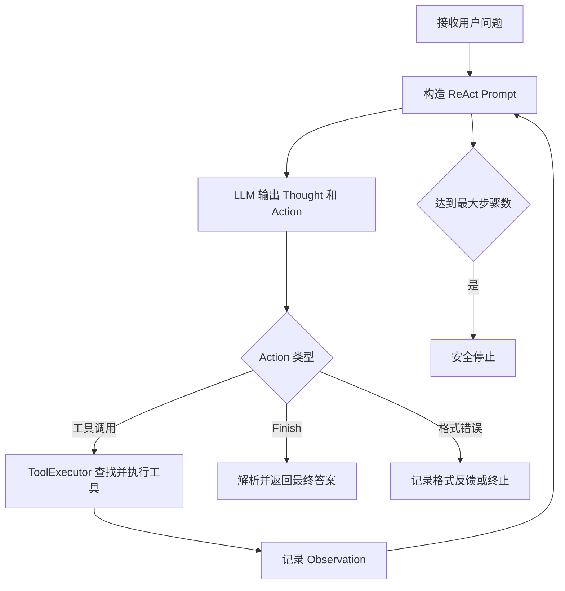

# 项目 04：ReAct、Plan-and-Solve 与 Reflection 经典智能体范式


本项目对应 Datawhale Hello-Agents 第四章“智能体经典范式构建”，使用原生 Python
分别实现三种经典智能体工作流：

1. **ReAct**：在推理、行动和观察之间循环，根据工具结果动态决定下一步。
2. **Plan-and-Solve**：先生成完整计划，再按照计划顺序执行各个子任务。
3. **Reflection**：先生成初始结果，再通过反思和改进循环提升结果质量。

三个示例共享 `HelloAgentsLLM.py` 中的 OpenAI 兼容模型客户端，便于比较不同
Agent Loop 在任务分解、工具调用和自我修正方面的差异。

> [返回仓库总览](../README.md)

## 目录

- [学习目标](#学习目标)
- [项目结构](#项目结构)
- [三种范式对比](#三种范式对比)
- [公共模型客户端](#公共模型客户端)
- [ReAct 实现](#react-实现)
- [Plan-and-Solve 实现](#plan-and-solve-实现)
- [Reflection 实现](#reflection-实现)
- [安装与配置](#安装与配置)
- [运行方法](#运行方法)
- [运行结果说明](#运行结果说明)
- [常见问题](#常见问题)
- [实现边界](#实现边界)
- [上传 GitHub](#上传-github)
- [参考资料](#参考资料)

## 学习目标

完成本项目后，可以理解：

- ReAct 如何组织 `Thought–Action–Observation` 循环。
- 工具注册表如何连接模型动作与 Python 函数。
- Plan-and-Solve 如何将全局规划和步骤执行解耦。
- Reflection 如何保存执行轨迹并根据反馈迭代结果。
- 为什么模型输出需要采用稳定、可验证的结构。
- 如何限制循环次数，避免智能体无限执行。
- 三种范式各自适合的任务类型及其局限。

## 项目结构

```text
hello_agent_04/
├── README.md                 # 项目 04 独立文档
├── HelloAgentsLLM.py         # OpenAI 兼容模型客户端
├── React.py                  # ReAct、工具注册与 SerpApi 搜索
├── Plan-and-solve.py         # Plan-and-Solve 规划与顺序执行
├── Reflection.py             # 执行、反思、优化循环
└── .env                      # 本地密钥配置，不上传 GitHub
```

| 文件 | 主要职责 |
| --- | --- |
| `HelloAgentsLLM.py` | 读取环境变量、创建 OpenAI 客户端并输出流式响应 |
| `React.py` | 注册工具，解析 Action，执行搜索并维护 Observation 历史 |
| `Plan-and-solve.py` | 生成 Python 列表形式的计划，并逐步骤调用模型执行 |
| `Reflection.py` | 生成 Python 代码、审查算法效率并根据反馈优化 |
| `README.md` | 介绍原理、配置、运行方法、问题排查与上传范围 |

> [!IMPORTANT]
> `Plan-and-solve.py` 的文件名包含连字符，可以作为脚本直接运行，但不能使用
> `from Plan-and-solve import Planner` 这样的普通导入语句。若需要将其作为模块复用，
> 建议重命名为 `plan_and_solve.py`。

## 三种范式对比

| 维度 | ReAct | Plan-and-Solve | Reflection |
| --- | --- | --- | --- |
| 核心循环 | 思考—行动—观察 | 规划—顺序执行 | 执行—反思—优化 |
| 决策粒度 | 每一步动态决定 | 执行前生成全局计划 | 根据评审结果迭代 |
| 工具调用 | 支持，本项目使用 SerpApi | 当前示例未接入工具 | 当前示例未接入工具 |
| 状态信息 | Action 与 Observation 历史 | 已完成步骤及结果 | 执行与反思记录 |
| 主要优势 | 对环境反馈灵活 | 多步骤结构清晰 | 能发现并修正初始结果 |
| 主要风险 | 容易循环或解析失败 | 错误计划会影响后续步骤 | 反思不一定正确且成本较高 |
| 适用任务 | 实时查询、工具协作 | 数学题、流程规划、任务拆解 | 代码优化、写作审查、质量改进 |

三种范式不是相互排斥的。增强版项目进一步将它们组合为统一闭环：

> [项目 04 Pro：混合范式智能体](../hello_agent_04_pro/README.md)

## 公共模型客户端

`HelloAgentsLLM.py` 封装了 OpenAI 兼容的 Chat Completions 接口：

```python
class HelloAgentsLLM:
    def __init__(
        self,
        model: str = None,
        apiKey: str = None,
        baseUrl: str = None,
        timeout: int = None,
    ):
        ...

    def think(
        self,
        messages: list[dict[str, str]],
        temperature: float = 0,
    ) -> str:
        ...
```

配置读取优先级为：

```text
构造函数显式参数
        >
.env 或系统环境变量
```

模型响应使用流式方式输出，同时将所有片段合并为完整字符串，供后续动作解析、
计划解析和反思模块使用。

## ReAct 实现

### 工作流程



### 工具注册

`ToolExecutor` 使用字典保存工具名称、描述和函数：

```python
tool_executor.registerTool(
    "Search",
    "一个网页搜索引擎。",
    search,
)
```

模型只能调用已注册工具。未知工具名称不会被直接执行，而是转换为错误
Observation。

### 搜索工具

`search()` 使用 SerpApi 查询网页，并按照以下优先级返回结果：

1. Answer Box 列表。
2. Answer Box 直接答案。
3. Knowledge Graph 描述。
4. 前三个自然搜索结果的标题和摘要。
5. 明确的“没有找到”提示。

搜索摘要可能过期或缺少完整上下文，因此涉及价格、开放时间、法规和产品发布日期
等信息时，应继续访问官方网站核验，不能仅凭摘要作出高风险结论。

### 动作格式

模型需要输出：

```text
Thought: 简要分析当前问题和下一步
Action: Search[查询内容]
```

信息充分后输出：

```text
Thought: 已经获得回答所需信息
Action: Finish[最终答案]
```

`React.py` 使用带空白兼容和多行匹配的正则表达式解析 `Finish[...]`，并在格式不合法
时给出反馈，避免直接对空匹配结果调用 `.group()`。

## Plan-and-Solve 实现

### 规划阶段

`Planner` 要求模型把复杂问题转换为 Python 字符串列表：

```python
["计算周一销量", "计算周二销量", "计算周三销量", "汇总三天销量"]
```

程序从 ```` ```python ```` 代码块中提取列表，并使用
`ast.literal_eval()` 安全解析。与 `eval()` 相比，`literal_eval()` 只接受字符串、
数字、列表、字典等 Python 字面量，不会执行任意函数调用。

### 执行阶段

`Executor` 按顺序执行计划，每一步都会获得：

- 原始问题。
- 完整计划。
- 已完成步骤及其结果。
- 当前需要完成的步骤。

执行结果会追加到历史中，为后续步骤提供上下文。当前教学实现将最后一个步骤的输出
作为最终答案。

### 默认任务

```text
一个水果店周一卖出了15个苹果。周二卖出的苹果数量是周一的两倍。
周三卖出的数量比周二少了5个。请问这三天总共卖出了多少个苹果？
```

这个例子用于观察“先生成计划，再逐步求解”的完整过程。

## Reflection 实现

### 工作流程

```text
根据任务生成初始代码
        ↓
保存 execution 记录
        ↓
审查时间复杂度与算法瓶颈
        ↓
保存 reflection 记录
        ↓
是否“无需改进”？
    ├── 是：返回当前代码
    └── 否：根据反馈生成优化代码并继续循环
```

### 短期记忆

`Memory` 保存两类记录：

| 记录类型 | 内容 |
| --- | --- |
| `execution` | 当前或上一轮生成的 Python 代码 |
| `reflection` | 对算法效率和改进方向的评审反馈 |

`get_last_execution()` 返回最近一次代码结果，供下一轮优化使用。记忆只存在于当前
Python 进程中，不会持久化到磁盘。

### 默认任务

```text
编写一个Python函数，找出1到n之间所有的素数。
```

反思提示重点检查时间复杂度，并鼓励模型在适当时使用筛法替代逐个试除。

## 安装与配置

### 环境要求

- Python 3.10 或更高版本。
- 可访问的 OpenAI 兼容模型服务。
- ReAct 搜索示例需要 SerpApi Key。

### 安装依赖

使用当前 Conda 环境：

```powershell
G:\conda_envs\agent\python.exe -m pip install --upgrade openai python-dotenv serpapi
```

或者使用当前解释器：

```powershell
python -m pip install --upgrade openai python-dotenv serpapi
```

> [!NOTE]
> 当前代码使用 `from serpapi import Client`。如果编辑器仍提示找不到模块，请确认
> 安装命令和运行脚本使用的是同一个 Python 解释器。

### 配置 `.env`

在 `hello_agent_04/.env` 中填写：

```dotenv
MODEL_NAME=服务商实际支持的模型ID
OPENAI_API_KEY=你的模型服务密钥
OPENAI_BASE_URL=OpenAI兼容接口地址
SERPAPI_API_KEY=你的SerpApi密钥
LLM_TIMEOUT=60
```

例如：

```dotenv
MODEL_NAME=your-model-name
OPENAI_API_KEY=your-api-key
OPENAI_BASE_URL=https://your-provider.example/v1
SERPAPI_API_KEY=your-serpapi-key
LLM_TIMEOUT=60
```

示例值只是占位符。不要把真实 `.env` 上传到公开仓库。

## 运行方法

进入项目目录：

```powershell
cd G:\AI\hello-agent\hello_agent_04
```

### 运行 ReAct

```powershell
G:\conda_envs\agent\python.exe .\React.py
```

默认问题是：

```text
华为最新的手机是哪一款？它的主要卖点是什么？
```

这类信息具有时效性，最终结论应以运行时查询到的官方网站为准。

### 运行 Plan-and-Solve

```powershell
G:\conda_envs\agent\python.exe .\Plan-and-solve.py
```

### 运行 Reflection

```powershell
G:\conda_envs\agent\python.exe .\Reflection.py
```

### 测试公共模型客户端

```powershell
G:\conda_envs\agent\python.exe .\HelloAgentsLLM.py
```

## 运行结果说明

### ReAct

终端会依次显示：

```text
工具注册
模型调用
Thought
Action
Observation
最终答案或最大步数提示
```

### Plan-and-Solve

终端会先显示完整计划，然后输出每个步骤及其结果。一次任务需要多次调用模型，
调用次数通常为：

```math
1+\text{计划步骤数}
```

其中第一次调用用于规划，其余调用用于执行各个步骤。

### Reflection

终端会显示初始代码、每轮评审反馈和优化后的代码。最大模型调用次数约为：

```math
1+2R
```

其中 \(R\) 是最大反思轮数；如果评审提前输出“无需改进”，实际调用次数会更少。

## 常见问题

### 1. 编辑器仍然标红 `dotenv`

通常是编辑器解释器与安装依赖的解释器不一致。检查：

```powershell
G:\conda_envs\agent\python.exe -c "import sys, dotenv; print(sys.executable); print(dotenv.__file__)"
```

然后把 IDE 的 Python Interpreter 设置为同一路径。

### 2. 返回 `404 Model not found`

这说明接口地址可以访问，但 `.env` 中的 `MODEL_NAME` 不是该服务商支持的准确模型
ID。模型名称不能根据习惯猜测，应在服务商控制台或模型列表接口中确认。

### 3. `cannot import name 'SerpApiClient' from 'serpapi'`

当前实现使用：

```python
from serpapi import Client
```

不要再导入当前环境中不存在的 `SerpApiClient`。同时确认依赖安装位置：

```powershell
G:\conda_envs\agent\python.exe -m pip show serpapi
```

### 4. 搜索结果为什么只有三条

`search()` 主动截取了前三个自然结果，以限制提示词长度和模型成本：

```python
results["organic_results"][:3]
```

这不是终端截断。如果需要更多结果，可以调整切片数量，但也会增加上下文长度。

### 5. 程序退出代码为 0，但没有输出

退出代码 0 只表示 Python 没有抛出未处理异常。常见原因包括：

- 代码只有类和函数定义，没有执行入口。
- `if __name__ == "__main__":` 中没有调用目标函数。
- 主入口被注释。
- 模型调用失败后函数返回空值。

### 6. `NoneType` 没有属性 `group`

这表示正则表达式没有匹配到模型输出，却直接调用了 `.group()`。应先判断匹配对象
是否存在，并在失败时提示模型重新使用指定格式。当前 `React.py` 已对
`Finish[...]` 增加匹配检查。

### 7. 模型一直不输出 `Finish`

- 检查提示词是否明确要求在信息充分后输出 `Finish[...]`。
- 查看 Observation 是否包含回答所需信息。
- 适当提高 `max_steps`。
- 不要无限提高上限，应同时保留终止条件。

### 8. 搜索信息与官网不一致

搜索引擎可能返回旧页面、第三方文章或未来日期的错误摘要。价格、开放时间、型号、
政策等动态信息应优先使用官方网站，并标明查询日期和不确定性。

## 实现边界

- 三个范式目前是独立脚本，没有共享统一任务状态。
- ReAct 的文本正则协议仍可能受模型格式漂移影响。
- 搜索工具只返回少量摘要，没有保存完整网页和引用链接。
- Plan-and-Solve 不会自动验证计划正确性，也不会在中途动态重规划。
- Plan-and-Solve 的最后一步输出不一定覆盖此前全部结果。
- Reflection 依赖同一个模型同时生成和审查，可能出现自我确认偏差。
- Reflection 只检查模型描述，不会真正执行生成代码或运行单元测试。
- LLM 与搜索服务会产生延迟、调用额度和网络依赖。

需要将三种范式组合起来、增加结构化状态和失败恢复时，请阅读：

> [项目 04 Pro：混合范式智能体](../hello_agent_04_pro/README.md)

## 验证状态

本项目已经使用 `G:\conda_envs\agent\python.exe` 完成：

| 检查项 | 结果 |
| --- | --- |
| 四个 Python 文件语法检查 | 通过 |
| `HelloAgentsLLM`、`React` 模块导入 | 通过 |
| OpenAI、python-dotenv、serpapi 依赖导入 | 通过 |
| 真实 LLM 调用 | 未在文档整理阶段重复执行，避免额外消耗额度 |
| 实时搜索内容准确性 | 取决于运行时间和搜索来源，必须单独核验 |

## 上传 GitHub

建议上传：

```text
hello_agent_04/
├── README.md
├── HelloAgentsLLM.py
├── React.py
├── Plan-and-solve.py
└── Reflection.py
```

不要上传：

```text
.env
__pycache__/
*.pyc
```

仓库根目录的 `.gitignore` 已包含 `**/.env`、`**/__pycache__/` 和
`**/*.py[cod]` 等规则。

## 参考资料

- [Datawhale / Hello-Agents](https://github.com/datawhalechina/hello-agents)
- [第四章：智能体经典范式构建](https://github.com/datawhalechina/hello-agents/blob/main/docs/chapter4/%E7%AC%AC%E5%9B%9B%E7%AB%A0%20%E6%99%BA%E8%83%BD%E4%BD%93%E7%BB%8F%E5%85%B8%E8%8C%83%E5%BC%8F%E6%9E%84%E5%BB%BA.md)
- [ReAct: Synergizing Reasoning and Acting in Language Models](https://arxiv.org/abs/2210.03629)
- [Plan-and-Solve Prompting: Improving Zero-Shot Chain-of-Thought Reasoning by Large Language Models](https://arxiv.org/abs/2305.04091)
- [Reflexion: Language Agents with Verbal Reinforcement Learning](https://arxiv.org/abs/2303.11366)
- [OpenAI Python SDK](https://github.com/openai/openai-python)
- [SerpApi Python Integration](https://serpapi.com/integrations/python)

本项目用于智能体原理学习与代码实践。源自或改编自 Hello-Agents 的内容，请遵守
上游项目的许可要求，并保留对 Datawhale Hello-Agents 项目及原作者的署名。
