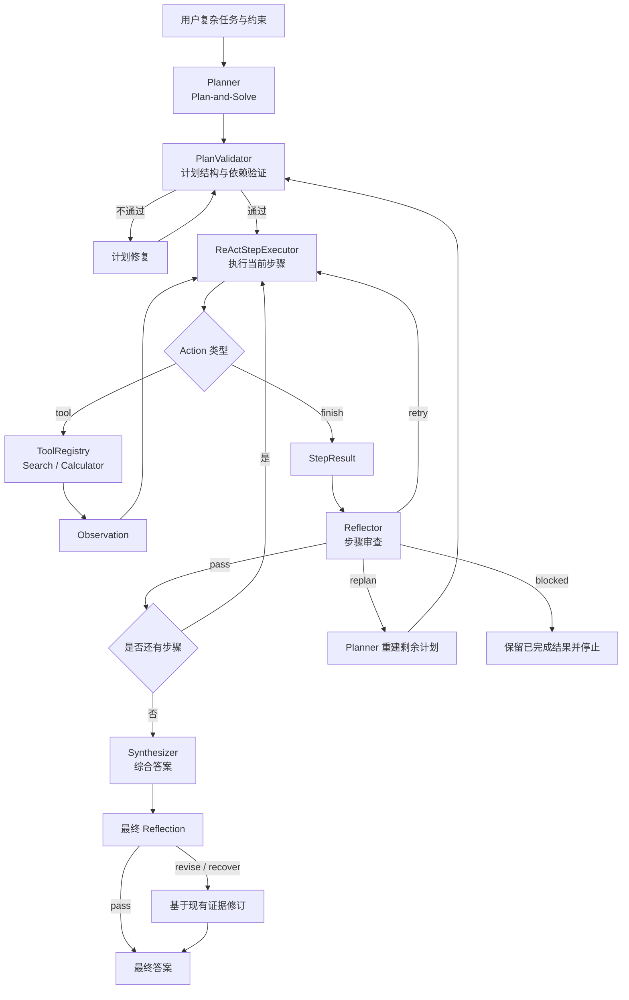

# 项目 04 Pro：ReAct、Plan-and-Solve 与 Reflection 混合范式智能体


本项目是[项目 04 基础版](../hello_agent_04/README.md)的增强实现，将 ReAct、
Plan-and-Solve 和 Reflection 从三个独立示例组合为一个共享状态、带验证与恢复能力
的混合智能体。

混合架构不是简单地依次运行三个脚本，而是建立如下闭环：

```text
Plan-and-Solve 生成并验证全局计划
        ↓
ReAct 执行当前步骤并调用工具
        ↓
Reflection 对步骤结果进行质量审查
        ├── pass：保存结果并进入下一步
        ├── retry：携带反馈重试当前步骤
        ├── replan：重新生成剩余计划
        └── blocked：保留已有结果并安全停止
        ↓
答案综合
        ↓
最终 Reflection 与修订
```

示例应用是一个具有实时信息、预算、偏好和异常备选约束的“西安历史文化主题两日
旅行规划”任务。

> [返回仓库总览](../README.md) ·
> [查看项目 04 基础版](../hello_agent_04/README.md) ·
> [查看实现补充说明](HYBRID_AGENT_USAGE.md)

## 目录

- [增强目标](#增强目标)
- [项目结构与依赖关系](#项目结构与依赖关系)
- [总体架构](#总体架构)
- [统一任务状态](#统一任务状态)
- [核心模块](#核心模块)
- [执行状态机](#执行状态机)
- [恢复与终止机制](#恢复与终止机制)
- [具体应用场景](#具体应用场景)
- [安装与配置](#安装与配置)
- [运行方法](#运行方法)
- [输出说明](#输出说明)
- [离线验证](#离线验证)
- [常见问题](#常见问题)
- [设计边界与适用场景](#设计边界与适用场景)
- [上传 GitHub](#上传-github)
- [参考资料](#参考资料)

## 增强目标

基础版的三个脚本分别演示单一范式，但仍存在以下局限：

- ReAct 缺少全局计划，容易被局部搜索结果带偏。
- Plan-and-Solve 计划生成后缺少动态反馈，错误步骤可能影响整个流程。
- Reflection 只面向代码优化，不能审查通用工具执行结果。
- 三个脚本没有统一状态，不能共享计划、Observation、失败记录和调用预算。
- 文本格式解析容易受到模型输出格式变化影响。

Pro 版本完成以下增强：

1. 使用结构化 JSON 表示计划、ReAct 动作和 Reflection 决策。
2. 执行前验证步骤 ID、依赖关系、工具名称和成功标准。
3. 将 ReAct 改造成“单个计划步骤执行器”。
4. 将 Reflection 扩展为通用步骤审查器和最终答案审查器。
5. 支持当前步骤重试和剩余计划重建。
6. 使用统一状态保存计划、结果、Observation、反思和预算。
7. 限制 LLM、工具、重试和重规划次数，避免无限循环。
8. 工具预算耗尽后允许模型使用已有证据完成当前步骤。
9. 同一地点连续两次搜索不到时标记“查询不到”并进入下一步。
10. 任务阻断时保留已经完成的结果并输出具体停止原因。

## 项目结构与依赖关系

```text
hello-agent/
├── hello_agent_04/
│   ├── README.md
│   ├── HelloAgentsLLM.py        # Pro 复用的模型客户端
│   ├── React.py                 # Pro 复用的 SerpApi 搜索函数
│   ├── Plan-and-solve.py
│   └── Reflection.py
└── hello_agent_04_pro/
    ├── README.md                # Pro 项目主文档
    ├── HYBRID_AGENT_USAGE.md    # 实现与迁移补充说明
    ├── HybridAgent.py           # 混合智能体核心模块
    └── hybrid_travel_demo.py    # 西安两日旅行示例入口
```

| 文件 | 作用 |
| --- | --- |
| `HybridAgent.py` | 数据结构、LLM 网关、工具注册、规划、执行、反思和总编排 |
| `hybrid_travel_demo.py` | 注册 Search 与 Calculator，构造旅行任务并打印运行统计 |
| `HYBRID_AGENT_USAGE.md` | 记录关键实现、降级规则和迁移方式 |
| `../hello_agent_04/HelloAgentsLLM.py` | 提供 OpenAI 兼容模型客户端 |
| `../hello_agent_04/React.py` | 提供当前项目使用的 SerpApi 搜索函数 |

> [!IMPORTANT]
> 当前 Pro 版本复用了相邻的 `hello_agent_04`，因此不能只复制
> `hello_agent_04_pro` 单独运行。运行时必须同时保留两个目录，并将它们加入
> Python 模块搜索路径。

## 总体架构



该架构体现三种范式的职责分离：

- **Plan-and-Solve** 负责全局目标、步骤依赖和成功标准。
- **ReAct** 负责局部行动，根据 Observation 动态选择下一动作。
- **Reflection** 负责质量控制，并改变编排器的控制流。

## 统一任务状态

`HybridAgentState` 是三个范式共享的任务记忆：

```python
@dataclass
class HybridAgentState:
    task: str
    constraints: list[str]
    plan: list[PlanStep]
    plan_version: int
    current_step: int
    observations: list[dict[str, Any]]
    step_results: dict[str, StepResult]
    reflections: list[dict[str, Any]]
    step_attempts: dict[str, int]
    search_failures: dict[str, int]
    unavailable_targets: dict[str, str]
    tool_calls: int
    llm_calls: int
    retries: int
    status: str
    blocked_reason: str
```

状态包含三类记忆：

| 层级 | 当前实现 |
| --- | --- |
| 工作记忆 | 当前步骤的工具动作和 Observation |
| 任务记忆 | 完整计划、步骤结果、反思、失败次数和调用预算 |
| 降级记忆 | 已连续查询不到的地点，防止后续重复搜索 |

历史记录只能作为执行上下文，不能自动成为可信事实。最终答案仍应基于当前任务获得的
Observation。

## 核心模块

### LLMGateway

统一封装模型调用并记录调用次数。规划、动作和反思均要求 JSON 输出；如果第一次
无法解析，网关会再调用一次模型进行格式修复：

```text
原始响应
  ↓
尝试解析纯 JSON 或 Markdown JSON 代码块
  ↓
失败时调用 JSON 修复 Prompt
  ↓
仍失败则安全终止
```

这种处理避免了基础文本协议中正则匹配为空后直接调用 `.group()` 的问题。

### ToolRegistry

保存工具描述和函数，并提供兼容基础版 `registerTool()` 的接口：

```python
tools.register_tool(
    "Search",
    "查询开放时间、门票和预约政策。",
    search,
)
```

工具执行异常会转换为结构化失败结果，不会直接使主程序崩溃。

### Planner

规划器生成 2–6 个步骤，每个步骤包含：

```json
{
  "step_id": "S1",
  "goal": "查询陕西历史博物馆预约政策",
  "dependencies": [],
  "tools": ["Search"],
  "success_criteria": ["得到开放时间、预约渠道和放票规则"],
  "max_attempts": 2
}
```

当 Reflection 判定当前计划不合理时，Planner 只重建尚未完成的步骤，已完成结果不会
被无条件丢弃。

### PlanValidator

执行前检查：

- 计划不能为空。
- 步骤数不能超过上限。
- `step_id` 必须唯一。
- 依赖只能引用已完成步骤或当前计划中的前序步骤。
- 工具名称必须已经注册。
- 每个步骤必须具有目标和成功标准。

### ReActStepExecutor

每轮只允许两种动作：

```json
{
  "thought_summary": "需要查询官方预约政策",
  "action": {
    "type": "tool",
    "tool_name": "Search",
    "tool_input": "陕西历史博物馆 官网 预约 开放时间",
    "search_target": "陕西历史博物馆"
  }
}
```

或者：

```json
{
  "thought_summary": "已有信息满足当前步骤",
  "action": {
    "type": "finish",
    "answer": "当前步骤结论"
  }
}
```

`thought_summary` 只保存简短决策依据，不要求模型输出冗长内部推理过程。

### Reflector

步骤 Reflection 可以返回：

| 决策 | 含义 |
| --- | --- |
| `pass` | 当前结果满足成功标准 |
| `retry` | 计划正确，但需要调整搜索或补充证据 |
| `replan` | 当前或剩余计划结构不合理 |
| `blocked` | 缺少用户信息、权限或外部服务，无法恢复 |

最终 Reflection 则检查答案是否回答原始任务、满足约束、与已验证结果一致，并正确
标记不确定信息。

### Synthesizer

综合器只接收已经通过步骤检查的结果。它需要区分：

- 已由 Observation 支持的信息。
- 预算或价格估算值。
- 搜索不到、证据不足或需要人工核验的信息。

## 执行状态机

| 当前状态 | 触发条件 | 下一状态 |
| --- | --- | --- |
| `planning` | 计划生成成功 | 计划验证 |
| 计划验证 | 计划合法 | `executing` |
| 计划验证 | 计划非法且仍有修订预算 | 计划修复 |
| `executing` | ReAct 输出步骤结果 | `reflecting` |
| `reflecting` | `pass` | 下一步骤 |
| `reflecting` | `retry` | 重试当前步骤 |
| `reflecting` | `replan` | 重建剩余计划 |
| `reflecting` | `blocked` | `blocked` |
| 全部步骤完成 | 生成候选答案 | `synthesizing` |
| 候选答案生成 | 最终审查 | `final_review` |
| 最终审查完成 | 通过或修订 | `done` |

## 恢复与终止机制

### 重试当前步骤

重试时会保留此前的 Observation，并把 Reflection 反馈提供给 ReAct。已使用过的相同
工具参数会被识别，避免跨重试重复调用。

### 重规划剩余步骤

当 Reflection 发现计划本身存在问题时，Planner 会基于已完成步骤、失败步骤和反思
建议生成新计划。新计划仍需通过 `PlanValidator`。

### 工具预算耗尽

工具预算为 0 后，ReAct 不会立即失败，而会获得一次无工具收尾机会：

1. 读取当前步骤和此前重试获得的 Observation。
2. 禁止继续返回工具动作。
3. 使用已有证据输出 `Finish`。
4. 无法确认的信息必须标记为“待核实”。

### 同一地点两次搜索不到

搜索动作通过 `search_target` 标识地点或对象。如果同一目标连续两次明确返回
“没有找到”：

1. 在 `unavailable_targets` 中标记该目标。
2. 将步骤结果保存为“查询不到”。
3. 不再对同一目标继续搜索。
4. 跳过当前步骤并进入下一步骤。

只有明确的无结果文本会触发该规则。网络错误、密钥错误和服务异常仍视为工具失败，
不会被错误记录成“查询不到”。

### 调用预算

示例默认配置：

```python
max_plan_revisions = 2
max_actions_per_step = 3
max_total_tool_calls = 12
max_llm_calls = 30
```

单步骤还会保留一次无工具收尾机会。达到限制后，程序输出已完成结果、具体停止原因
和建议操作，而不是无限循环。

## 具体应用场景

### 用户任务

```text
当前日期为运行当天。一位游客计划周末在西安游玩 2 天，
预算为每人 1500 元（不含往返西安的大交通），偏好历史文化景点，
希望尽量避开长时间排队。请查询关键景点当前的开放时间、
门票和预约要求，给出两日行程、费用估算、预约提醒，
并为售罄或临时闭馆提供同类型备选方案。
无法确认的信息必须标记为“待核实”。
```

### 任务约束

- 总预算不超过每人 1500 元。
- 优先历史文化类景点。
- 减少不必要的跨城区往返。
- 动态信息优先搜索官方来源。
- 搜索结果无法确认时标记“待核实”。
- 必须提供售罄、闭馆和预约失败的备选方案。

### 典型执行过程

```text
S1：查询陕西历史博物馆开放与预约信息
S2：查询秦始皇帝陵博物院门票和开放信息
S3：查询其他候选历史文化景点
S4：按照地理位置组织两日时间表
S5：使用 Calculator 汇总费用
S6：生成预约提醒和异常备选方案
```

实际计划由模型动态生成，因此步骤数量和顺序可能不同。

这个场景适合混合范式，因为它同时包含：

- 需要全局拆解的多步骤目标。
- 会随时间变化的外部信息。
- 工具结果不足或相互冲突的可能性。
- 预算、地点、偏好和时间之间的组合约束。
- 售罄、闭馆和查询不到等异常分支。

## 安装与配置

### 环境要求

- Python 3.10 或更高版本。
- 基础版与 Pro 两个目录必须同时存在。
- OpenAI 兼容模型服务。
- SerpApi 搜索服务。

### 安装依赖

```powershell
G:\conda_envs\agent\python.exe -m pip install --upgrade openai python-dotenv serpapi
```

### 配置文件

Pro 复用 `hello_agent_04/.env`：

```dotenv
MODEL_NAME=服务商实际支持的模型ID
OPENAI_API_KEY=你的模型服务密钥
OPENAI_BASE_URL=OpenAI兼容接口地址
SERPAPI_API_KEY=你的SerpApi密钥
LLM_TIMEOUT=60
```

不要把真实 `.env` 上传到 GitHub。如果返回 `404 Model not found`，应检查模型 ID，
而不是重新安装 Python 包。

## 运行方法

### Windows PowerShell

从仓库根目录运行：

```powershell
cd G:\AI\hello-agent
$env:PYTHONPATH = "$PWD\hello_agent_04;$PWD\hello_agent_04_pro"
G:\conda_envs\agent\python.exe .\hello_agent_04_pro\hybrid_travel_demo.py
```

自定义任务：

```powershell
$env:PYTHONPATH = "$PWD\hello_agent_04;$PWD\hello_agent_04_pro"
G:\conda_envs\agent\python.exe .\hello_agent_04_pro\hybrid_travel_demo.py "请为杭州三日游制定带预算和雨天备选方案的行程"
```

`PYTHONPATH` 只对当前 PowerShell 会话生效。关闭终端后不会永久修改系统设置。

### macOS 或 Linux

```bash
cd /path/to/hello-agent
PYTHONPATH="./hello_agent_04:./hello_agent_04_pro" \
python hello_agent_04_pro/hybrid_travel_demo.py
```

### 安全退出

运行过程中按：

```text
Ctrl+C
```

程序会捕获 `KeyboardInterrupt` 并输出“用户已终止运行”。

## 输出说明

程序依次打印：

1. 具体应用场景和用户任务。
2. 已验证的全局计划。
3. 每个步骤的 `Thought` 摘要。
4. 工具 `Action`。
5. 工具 `Observation`。
6. Reflection 决策。
7. 最终答案或阻断原因。
8. 计划版本、LLM 调用、工具调用和重试次数。

正常完成时：

```text
状态：done
```

安全停止时：

```text
状态：blocked
```

`blocked` 不等于 Python 崩溃。进程退出代码仍可能为 0，因为这是程序主动处理的状态。

## 离线验证

本项目已使用模拟 LLM 和模拟工具完成以下测试，不消耗真实 API 额度：

| 测试路径 | 结果 |
| --- | --- |
| Python 语法与模块导入 | 通过 |
| 正常规划、ReAct、步骤 Reflection、综合与最终审查 | 通过 |
| Reflection 要求重试当前步骤 | 通过 |
| Reflection 触发剩余计划重建 | 通过 |
| 工具预算归零后使用已有 Observation 完成 | 通过 |
| 同一地点两次无结果后标记并进入下一步 | 通过 |
| `blocked` 输出具体原因 | 通过 |
| `blocked` 状态下 LLM 调用统计 | 通过 |
| 计算器拒绝函数调用等非算术语法 | 通过 |

真实模型响应和实时搜索结果具有外部依赖，不能由离线测试保证准确性。

## 常见问题

### 1. 提示 `No module named 'HelloAgentsLLM'`

Pro 需要基础目录加入 `PYTHONPATH`。Windows PowerShell：

```powershell
cd G:\AI\hello-agent
$env:PYTHONPATH = "$PWD\hello_agent_04;$PWD\hello_agent_04_pro"
```

然后在同一个终端窗口运行示例。

### 2. 提示 `No module named 'HybridAgent'`

确认 `hello_agent_04_pro` 也在 `PYTHONPATH` 中，并且文件名为
`HybridAgent.py`。

### 3. 任务返回 `blocked`

查看输出中的具体停止原因和运行统计。常见原因包括：

- 工具或 LLM 调用预算耗尽。
- 多次 Reflection 后仍不满足成功标准。
- 计划修订次数达到上限。
- 重规划结果存在重复 ID、错误依赖或未知工具。
- 模型持续返回无法解析的 JSON。
- 缺少用户必须提供的信息。

### 4. 工具调用达到 12 次后会怎样

模型会获得一次无工具收尾机会，使用已经取得的 Observation 完成当前步骤。只有在
现有信息仍不足且恢复预算也已耗尽时，任务才进入 `blocked`。

可以根据任务复杂度调整：

```python
max_total_tool_calls=20
max_llm_calls=45
```

预算越高，调用成本和运行时间也越高。

### 5. 为什么地点被标记为“查询不到”

同一 `search_target` 已连续两次返回明确的无结果文本。该规则用于避免智能体针对
同一地点反复更换近似搜索词并消耗全部预算。

搜索服务异常或 API Key 错误不会触发该标记。

### 6. 搜索结果中的日期或价格是否一定正确

不一定。SerpApi 返回的摘要可能来自第三方页面、缓存内容或不完整片段。最终结果应：

- 优先核对景点官方网站或官方公众号。
- 标明信息查询日期。
- 对无法交叉验证的内容标记“待核实”。
- 出行前由用户再次确认预约和开放状态。

### 7. 为什么模型返回 JSON 仍然失败

系统只允许一次自动格式修复。如果模型连续两次没有返回合法 JSON，程序会安全停止，
避免用不可靠的字符串猜测动作。

### 8. 为什么没有自动执行高风险操作

本示例只有搜索和安全算术计算。预订、付款、发送消息、删除数据等操作需要加入人工
确认和权限控制，不能仅依赖 Reflection 自动决定。

## 设计边界与适用场景

### 适用场景

- 需要多轮搜索和证据检查的研究任务。
- 带预算、偏好、时间和备选约束的旅行规划。
- 代码生成、测试、反思和错误修复。
- 数据分析与报告生成。
- 多来源产品比较和采购建议。

### 不适用或需要额外控制的场景

- 一个模型调用即可解决的简单问答。
- 对毫秒级延迟有要求的实时控制。
- 工具调用额度极低的场景。
- 医疗、法律、金融等高风险决策。
- 转账、删除、发布等不可逆外部操作。

### 当前实现边界

- `search()` 主要返回搜索摘要，没有抓取和验证完整网页。
- 搜索结果没有统一保存来源 URL。
- 计划质量仍依赖模型输出。
- Planner、Executor 和 Reflector 默认使用同一个模型，可能共享偏差。
- 最终 `recover` 不会无限开启新一轮搜索，而是基于现有证据保守修订。
- “同一地点”主要依赖模型提供一致的 `search_target`。
- 没有持久化长期记忆和任务恢复。
- 没有为真实外部写操作设计人工审批节点。

## 上传 GitHub

需要上传基础版依赖和 Pro 文件：

```text
hello_agent_04/
├── README.md
├── HelloAgentsLLM.py
├── React.py
├── Plan-and-solve.py
└── Reflection.py

hello_agent_04_pro/
├── README.md
├── HYBRID_AGENT_USAGE.md
├── HybridAgent.py
└── hybrid_travel_demo.py
```

同时更新仓库根目录：

```text
README.md
```

不要上传：

```text
hello_agent_04/.env
**/__pycache__/
**/*.pyc
.idea/
```

根目录 `.gitignore` 已包含这些忽略规则。网页上传前仍应手动检查文件列表，确认没有
密钥和运行缓存。

## 参考资料

- [Datawhale / Hello-Agents](https://github.com/datawhalechina/hello-agents)
- [第四章：智能体经典范式构建](https://github.com/datawhalechina/hello-agents/blob/main/docs/chapter4/%E7%AC%AC%E5%9B%9B%E7%AB%A0%20%E6%99%BA%E8%83%BD%E4%BD%93%E7%BB%8F%E5%85%B8%E8%8C%83%E5%BC%8F%E6%9E%84%E5%BB%BA.md)
- [ReAct: Synergizing Reasoning and Acting in Language Models](https://arxiv.org/abs/2210.03629)
- [Plan-and-Solve Prompting](https://arxiv.org/abs/2305.04091)
- [Reflexion](https://arxiv.org/abs/2303.11366)

本项目用于智能体架构学习与工程实践。源自或改编自 Hello-Agents 的内容，请遵守
上游项目许可要求，并保留对 Datawhale Hello-Agents 项目及原作者的署名。
