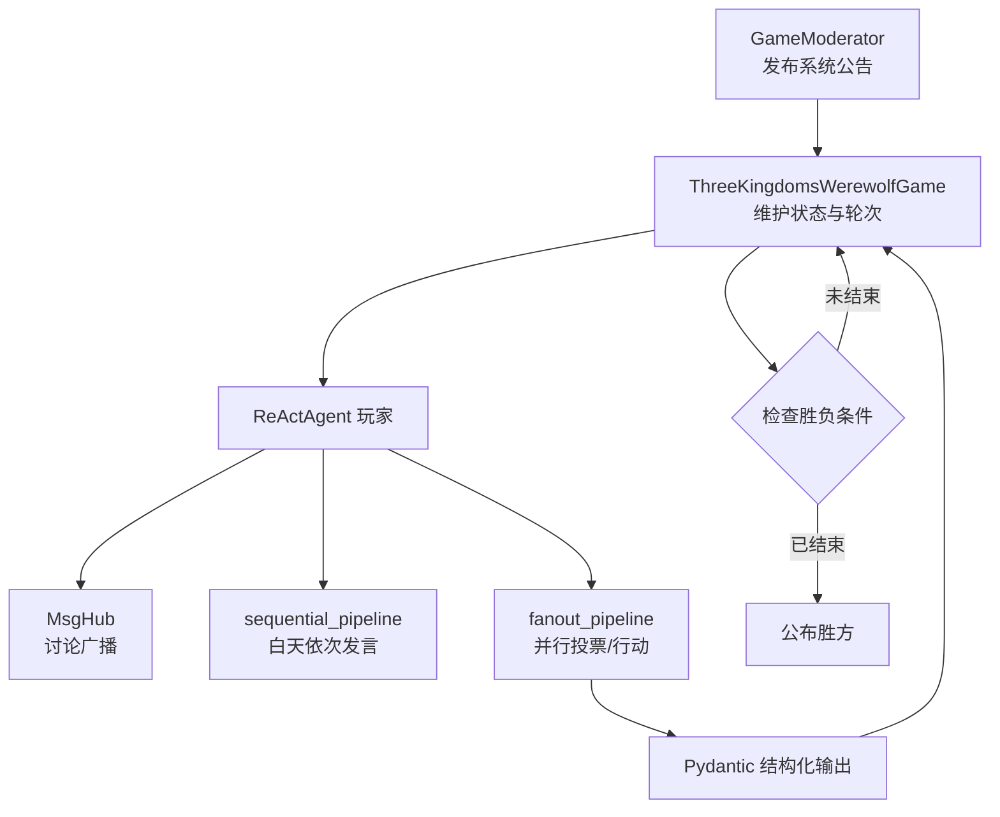
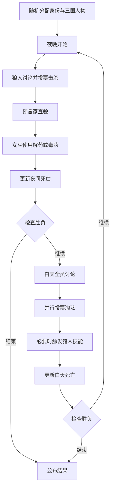

# AgentScope：三国主题多智能体狼人杀

[返回仓库总览](../README.md) · [查看项目目录](AgentScope/)

## 项目简介

`AgentScope/` 使用 AgentScope 构建了一个六人三国狼人杀模拟系统。程序将刘备、关羽、
曹操、诸葛亮等三国人物随机映射为狼人、预言家、女巫、猎人或村民，并通过多智能体
消息广播、并行投票和结构化输出推进夜晚与白天阶段。

该项目重点展示多智能体通信、角色私有信息、并行决策、结构化动作以及共享游戏状态的
组合方式。

## 学习目标

- 使用 `ReActAgent` 创建具有角色设定的玩家。
- 使用 `MsgHub` 实现局部或全体消息广播。
- 使用 `sequential_pipeline` 组织依次发言。
- 使用 `fanout_pipeline` 并行收集投票或技能动作。
- 使用 Pydantic 模型约束投票、查验、击杀和技能输出。
- 在 Python 主循环中维护存活状态、道具状态和胜负条件。

## 游戏角色

| 身份 | 阵营 | 能力 |
| --- | --- | --- |
| 狼人 | 狼人阵营 | 夜晚讨论并投票击杀一名非狼人玩家 |
| 预言家 | 好人阵营 | 每晚查验一名玩家的阵营 |
| 女巫 | 好人阵营 | 拥有一瓶解药和一瓶毒药 |
| 猎人 | 好人阵营 | 被投票淘汰时可以带走一名玩家 |
| 村民 | 好人阵营 | 通过发言、推理和投票寻找狼人 |
| 守护者 | 好人阵营 | 角色表已定义，但当前主流程尚未实现守护阶段 |

默认六人局使用：

```text
2 狼人 + 1 预言家 + 1 女巫 + 2 村民
```

三国人物只决定玩家名称和提示词风格，真实游戏身份由程序单独保存。

## 系统架构



## 游戏流程



最多进行 `MAX_GAME_ROUND = 10` 轮，每个狼人夜间讨论阶段最多进行
`MAX_DISCUSSION_ROUND = 3` 轮。

## 目录结构

```text
hello_agent_06/
├── AGENTSCOPE.md
└── AgentScope/
    ├── main_cn.py               # 游戏入口、阶段编排和状态更新
    ├── game_roles.py            # 身份、阵营、技能与三国人物特征
    ├── prompt_cn.py              # 不同身份的中文 System Prompt
    ├── structured_output_cn.py   # 投票、技能和讨论的 Pydantic 模型
    ├── utils_cn.py               # 主持人、投票、胜负判断和辅助函数
    └── .env                      # 本地模型配置，不上传 GitHub
```

## 核心模块

### `main_cn.py`

`ThreeKingdomsWerewolfGame` 保存：

- 所有玩家、身份映射和当前存活玩家。
- 狼人、预言家、女巫、猎人和村民列表。
- 女巫解药、毒药的剩余状态。
- 夜晚、白天、死亡更新和胜负判断流程。

### `game_roles.py`

`GameRoles` 定义身份描述、技能、胜利条件和阵营，并提供 6、8、9 人标准身份配置。

### `prompt_cn.py`

根据身份和三国人物生成角色提示词。提示词要求讨论阶段返回：

```json
{
  "reach_agreement": true,
  "confidence_level": 8,
  "key_evidence": "当前推理依据"
}
```

### `structured_output_cn.py`

使用 Pydantic 对关键决策进行约束，包括：

- `DiscussionModelCN`
- `VoteModelCN`
- `WitchActionModelCN`
- `SeerModelCN`
- `HunterModelCN`
- `WerewolfKillModelCN`

动态模型会把当前存活玩家姓名转换为 `Literal` 候选值，从而减少模型输出不存在玩家的
概率。

### `utils_cn.py`

包含多数投票、胜负判断、姓名格式化、简单发言分析及 `GameModerator`。主持人使用系统
消息发布阶段公告，并保存游戏日志。

## 模型配置

入口会读取 `AgentScope/.env`：

```dotenv
LLM_MODEL_ID=模型ID
LLM_API_KEY=你的API密钥
LLM_BASE_URL=OpenAI兼容接口地址
```

项目通过 `OpenAIChatModel` 连接 OpenAI 兼容服务：

```python
OpenAIChatModel(
    model_name=os.environ["LLM_MODEL_ID"],
    api_key=os.environ["LLM_API_KEY"],
    client_kwargs={"base_url": os.environ["LLM_BASE_URL"]},
    generate_kwargs={
        "extra_body": {"enable_thinking": False},
    },
)
```

结构化输出会使用工具调用约束模型。Qwen thinking 模式不支持
`tool_choice="required"`，因此当前代码显式设置 `enable_thinking=False`。

## 环境安装

本地代码验证环境使用 `agentscope==1.0.21`：

```powershell
G:\conda_envs\agent\python.exe -m pip install `
  "agentscope==1.0.21" `
  "openai>=1.0.0" `
  "pydantic>=2.0.0" `
  "python-dotenv>=1.0.0"
```

如果出现 `mcp.client.streamable_http` 导入错误，通常是 AgentScope 与 MCP 包版本不兼容，
应在同一解释器中重新安装与当前 AgentScope 版本匹配的依赖。

## 运行

```powershell
G:\conda_envs\agent\python.exe G:\AI\hello-agent\hello_agent_06\AgentScope\main_cn.py
```

程序会自动创建六名玩家并运行完整游戏，不需要人工逐轮输入。可按 `Ctrl+C` 中断。

## 常见问题

### 401 `InvalidApiKey`

密钥无效、已经过期，或 `.env` 不在 `AgentScope` 目录。确认密钥对应
`LLM_BASE_URL` 所属服务商。

### `tool_choice` 在 thinking 模式下不受支持

结构化输出需要强制工具调用，而部分 Qwen thinking 模型拒绝该参数组合。当前
`main_cn.py` 已通过 `extra_body={"enable_thinking": False}` 关闭 thinking 模式。

### `streamablehttp_client` 导入失败

这是 `agentscope` 和 `mcp` 的依赖版本不匹配，不是游戏代码语法错误。请确认运行解释器
为 `G:\conda_envs\agent\python.exe`，并在该环境中统一升级或重新安装依赖。

### 游戏异常后退出代码仍为 0

`run_game()` 捕获异常并打印堆栈，但没有重新抛出异常，因此主进程可能以 0 退出。退出码
只能说明异常被程序捕获，不能据此判断游戏已经成功完成。

## 当前边界

- 守护者身份已定义，但主游戏循环没有守护阶段。
- 狼人击杀模型的 `target` 是普通字符串，约束弱于动态 `Literal` 投票模型。
- 平票目前直接由 `Counter.most_common(1)` 选择一个结果，没有二次投票。
- 模型调用次数较多，完整游戏可能产生较高耗时和费用。
- 游戏逻辑主要用于框架学习，不等同于严格的狼人杀规则引擎。
- 自动降级会把无效狼人票随机替换，因此不同运行结果不可完全复现。

## 参考资料

- [Hello-Agents 第六章：框架开发实践](https://github.com/datawhalechina/hello-agents/blob/main/docs/chapter6/%E7%AC%AC%E5%85%AD%E7%AB%A0%20%E6%A1%86%E6%9E%B6%E5%BC%80%E5%8F%91%E5%AE%9E%E8%B7%B5.md)
- [AgentScope 官方文档](https://doc.agentscope.io/)

