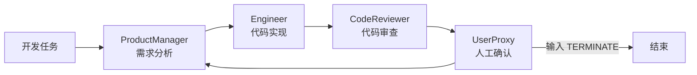

# AutoGen：基于轮询群聊的软件开发团队

[返回仓库总览](../README.md) · [查看源码](AutoGen.py) · [查看动态增强版](AUTOGEN_PRO.md)

## 项目简介

`AutoGen.py` 使用 AutoGen AgentChat 构建了一个由多个角色组成的软件开发团队。团队围绕
“开发比特币价格显示应用”这一任务展开协作，依次完成需求分析、代码实现、代码审查和
用户确认。

该示例的重点不是比特币应用本身，而是理解 AutoGen 如何将多个具有不同 System Message
的智能体组织为一场群聊，并通过共享对话上下文完成角色分工。

## 学习目标

- 使用 `AssistantAgent` 定义产品经理、工程师和代码审查员。
- 使用 `UserProxyAgent` 表示需要人工参与的用户代理。
- 使用 `RoundRobinGroupChat` 实现固定顺序的多智能体协作。
- 使用 `TextMentionTermination` 根据终止词结束对话。
- 使用 `OpenAIChatCompletionClient` 连接 OpenAI 兼容模型服务。
- 理解轮询协作的优势、限制和人工输入阻塞问题。

## 团队角色

| 角色 | 类型 | 主要职责 |
| --- | --- | --- |
| `ProductManager` | `AssistantAgent` | 分析需求、划分功能、给出技术建议和验收标准 |
| `Engineer` | `AssistantAgent` | 编写完整 Python/Streamlit 代码并处理异常情况 |
| `CodeReviewer` | `AssistantAgent` | 检查质量、安全性、可维护性和错误处理 |
| `UserProxy` | `UserProxyAgent` | 代表用户测试代码，并在完成后输出 `TERMINATE` |

每个角色的能力边界由独立的 System Message 描述。模型相同，但角色提示词、任务阶段和
输出要求不同，因此能够形成面向软件开发的职责分工。

## 协作流程



`RoundRobinGroupChat` 始终按照参与者列表中的固定顺序选择发言者：

```text
ProductManager → Engineer → CodeReviewer → UserProxy → ProductManager → ...
```

这种方式结构简单、过程直观，但无法根据当前结论自动跳转。例如代码存在缺陷时，审查员
不能直接把任务退回工程师；需求发生变化时，也不能直接回到产品经理。相关问题在
[`AutoGen_pro.py`](AutoGen_pro.py) 中通过动态路由解决。

## 核心代码

### 模型客户端

`create_openai_model_client()` 从环境变量读取模型信息，并显式提供非官方模型所需的
`model_info`：

```python
OpenAIChatCompletionClient(
    model=model,
    api_key=api_key,
    base_url=base_url,
    model_info={
        "vision": False,
        "function_calling": False,
        "json_output": False,
        "structured_output": False,
        "family": "unknown",
    },
)
```

### 终止条件

```python
termination = TextMentionTermination("TERMINATE")
```

任意对话消息包含 `TERMINATE` 时都可能触发终止。基础版依赖 `UserProxy` 在人工验证后
输入该标记。

### 团队编排

```python
team_chat = RoundRobinGroupChat(
    participants=[
        product_manager,
        engineer,
        code_reviewer,
        user_proxy,
    ],
    termination_condition=termination,
    max_turns=20,
)
```

`max_turns=20` 是防止对话无限进行的硬上限，不代表任务一定能够在 20 轮内成功完成。

## 项目结构

```text
hello_agent_06/
├── AutoGen.py          # 本项目源码
├── AUTOGEN.md          # 本文档
├── AutoGen_pro.py      # 动态路由增强版
├── AUTOGEN_PRO.md      # 增强版说明
└── .env                # 本地模型配置，不上传 GitHub
```

## 环境安装

参考章节以 AutoGen 0.7.4 为例；本项目沿用同一代 AgentChat 组合式接口，并在本地
`autogen-agentchat==0.7.5` 和 `autogen-ext==0.7.5` 环境中验证：

```powershell
G:\conda_envs\agent\python.exe -m pip install `
  "autogen-agentchat==0.7.5" `
  "autogen-ext[openai]==0.7.5" `
  "python-dotenv>=1.0.0"
```

## 配置

在 `hello_agent_06/.env` 中配置：

```dotenv
LLM_MODEL_ID=模型ID
LLM_API_KEY=你的API密钥
LLM_BASE_URL=OpenAI兼容接口地址
```

例如使用第三方 OpenAI 兼容服务时，`LLM_MODEL_ID` 必须是该服务实际支持的模型名称。
不要直接照抄其他平台的模型 ID。

> [!CAUTION]
> `.env` 包含密钥，只能保留在本地。仓库根目录 `.gitignore` 已配置 `**/.env` 和
> `**/.env.*`，上传前仍应通过 `git status` 再次确认。

## 运行

```powershell
G:\conda_envs\agent\python.exe G:\AI\hello-agent\hello_agent_06\AutoGen.py
```

运行过程会依次显示产品经理、工程师和代码审查员的输出。当程序停在用户代理阶段时，
需要在控制台输入反馈；确认完成后输入：

```text
TERMINATE
```

## 为什么会停在“请用户代理测试”

这不是程序死循环，而是 `UserProxyAgent` 正在等待人工输入。基础版把最终测试职责交给
用户代理，因此代码审查结束后程序会暂停。

可以采用以下方式处理：

1. 在控制台输入测试意见，让团队继续下一轮。
2. 如果已经确认完成，输入 `TERMINATE`。
3. 如果希望全自动运行，改用增强版的 `QualityAssurance` 自动静态测试流程。

## 常见问题

### `AssertionError: model`

`LLM_MODEL_ID` 为空或不是字符串。检查 `.env` 是否位于运行目录可读取的位置，并确认
变量名完全一致。

### `model_info is required`

第三方模型名称不能被 AutoGen 自动识别，需要像当前代码一样显式设置 `model_info`。

### 模型返回 404

通常表示 `LLM_BASE_URL` 或 `LLM_MODEL_ID` 与服务商不匹配。404 不是 Python 包安装问题，
应到模型服务商控制台核对接口地址和模型名称。

### 对话没有结束

确认消息中出现完全一致的 `TERMINATE`，同时检查是否已经达到 `max_turns`。基础版的
终止协议依赖语言输出，因此可能受模型遵循指令能力影响。

## 局限与改进方向

- 固定轮询会让无关角色也被迫发言。
- 需求变更无法直接回退到产品经理。
- 代码缺陷无法直接返回工程师。
- 用户代理需要人工输入，不适合无人值守任务。
- 没有真正执行代码或自动化测试。
- 仅依赖终止词，可能出现过早终止或无法终止。

增强版通过 `SelectorGroupChat`、显式路由标签、QA 工具和质量监控机制处理上述问题：

> [AutoGen Pro：动态回退、自动 QA 与质量监控](AUTOGEN_PRO.md)

## 参考资料

- [Hello-Agents 第六章：框架开发实践](https://github.com/datawhalechina/hello-agents/blob/main/docs/chapter6/%E7%AC%AC%E5%85%AD%E7%AB%A0%20%E6%A1%86%E6%9E%B6%E5%BC%80%E5%8F%91%E5%AE%9E%E8%B7%B5.md)
- [AutoGen AgentChat 文档](https://microsoft.github.io/autogen/stable/user-guide/agentchat-user-guide/index.html)
