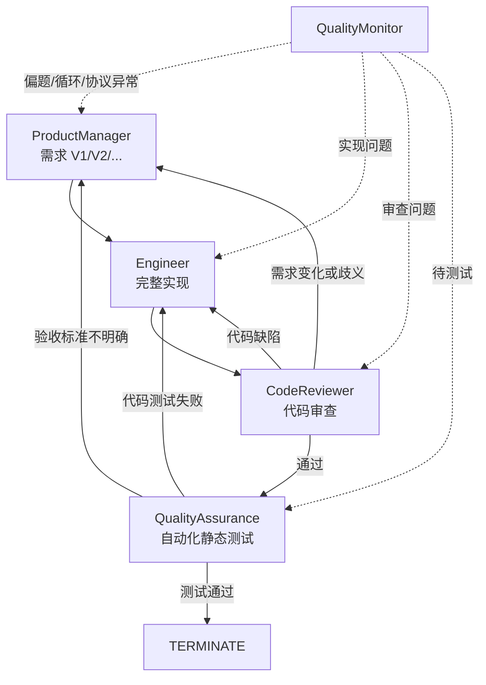

# AutoGen Pro：支持动态回退、自动 QA 与对话质量监控的软件团队

[返回仓库总览](../README.md) · [查看源码](AutoGen_pro.py) · [查看基础版](AUTOGEN.md)

`AutoGen_pro.py` 是 `AutoGen.py` 的增强版本。基础版使用
`RoundRobinGroupChat`，所有角色按照固定顺序发言；增强版改用
`SelectorGroupChat` 和确定性 `selector_func`，根据每轮结论动态选择下一角色。

## 1. 项目目标

增强版重点解决基础轮询团队的三个问题：

1. 需求发生变化时，流程必须返回产品经理更新需求版本，而不是机械进入下一角色。
2. 代码审查完成后，需要独立测试工程师执行自动化检查。
3. 对话出现偏题、重复往返或路由协议异常时，需要及时干预并限制总轮数。

基础版与增强版的差异如下：

| 维度 | `AutoGen.py` | `AutoGen_pro.py` |
| --- | --- | --- |
| 群聊类型 | `RoundRobinGroupChat` | `SelectorGroupChat` |
| 发言顺序 | 固定轮询 | 根据结果动态路由 |
| 需求变更 | 无专用回退 | 返回 `ProductManager` 并升级需求版本 |
| 代码缺陷 | 等待下一轮 | 直接返回 `Engineer` |
| 测试角色 | 人工 `UserProxy` | 自动 `QualityAssurance` |
| 对话监控 | 最大轮数 | 规则监控、监控智能体和最大轮数 |
| 成功终止 | 任意消息命中终止词 | 仅 QA 可以输出成功终止词 |

## 2. 团队角色

| 角色 | 职责 |
| --- | --- |
| `ProductManager` | 维护需求版本、验收标准和需求变更 |
| `Engineer` | 实现完整代码并修复审查或测试缺陷 |
| `CodeReviewer` | 区分代码缺陷与需求变更 |
| `QualityAssurance` | 调用自动化静态测试工具并作出发布判断 |
| `QualityMonitor` | 检测偏题、重复循环、需求漂移和路由异常 |

## 3. 动态回退



角色必须使用明确的控制标签：

```text
[ROUTE:Engineer]
[REVIEW:APPROVED]
[REVIEW:CODE_CHANGES]
[REVIEW:REQUIREMENT_CHANGE]
[QA:PASSED]
[QA:FAILED_CODE]
[QA:FAILED_REQUIREMENT]
[MONITOR:OK]
[MONITOR:INTERVENE]
```

选择器优先执行质量监控干预，其次解析显式 `ROUTE`，不会让语言模型任意猜测
下一位发言者。

### 需求变更示例

```text
Engineer
  ↓
CodeReviewer
  ↓ [REVIEW:REQUIREMENT_CHANGE]
ProductManager：V1 → V2，更新影响范围和验收标准
  ↓
Engineer：按照 V2 重新实现
```

产品经理不会直接修改代码，工程师也不能自行改变验收标准，从而保持需求决策与实现职责
相互分离。

## 4. 测试工程师

测试工程师注册了 `run_python_static_tests` 工具。工具会：

- 从 Markdown 中提取最新 Python 代码块。
- 使用 `ast.parse()` 检查语法。
- 使用 `compile()` 检查可编译性。
- 检查 Streamlit 和 HTTP 客户端导入。
- 检查异常处理、请求超时、刷新按钮和价格字段。
- 检查 `eval`、`exec`、`os.system` 和 `subprocess` 等高风险调用。
- 检查疑似硬编码密钥。

该工具不会运行生成代码、访问网络或写入文件，因此属于受控静态测试，而不是完整
运行时或浏览器端到端测试。

### QA 判断

| QA 结论 | 含义 | 下一步 |
| --- | --- | --- |
| `[QA:PASSED]` | 所有静态检查通过 | 输出 `TERMINATE` |
| `[QA:FAILED_CODE]` | 代码存在可复现问题 | 返回 `Engineer` |
| `[QA:FAILED_REQUIREMENT]` | 验收标准无法确定 | 返回 `ProductManager` |

## 5. 对话质量监控

质量控制器在以下情况介入：

1. 达到定期检查间隔。
2. 同一角色连续输出高度相似内容。
3. 出现 A-B-A-B 式重复回退。
4. 最近回复与原始任务缺少关键词关联。
5. 相同角色转换重复三次以上。
6. 角色遗漏合法的 `[ROUTE:角色]` 标签。

除上述监控外，系统还设置：

```text
max_turns = 30
max_messages = 45
```

只有 `QualityAssurance` 输出 `TERMINATE` 才能以测试通过状态结束；其他角色即使输出
相同单词也不会触发成功终止。

## 6. 项目结构

```text
hello_agent_06/
├── AutoGen.py          # 固定轮询基础版
├── AUTOGEN.md          # 基础版文档
├── AutoGen_pro.py      # 动态回退增强版
├── AUTOGEN_PRO.md      # 本文档
└── .env                # 本地模型配置，不上传 GitHub
```

## 7. 环境安装

参考章节以 AutoGen 0.7.4 为例；增强版沿用同一代 AgentChat 组合式接口，并在本地
`autogen-agentchat==0.7.5` 和 `autogen-ext==0.7.5` 环境中验证：

```powershell
G:\conda_envs\agent\python.exe -m pip install `
  "autogen-agentchat==0.7.5" `
  "autogen-ext[openai]==0.7.5" `
  "python-dotenv>=1.0.0"
```

## 8. 模型配置

程序读取同目录 `.env`：

```dotenv
LLM_MODEL_ID=服务商支持的模型ID
LLM_API_KEY=你的API密钥
LLM_BASE_URL=OpenAI兼容接口地址
```

模型必须支持 OpenAI 风格 Function Calling，因为测试工程师需要调用工具。当前代码
为兼容 Qwen 工具调用，显式设置：

```python
extra_body={"enable_thinking": False}
```

> [!CAUTION]
> `.env` 不能上传 GitHub。程序虽然会检查变量是否存在，但不会判断密钥是否有效；401
> 仍需到模型服务商控制台核对。

## 9. 运行

```powershell
G:\conda_envs\agent\python.exe G:\AI\hello-agent\hello_agent_06\AutoGen_pro.py
```

运行中按 `Ctrl+C` 可以停止。

## 10. 离线验证

当前版本已经完成以下不调用模型 API 的检查：

- Python 语法编译。
- 五个角色和 `SelectorGroupChat` 的对象构造。
- 初始路由和常规角色交接。
- 审查发现需求变更后退回产品经理。
- 审查通过后进入 QA。
- QA 失败后返回工程师或产品经理。
- 高相似度重复输出触发质量监控。
- 合法 Streamlit 示例通过静态检查。
- `eval` 等高风险调用被静态检查拦截。

真实模型协作结果仍取决于模型服务、网络、模型指令遵循能力和工具调用兼容性。

## 11. 常见问题

### `tool_choice` 与 thinking 模式冲突

QA 需要调用测试工具，而部分 Qwen thinking 模式不支持强制工具选择。当前客户端已通过
`extra_body={"enable_thinking": False}` 关闭 thinking 模式。

### 频繁进入 `QualityMonitor`

可能原因包括角色遗漏 `[ROUTE:...]` 标签、回复内容高度重复，或达到定期检查间隔。
监控介入是预设流程，不代表程序崩溃。

### 达到最大消息数仍未成功

说明团队没有形成 QA 通过结论。程序会停止以避免无限消耗；应检查最近一次审查、测试
失败原因和模型对路由协议的遵循情况。

### QA 通过是否代表应用可以发布

不是。当前 QA 不执行模型代码，只进行语法和静态质量检查。Streamlit 启动、真实 API
响应、浏览器交互和端到端行为仍需在隔离环境中验证。

## 12. 设计边界

- 自动测试只做语法和静态质量检查，不执行不可信代码。
- 静态规则不能代替真实 Streamlit 启动、网络请求和浏览器测试。
- 质量监控采用规则与监控智能体结合，仍可能出现误报。
- 模型若持续忽略路由协议，流程会在最大消息数处停止。
- 涉及真实代码执行时，应使用隔离容器、资源限制、网络策略和人工批准。

## 参考资料

- [Hello-Agents 第六章：框架开发实践](https://github.com/datawhalechina/hello-agents/blob/main/docs/chapter6/%E7%AC%AC%E5%85%AD%E7%AB%A0%20%E6%A1%86%E6%9E%B6%E5%BC%80%E5%8F%91%E5%AE%9E%E8%B7%B5.md)
- [AutoGen Selector Group Chat](https://microsoft.github.io/autogen/stable/user-guide/agentchat-user-guide/selector-group-chat.html)
