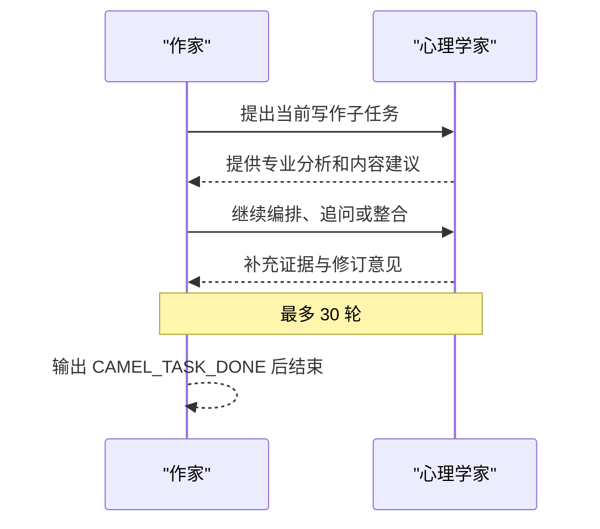

# CAMEL：心理学家与作家的角色扮演协作

[返回仓库总览](../README.md) · [查看源码](Camel.py)

## 项目简介

`Camel.py` 使用 CAMEL 的 `RolePlaying` 范式创建“心理学家—作家”双智能体团队。两个角色
围绕同一任务持续交换消息，共同创作一篇面向普通读者的“拖延症心理学”短篇电子书。

该案例展示 CAMEL 的核心思想：通过角色定义、任务约束和 inception prompting，使两个
智能体在较少的编排代码下形成自主协作。

## 学习目标

- 使用 `ModelFactory` 接入 Qwen 模型服务。
- 使用 `RolePlaying` 创建双智能体角色扮演会话。
- 理解 assistant role 与 user role 的职责分工。
- 使用轮次上限和完成标记控制对话终止。
- 观察自然语言协作的涌现性与不稳定性。

## 协作任务

项目要求团队创作约 800 字的心理学科普电子书，并满足：

- 内容基于实证研究。
- 面向普通读者，减少不必要术语。
- 包含改善建议和案例分析。
- 具有引言、核心章节和总结。

角色配置如下：

| CAMEL 角色 | 代码名称 | 职责 |
| --- | --- | --- |
| Assistant Role | 心理学家 | 提供理论、证据、概念解释和专业审校 |
| User Role | 作家 | 组织内容、提出写作任务并形成大众化表达 |

## 工作流程



程序通过以下代码初始化会话：

```python
role_play_session = RolePlaying(
    assistant_role_name="心理学家",
    user_role_name="作家",
    task_prompt=task_prompt,
    model=model,
)
```

随后调用 `init_chat()` 获得第一条消息，并在循环中执行：

```python
assistant_response, user_response = role_play_session.step(input_msg)
```

## 终止机制

系统设置双重限制：

```python
chat_turn_limit = 30
```

以及自然语言完成标记：

```text
CAMEL_TASK_DONE
```

如果作家回复中出现完成标记，程序提前结束；否则最多运行 30 轮。轮次上限是防止开放式
角色对话无限持续的重要保护措施。

## 项目结构

```text
hello_agent_06/
├── Camel.py       # CAMEL 双智能体示例
├── CAMEL.md       # 本文档
└── .env           # 本地模型配置，不上传 GitHub
```

## 环境安装

本地代码验证环境使用 `camel-ai==0.2.75`：

```powershell
G:\conda_envs\agent\python.exe -m pip install `
  "camel-ai==0.2.75" `
  "colorama>=0.4.6" `
  "python-dotenv>=1.0.0"
```

CAMEL 更新较快。如果安装其他版本后出现导入错误，应首先核对
`RolePlaying`、`ModelFactory` 和 `ModelPlatformType` 的接口是否发生变化。

## 配置

在 `hello_agent_06/.env` 中填写：

```dotenv
LLM_MODEL_ID=百炼平台支持的Qwen模型ID
LLM_API_KEY=你的百炼API密钥
LLM_BASE_URL=模型服务地址
```

源码使用：

```python
ModelFactory.create(
    model_platform=ModelPlatformType.QWEN,
    model_type=LLM_MODEL_ID,
    url=LLM_BASE_URL,
    api_key=LLM_API_KEY,
)
```

因此密钥、平台类型、模型名称和 URL 必须属于同一服务商配置。

## 运行

```powershell
G:\conda_envs\agent\python.exe G:\AI\hello-agent\hello_agent_06\Camel.py
```

程序会依次显示：

1. 原始协作任务。
2. CAMEL 扩展后的具体任务描述。
3. 作家和心理学家的逐轮回复。
4. 完成提示或最终对话轮数。

## 常见问题

### 401 `InvalidApiKey`

当前密钥无效、已过期，或密钥不属于 `ModelPlatformType.QWEN` 对应的平台。重新生成密钥，
并确认 `.env` 被当前 Python 进程读取。

### 模型名称无效

`LLM_MODEL_ID` 必须使用服务商实际提供的模型 ID，不能使用网页产品名称或其他平台别名。

### 达到 30 轮仍未完成

模型没有按约定输出 `CAMEL_TASK_DONE`。可以在任务提示词中进一步强调结束条件，或增加
独立的完成度评估器，不应只依赖关键词。

### 导入脚本后立即开始运行

当前 `Camel.py` 的会话创建和循环位于模块顶层，没有使用
`if __name__ == "__main__"` 保护。因此导入该文件也会执行任务。作为教学示例可以直接
运行；若要复用为模块，建议把主流程封装为函数。

## 设计特点与边界

| 维度 | 特点 |
| --- | --- |
| 协作方式 | 双智能体自然语言角色扮演 |
| 控制强度 | 较弱，主要依赖任务提示词 |
| 优势 | 代码短、角色分工自然、适合内容共创 |
| 风险 | 可能重复、偏题、事实依据不足或忘记完成标记 |
| 适用场景 | 写作、头脑风暴、专家咨询、方案迭代 |

如果任务包含严格审批、动态回退、外部工具验证或不可跳过的质量门，宜增加状态机、监督
智能体或确定性路由，而不是仅依赖自由对话。

## 参考资料

- [Hello-Agents 第六章：框架开发实践](https://github.com/datawhalechina/hello-agents/blob/main/docs/chapter6/%E7%AC%AC%E5%85%AD%E7%AB%A0%20%E6%A1%86%E6%9E%B6%E5%BC%80%E5%8F%91%E5%AE%9E%E8%B7%B5.md)
- [CAMEL 官方文档](https://docs.camel-ai.org/)

