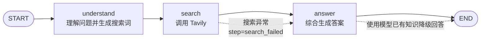
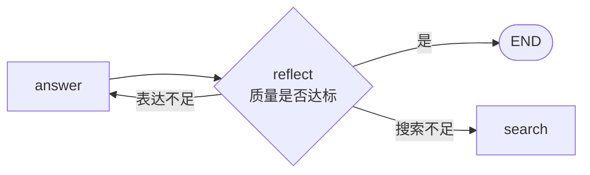

# LangGraph：基于状态图的智能搜索助手

[返回仓库总览](../README.md) · [查看源码](LangGraph.py)

## 项目简介

`LangGraph.py` 实现了一个“理解—搜索—回答”三阶段智能搜索助手。系统先利用大语言模型
理解用户问题并生成搜索关键词，再调用 Tavily 获取外部信息，最后依据搜索结果组织答案。

与自由对话式多智能体不同，LangGraph 将执行过程表示为显式状态和有向图，节点职责、
执行顺序及结束位置都由代码确定。

## 学习目标

- 使用 `TypedDict` 定义共享状态。
- 使用 `StateGraph` 构建节点和有向边。
- 使用 `add_messages` 合并对话消息。
- 使用 Tavily API 获取外部实时信息。
- 使用 `InMemorySaver` 保存图运行检查点。
- 理解搜索失败后的降级回答机制。

## 状态定义

`SearchState` 是所有节点共享的数据结构：

| 字段 | 作用 |
| --- | --- |
| `messages` | 保存用户消息和各节点生成的 AI 消息 |
| `user_query` | 保存模型对用户需求的理解 |
| `search_query` | 保存优化后的搜索关键词 |
| `search_results` | 保存 Tavily 返回并格式化后的搜索结果 |
| `final_answer` | 保存最终答案 |
| `step` | 标记当前执行阶段或失败状态 |

```python
class SearchState(TypedDict):
    messages: Annotated[list, add_messages]
    user_query: str
    search_query: str
    search_results: str
    final_answer: str
    step: str
```

节点只返回自己更新的状态字段，LangGraph 负责合并为新的全局状态。

## 工作流



### `understand_query_node`

- 从 `messages` 中找到最近一条 `HumanMessage`。
- 要求模型输出“理解”和“搜索词”。
- 通过字符串切分提取搜索关键词。
- 如果提取失败，退回原始用户输入。

### `tavily_search_node`

- 使用 `search_depth="basic"` 搜索。
- 最多请求 5 条结果，展示前 3 条。
- 优先加入 Tavily 的综合答案。
- 保留标题、摘要和来源 URL。
- 捕获搜索异常并设置 `step="search_failed"`。

### `generate_answer_node`

- 搜索成功时，依据搜索结果生成结构化答案并要求引用来源。
- 搜索失败时，使用模型已有知识回答，并要求声明信息来源边界。

## 图构建

```python
workflow.add_edge(START, "understand")
workflow.add_edge("understand", "search")
workflow.add_edge("search", "answer")
workflow.add_edge("answer", END)
```

当前图是确定性的线性流程。搜索失败不是条件边，而是由 `step` 字段在回答节点内部决定
使用正常提示词还是降级提示词。

## 检查点与会话

```python
memory = InMemorySaver()
app = workflow.compile(checkpointer=memory)
```

每次查询使用新的线程 ID：

```python
{"configurable": {"thread_id": f"search-session-{session_count}"}}
```

因此当前实现将每个问题视为独立会话，不会自动把上一问题的状态延续到下一问题。
`InMemorySaver` 也只保存当前进程中的数据，关闭程序后不会持久化。

## 项目结构

```text
hello_agent_06/
├── LangGraph.py     # 三阶段搜索工作流
├── LANGGRAPH.md     # 本文档
└── .env             # 模型与 Tavily 配置，不上传 GitHub
```

## 环境安装

本地代码环境使用 `langgraph==1.0.0a3`、`langchain-openai==0.3.33` 和
`tavily-python==0.7.26`：

```powershell
G:\conda_envs\agent\python.exe -m pip install `
  "langgraph==1.0.0a3" `
  "langchain-openai==0.3.33" `
  "tavily-python==0.7.26" `
  "python-dotenv>=1.0.0"
```

如果使用不同版本，应核对 `StateGraph`、`InMemorySaver` 和消息 API 是否兼容。

## 配置

在 `hello_agent_06/.env` 中填写：

```dotenv
LLM_MODEL_ID=模型ID
LLM_API_KEY=你的模型API密钥
LLM_BASE_URL=OpenAI兼容接口地址
TAVILY_API_KEY=你的Tavily密钥
```

`LLM_*` 用于问题理解与答案生成，`TAVILY_API_KEY` 只用于网页搜索。任何一个真实密钥都
不应提交到 GitHub。

## 运行

```powershell
G:\conda_envs\agent\python.exe G:\AI\hello-agent\hello_agent_06\LangGraph.py
```

启动后可以输入新闻、技术或事实类问题。退出命令包括：

```text
quit
q
exit
退出
```

## 常见问题

### 提示缺少 `TAVILY_API_KEY`

确认变量位于可读取的 `.env` 中。当前脚本只在主函数中显式检查 Tavily 密钥；模型配置
错误会在调用 `ChatOpenAI` 时报告。

### 搜索失败但程序继续回答

这是预设的降级逻辑。`tavily_search_node` 捕获异常后写入
`step="search_failed"`，回答节点转而使用模型已有知识。此时答案不代表实时搜索结果。

### 搜索词提取不准确

当前实现依赖模型输出“搜索词：”或“搜索关键词：”并使用字符串切分，格式稍有变化就会
退回原问题。更稳健的实现可以使用结构化输出模型。

### 多轮问题没有引用上一轮内容

每次输入都会生成新的 `thread_id`。若要实现真正的多轮记忆，需要复用同一线程 ID，并
明确设计历史消息裁剪和状态持久化策略。

## 局限与扩展

- 当前工作流没有答案质量评估和反思节点。
- 节点内部使用同步 `llm.invoke()`，长请求会占用当前异步执行线程。
- 关键词提取依赖自然语言格式。
- `InMemorySaver` 不提供跨进程持久化。
- 搜索结果可信度、来源冲突和时效性仍需评估。

可进一步增加：



该结构能够把线性流程扩展为可反思、可重试的闭环状态图。

## 参考资料

- [Hello-Agents 第六章：框架开发实践](https://github.com/datawhalechina/hello-agents/blob/main/docs/chapter6/%E7%AC%AC%E5%85%AD%E7%AB%A0%20%E6%A1%86%E6%9E%B6%E5%BC%80%E5%8F%91%E5%AE%9E%E8%B7%B5.md)
- [LangGraph 官方文档](https://docs.langchain.com/oss/python/langgraph/overview)
- [Tavily Python SDK](https://docs.tavily.com/sdk/python/quick-start)

