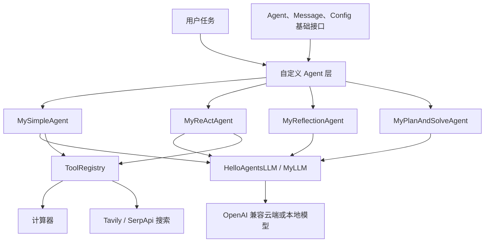

# 项目 07：基于 HelloAgents 的自定义智能体框架扩展


本项目对应 Datawhale Hello-Agents 第七章“构建你的智能体框架”，围绕统一模型接口、
Agent 基类、经典智能体范式和工具注册机制进行扩展实践。项目通过继承 `hello-agents`
提供的基础组件，实现自定义 LLM 客户端、SimpleAgent、ReAct、Reflection、
Plan-and-Solve、计算器工具和多源搜索工具。

> [!IMPORTANT]
> 本目录是基于 `hello-agents==0.1.1` 的扩展练习，不是从零复刻完整的
> `hello_agents` Python 包。框架的 `Agent`、`Message`、`Config`、
> `HelloAgentsLLM` 和 `ToolRegistry` 等基础设施由已安装的上游包提供，
> 本项目重点展示如何在不修改依赖源码的情况下扩展这些接口。

返回[仓库总览](../README.md)。

## 目录

- [学习目标](#学习目标)
- [实现内容](#实现内容)
- [总体架构](#总体架构)
- [项目结构](#项目结构)
- [安装与配置](#安装与配置)
- [运行方法](#运行方法)
- [核心模块](#核心模块)
- [验证状态](#验证状态)
- [已知边界](#已知边界)
- [上传 GitHub](#上传-github)
- [参考与许可](#参考与许可)

## 学习目标

- 理解“分层解耦、职责单一、接口统一”的轻量级框架设计原则。
- 使用统一的 OpenAI 兼容接口连接云端模型或本地推理服务。
- 通过继承和方法重写扩展 LLM 客户端与 Agent 行为。
- 将 SimpleAgent、ReAct、Reflection 和 Plan-and-Solve 组织到统一接口下。
- 使用 `ToolRegistry` 完成工具注册、发现与执行。
- 理解文本协议工具调用、多源搜索和安全表达式求值的实现边界。

## 实现内容

| 组件 | 当前实现 | 主要文件 | 状态 |
| --- | --- | --- | --- |
| 基础框架体验 | 创建 `HelloAgentsLLM` 和 `SimpleAgent`，维护对话历史 | `helloagentLLM.py` | ✅ 已实现 |
| LLM 扩展 | 为 ModelScope 增加独立配置分支，其余提供商回退到父类 | `my_llm.py` | ✅ 已实现 |
| SimpleAgent | 基础对话、流式输出、历史记录和文本协议工具调用 | `my_simple_agent.py` | ✅ 已实现 |
| ReAct | Thought–Action–Observation 循环、工具执行和最大步数限制 | `my_react_agent.py` | ✅ 已实现 |
| Reflection | 初始回答、质量反思、迭代改写和自定义提示词 | `my_reflection_agent.py` | ✅ 已实现 |
| Plan-and-Solve | 结构化计划解析、顺序执行、历史传递和步骤上限 | `my_plan_solve_agent.py` | ✅ 已实现 |
| 计算工具 | 基于 AST 的四则运算、平方根与圆周率计算 | `my_calculator_tool.py` | ✅ 离线验证通过 |
| 多源搜索 | Tavily 优先、SerpApi 回退的搜索工具 | `my_advanced_search.py` | 🟡 需要密钥与网络 |

第七章还讨论了 FunctionCallAgent、工具链和异步执行器等后续能力；当前目录尚未实现
这些组件，因此文档不将它们列为已完成功能。

## 总体架构



四种 Agent 范式承担不同职责：

| 范式 | 控制方式 | 适合任务 |
| --- | --- | --- |
| SimpleAgent | 直接对话，可选多轮工具调用 | 问答、轻量工具增强 |
| ReAct | 推理、行动、观察循环 | 需要边检索边决策的任务 |
| Reflection | 生成、批评、改写循环 | 文本完善、代码或方案优化 |
| Plan-and-Solve | 先生成完整计划，再顺序执行 | 可拆分的多步骤问题 |

## 项目结构

```text
helloagent/
├── README.md                       # 本项目文档
├── .env                            # 本地密钥配置，不上传 GitHub
├── helloagentLLM.py                # 原生 HelloAgents 快速体验
├── main.py                         # MyLLM 云端/本地模型调用模板
├── my_llm.py                       # ModelScope 提供商扩展
├── my_simple_agent.py              # 带可选工具调用的 SimpleAgent
├── my_react_agent.py               # ReAct 范式
├── my_reflection_agent.py          # Reflection 范式
├── my_plan_solve_agent.py          # Plan-and-Solve 范式
├── my_calculator_tool.py           # AST 计算器与注册函数
├── my_advanced_search.py           # Tavily/SerpApi 多源搜索
├── test_simple_agent.py            # SimpleAgent 综合示例
├── test_react_agent.py             # ReAct 综合示例
├── test_reflection_agent.py        # Reflection 综合示例
├── test_plan_solve_agent.py        # Plan-and-Solve 综合示例
├── test_my_calculator.py.py        # 计算器示例，保留现有文件名
└── test_advanced_search.py.py      # 多源搜索示例，保留现有文件名
```

> [!NOTE]
> 两个工具示例目前使用 `.py.py` 后缀。它们可以按文档中的完整文件名运行，但若后续
> 接入 `pytest`，建议先分别重命名为 `test_my_calculator.py` 和
> `test_advanced_search.py`。

## 安装与配置

### 1. 环境要求

- Python 3.10 或更高版本
- `hello-agents==0.1.1`
- 可访问的 OpenAI 兼容模型服务
- 可选：Tavily 或 SerpApi 搜索服务

### 2. 安装依赖

在 PowerShell 中执行：

```powershell
cd G:\AI\hello-agent\helloagent
G:\conda_envs\agent\python.exe -m pip install `
  "hello-agents==0.1.1" `
  "openai>=1.0.0" `
  "python-dotenv>=1.0.0"
```

如需运行多源搜索，再安装可选依赖：

```powershell
G:\conda_envs\agent\python.exe -m pip install `
  "tavily-python" `
  "google-search-results"
```

也可以按上游章节提供的搜索扩展方式安装：

```powershell
G:\conda_envs\agent\python.exe -m pip install "hello-agents[search]==0.1.1"
```

### 3. 配置 `.env`

根据使用的模型服务，在 `helloagent/.env` 中填写相应变量。以下仅为模板，不要提交
真实密钥：

```dotenv
# 通用 OpenAI 兼容配置
LLM_MODEL_ID=你的模型ID
LLM_API_KEY=你的模型API密钥
LLM_BASE_URL=OpenAI兼容接口地址

# 使用 provider="qwen" 时
DASHSCOPE_API_KEY=你的DashScope密钥

# 使用 MyLLM(provider="modelscope") 时
MODELSCOPE_API_KEY=你的ModelScope密钥
MODELSCOPE_BASE_URL=https://api-inference.modelscope.cn/v1/
MODELSCOPE_MODEL_ID=Qwen/Qwen2.5-VL-72B-Instruct

# 可选搜索服务
TAVILY_API_KEY=你的Tavily密钥
SERPAPI_API_KEY=你的SerpApi密钥
```

根目录 `.gitignore` 已使用 `**/.env` 和 `**/.env.*` 排除各项目的本地环境文件。

## 运行方法

以下命令均从项目目录执行：

```powershell
cd G:\AI\hello-agent\helloagent
```

### 1. 体验原生 HelloAgents

`helloagentLLM.py` 当前显式使用 `provider="qwen"`：

```powershell
G:\conda_envs\agent\python.exe .\helloagentLLM.py
```

该脚本创建基础 `SimpleAgent`、执行两轮对话并输出历史消息数量。脚本虽然创建了
`CalculatorTool`，但没有将其注册到原生 `SimpleAgent`；第二个问题仍由模型直接回答。

### 2. 运行自定义 LLM

`main.py` 是云端 ModelScope 与本地 vLLM 的切换模板。运行前必须取消注释其中一个
`llm = MyLLM(...)` 配置分支，否则 `llm` 未定义，脚本会抛出 `NameError`。

配置完成后运行：

```powershell
G:\conda_envs\agent\python.exe .\main.py
```

### 3. 运行四种 Agent 示例

这些脚本会调用实际模型服务并产生 API 消耗：

```powershell
G:\conda_envs\agent\python.exe .\test_simple_agent.py
G:\conda_envs\agent\python.exe .\test_react_agent.py
G:\conda_envs\agent\python.exe .\test_reflection_agent.py
G:\conda_envs\agent\python.exe .\test_plan_solve_agent.py
```

### 4. 运行工具示例

```powershell
G:\conda_envs\agent\python.exe .\test_my_calculator.py.py
G:\conda_envs\agent\python.exe .\test_advanced_search.py.py
```

计算器脚本后半部分也会调用 LLM；搜索脚本会访问已配置的外部搜索服务。

## 核心模块

### `MyLLM`

`MyLLM` 继承 `HelloAgentsLLM`。当 `provider="modelscope"` 时，它读取独立的
ModelScope 配置并直接创建 OpenAI 客户端；使用其他提供商时，通过
`super().__init__()` 保留上游框架的解析逻辑。

这种实现体现了“扩展而非修改依赖源码”的原则，但自定义分支依赖父类内部的
`_client` 约定。升级 `hello-agents` 后，应重新检查父类字段和调用接口。

### `MySimpleAgent`

`MySimpleAgent` 在基础对话与流式输出之上增加文本协议工具调用：

```text
[TOOL_CALL:{tool_name}:{parameters}]
```

Agent 使用正则表达式解析工具名称和参数，执行工具后将结果重新加入上下文，默认最多
循环三次。该方式便于理解工具调用过程，但稳定性取决于模型是否严格遵守格式。

### `MyReActAgent`

ReAct 使用以下循环：

```text
Question
   ↓
Thought：分析当前状态
   ↓
Action：调用工具或 Finish
   ↓
Observation：记录工具结果
   └──────────────→ 下一轮 Thought
```

`max_steps` 防止模型陷入无限循环；到达限制仍未输出 `Finish[...]` 时，Agent 返回明确的
失败信息。

### `MyReflectionAgent`

Reflection 先生成初始回答，再让模型输出反馈并据此改写。若反馈包含“无需改进”，循环
提前结束。`custom_prompts` 可以只覆盖 `initial`、`reflect` 或 `refine` 中的部分模板。

### `MyPlanAndSolveAgent`

Planner 必须返回由非空字符串组成的 Python 列表。实现使用 `ast.literal_eval()` 安全
解析计划，并通过 `max_steps` 控制最大步骤数。Executor 顺序执行每一步，同时接收原始
问题、完整计划和已完成步骤结果，最终返回最后一步的输出。

### 自定义工具

- `my_calculator`：只接受数字、`+`、`-`、`*`、`/`、`sqrt()` 和 `pi`，不使用
  Python `eval()`，避免直接执行任意代码。
- `advanced_search`：按可用性依次尝试 Tavily 和 SerpApi；某一后端异常时继续尝试
  下一后端，并在所有后端不可用时返回可诊断错误。

## 验证状态

当前已在以下环境完成本地检查：

```text
Python:       3.10.20
hello-agents: 0.1.1
语法编译:     通过
计算器冒烟测试: sqrt(16) + 2 * 3 = 10.0
```

可重复执行的离线检查：

```powershell
G:\conda_envs\agent\python.exe -m compileall -q .
G:\conda_envs\agent\python.exe -c "from my_calculator_tool import my_calculate; assert my_calculate('sqrt(16) + 2 * 3') == '10.0'; print('PASS')"
```

依赖真实 LLM 或搜索 API 的脚本未被视为离线单元测试；其结果还取决于密钥、网络、
模型兼容性和服务端状态。

## 已知边界

1. 当前项目依赖已安装的 `hello-agents`，没有在本目录重新实现完整的核心包。
2. `main.py` 默认没有启用任何 `llm` 初始化分支，直接运行会出现 `NameError`。
3. SimpleAgent 和 ReAct 使用提示词约束与文本解析，不是原生 Function Calling。
4. 示例测试大多是可直接运行的演示脚本，不是使用 Mock 隔离外部服务的单元测试。
5. 多源搜索没有对不同后端结果进行排序、去重或可信度校准，而是采用顺序回退策略。
6. 计算器只支持有限语法；负数、一元运算、幂运算和复杂数学函数尚未完整处理。
7. 当前未实现第七章后半部分涉及的 FunctionCallAgent、工具链和异步工具执行器。

## 上传 GitHub

当前 `G:\AI\hello-agent` 尚未初始化为 Git 仓库。先初始化仓库，再确认本地密钥和
缓存文件已被忽略：

```powershell
cd G:\AI\hello-agent
git init
git check-ignore -v .\helloagent\.env
git status --short
```

确认 `.env` 显示为已忽略后，首次上传可继续执行：

```powershell
cd G:\AI\hello-agent
git add .
git status --short
git commit -m "docs: add chapter 7 agent framework project"
git branch -M main
git remote add origin https://github.com/<你的用户名>/<仓库名>.git
git push -u origin main
```

执行 `git add .` 后务必再次检查暂存区，确保没有 `.env`、API Key、缓存、日志或私有
数据。若远程仓库已配置 `origin`，不要重复执行 `git remote add`，可使用
`git remote -v` 查看现有地址。

## 参考与许可

- [Datawhale Hello-Agents：第七章 构建你的智能体框架](https://github.com/datawhalechina/hello-agents/blob/main/docs/chapter7/%E7%AC%AC%E4%B8%83%E7%AB%A0%20%E6%9E%84%E5%BB%BA%E4%BD%A0%E7%9A%84Agent%E6%A1%86%E6%9E%B6.md)
- [HelloAgents 框架源码](https://github.com/jjyaoao/helloagents)
- [OpenAI Python SDK](https://github.com/openai/openai-python)
- [Tavily Python SDK](https://docs.tavily.com/sdk/python/quick-start)
- [SerpApi Python 集成文档](https://serpapi.com/integrations/python)

本项目是对上游教程的个人学习与工程实践。使用、修改或再发布相关内容时，请保留对
Datawhale Hello-Agents 及原作者的署名，并遵守上游项目的许可要求。
