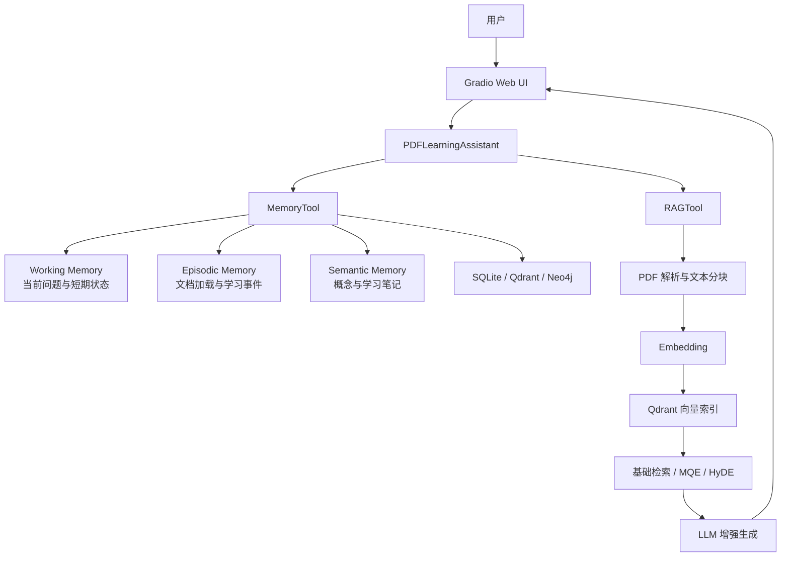
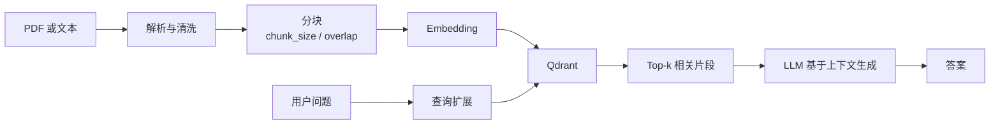

# 项目 08：记忆系统、RAG 与智能 PDF 学习助手


本项目对应 Datawhale Hello-Agents 第八章“记忆与检索”，在第七章统一 Agent 与工具接口的
基础上，引入 `MemoryTool` 和 `RAGTool`，并构建一个支持 PDF 知识库问答、学习笔记、
历史回顾和学习报告的 Gradio 应用。

项目包含三个最小示例与一个综合应用：

- `memory_eg.py`：添加、搜索和汇总智能体记忆。
- `RAG_eg.py`：写入文本知识、向量检索并查看知识库统计。
- `memory.py`：将 Memory 和 RAG 同时注册为 `SimpleAgent` 工具。
- `QA_Assistant.py`：面向 PDF 学习场景的完整 Web 应用。

> [返回仓库总览](../README.md) ·
> [参考第八章原文](https://github.com/datawhalechina/hello-agents/blob/main/docs/chapter8/%E7%AC%AC%E5%85%AB%E7%AB%A0%20%E8%AE%B0%E5%BF%86%E4%B8%8E%E6%A3%80%E7%B4%A2.md)

## 目录

- [学习目标](#学习目标)
- [实现内容](#实现内容)
- [系统架构](#系统架构)
- [记忆系统](#记忆系统)
- [RAG 系统](#rag-系统)
- [项目结构](#项目结构)
- [核心代码](#核心代码)
- [安装与配置](#安装与配置)
- [运行方法](#运行方法)
- [Web 应用使用流程](#web-应用使用流程)
- [验证状态](#验证状态)
- [常见问题](#常见问题)
- [实现边界](#实现边界)
- [上传 GitHub](#上传-github)
- [参考与许可](#参考与许可)

## 学习目标

- 理解为什么无状态 LLM 需要外部记忆与知识检索。
- 区分工作记忆、情景记忆、语义记忆和感知记忆的职责。
- 使用 `MemoryTool` 完成记忆添加、搜索与摘要。
- 使用 `RAGTool` 完成文本/PDF 入库、检索、问答与统计。
- 理解文档解析、分块、嵌入、向量检索和增强生成的数据流。
- 理解 MQE 与 HyDE 如何缓解查询表述和文档表述之间的语义差异。
- 使用 `user_id` 与 `rag_namespace` 隔离不同用户的记忆和知识库。
- 将记忆、检索和 Gradio 界面组合为可交互的 PDF 学习助手。

## 实现内容

| 模块 | 当前实现 | 主要文件 | 状态 |
| --- | --- | --- | --- |
| Memory 快速体验 | 添加三条语义记忆、关键词搜索、摘要统计 | `memory_eg.py` | ✅ 已实现 |
| RAG 快速体验 | 添加三段文本、向量搜索、知识库统计 | `RAG_eg.py` | ✅ 已实现 |
| Memory + RAG Agent | 将两个工具注册到 `SimpleAgent` | `memory.py` | ✅ 已实现 |
| PDF 文档入库 | 校验 PDF、分块并写入用户知识库 | `QA_Assistant.py` | ✅ 已实现 |
| 文档问答 | 基础检索或 MQE + HyDE 高级检索 | `QA_Assistant.py` | ✅ 已实现 |
| 学习记忆 | 记录文档、问题、学习事件与概念笔记 | `QA_Assistant.py` | ✅ 已实现 |
| 用户隔离 | `user_id` 隔离记忆，命名空间隔离 RAG 数据 | `QA_Assistant.py` | ✅ 已实现 |
| 学习报告 | 汇总会话、记忆与知识库统计并输出 JSON | `QA_Assistant.py` | ✅ 已实现 |
| Gradio 界面 | 初始化、上传、问答、笔记、统计和报告四个页面 | `QA_Assistant.py` | ✅ 界面构建验证通过 |

## 系统架构



系统包含两条互补的数据链路：

```text
记忆链路：交互事件 → 分类与重要性 → 持久化 → 搜索/摘要 → 学习回顾
知识链路：PDF/文本 → 解析 → 分块 → 嵌入 → 向量检索 → LLM 回答
```

记忆关注“用户和智能体经历过什么”，RAG 关注“外部文档中有什么”。两者结合后，系统既
能基于文档回答问题，也能记录用户的学习过程。

## 记忆系统

### 四类记忆

| 类型 | 作用 | 本项目示例 |
| --- | --- | --- |
| Working Memory | 保存当前任务中的短期信息，通常具有容量或 TTL 限制 | 当前提问 |
| Episodic Memory | 保存带有时间和情境的具体事件 | 加载文档、完成一次问答 |
| Semantic Memory | 保存稳定知识、概念、偏好或规则 | 用户主动记录的学习笔记 |
| Perceptual Memory | 保存图像、音频等多模态感知信息 | 框架支持，本项目未单独演示 |

### MemoryTool 操作

`memory_eg.py` 使用字典参数调用工具：

```python
memory_tool.run({
    "action": "add",
    "content": "用户张三是一名Python开发者",
    "memory_type": "semantic",
    "importance": 0.8,
})
```

当前示例使用三种操作：

| Action | 主要参数 | 作用 |
| --- | --- | --- |
| `add` | `content`、`memory_type`、`importance` | 添加记忆 |
| `search` | `query`、`limit` | 搜索相关记忆 |
| `summary` | 可选 `limit` | 汇总记忆状态 |

`importance` 用于表达记忆的重要程度。示例采用 `0.6`～`0.9`，但它不是模型置信度，
也不意味着记忆内容一定正确。

## RAG 系统

### 基本流程



`QA_Assistant.py` 入库 PDF 时使用：

```python
result = self.rag_tool.run({
    "action": "add_document",
    "file_path": pdf_path,
    "chunk_size": 1000,
    "chunk_overlap": 200,
    "namespace": self.rag_namespace,
})
```

问答时默认启用高级检索：

```python
answer = self.rag_tool.run({
    "action": "ask",
    "question": question,
    "limit": 5,
    "enable_advanced_search": True,
    "namespace": self.rag_namespace,
})
```

### MQE 与 HyDE

- **MQE（Multi-Query Expansion）**：将一个问题改写成多个语义相近或互补的查询，扩大
  候选文档覆盖范围。
- **HyDE（Hypothetical Document Embeddings）**：先让模型生成一段假设答案，再用其
  向量检索真实文档，缩小问题句与陈述性文档之间的表示差异。

高级检索通常能提高召回质量，但会增加 LLM 调用次数、延迟和 Token 消耗。对简单问题、
小型知识库或延迟敏感场景，可以把 `use_advanced_search` 设置为 `False`。

## 项目结构

```text
helloagent_08/
├── README.md                    # 项目 08 独立文档
├── memory.py                    # Memory + RAG 的 SimpleAgent 示例
├── memory_eg.py                 # MemoryTool 添加、搜索和摘要示例
├── RAG_eg.py                    # RAGTool 文本入库、检索和统计示例
├── QA_Assistant.py              # PDF 学习助手与 Gradio Web UI
├── Happy-LLM-0727.pdf           # 本地示例 PDF，上传 GitHub 前确认许可与必要性
├── .env                         # 本地服务密钥，不上传 GitHub
└── memory_data/
    └── memory.db                # 运行生成的 SQLite 数据，不建议上传 GitHub
```

运行过程中还可能生成：

```text
learning_report_session_*.json   # 学习报告
knowledge_base/                  # 本地知识库缓存（视框架配置而定）
__pycache__/                     # Python 缓存
```

这些文件属于本地输入或运行产物，不是项目源码。

## 核心代码

### `memory_eg.py`

该文件直接调用 `MemoryTool`，不依赖模型判断是否使用工具，因此适合验证记忆基础设施：

1. 为 `user123` 创建记忆空间。
2. 添加 Python、前端与产品经理三条语义记忆。
3. 搜索“前端工程师”。
4. 输出记忆摘要。

### `RAG_eg.py`

该文件创建独立集合与命名空间：

```python
rag_tool = RAGTool(
    knowledge_base_path="./knowledge_base",
    collection_name="test_collection",
    rag_namespace="test",
)
```

随后写入 Python、机器学习和 RAG 三段知识，并演示：

- `add_text`：写入文本知识；
- `search`：按语义搜索知识片段；
- `stats`：查看知识库状态。

### `memory.py`

该文件将两个工具注册给同一个 `SimpleAgent`：

```python
tool_registry = ToolRegistry()
tool_registry.register_tool(MemoryTool(user_id="user123"))
tool_registry.register_tool(RAGTool(knowledge_base_path="./knowledge_base"))
```

工具注册成功不代表模型一定会主动调用工具；模型是否正确选择和填写工具参数仍受模型能力、
系统提示词和框架工具协议影响。

### `QA_Assistant.py`

`PDFLearningAssistant` 是综合应用的核心类：

| 方法 | 作用 |
| --- | --- |
| `load_document()` | 校验并加载 PDF，记录文档加载事件 |
| `ask()` | 检索文档并回答问题，记录问题和学习事件 |
| `add_note()` | 将用户笔记写入语义记忆 |
| `recall()` | 搜索相关学习记忆 |
| `get_stats()` | 返回会话时长、文档、问题和笔记数量 |
| `generate_report()` | 合并记忆摘要和 RAG 状态并保存 JSON 报告 |

隔离策略如下：

```python
self.memory_tool = MemoryTool(user_id=user_id)
self.rag_namespace = f"pdf_{user_id}"
self.rag_tool = RAGTool(rag_namespace=self.rag_namespace)
```

这实现了逻辑命名空间隔离，但生产环境仍需要认证、授权和数据库访问控制，不能只依赖用户
在文本框中填写的 `user_id`。

## 安装与配置

### 1. Python 环境

当前代码已在以下主要版本组合中完成语法与界面构建检查：

```text
Python 3.10
hello-agents 0.2.8
gradio 4.44.1
qdrant-client 1.19.0
neo4j 6.3.0
spacy 3.8.16
```

安装完整依赖：

```powershell
G:\conda_envs\agent\python.exe -m pip install `
  "hello-agents[all]==0.2.8" `
  "gradio==4.44.1" `
  "python-dotenv>=1.0.0"
```

如果使用语义记忆中的中英文实体处理，还需要安装 spaCy 模型：

```powershell
G:\conda_envs\agent\python.exe -m spacy download zh_core_web_sm
G:\conda_envs\agent\python.exe -m spacy download en_core_web_sm
```

### 2. `.env` 配置

在 `helloagent_08/.env` 中配置。以下仅为模板，不要填写后上传 GitHub。

#### LLM

```dotenv
LLM_MODEL_ID=你的模型ID
LLM_API_KEY=你的API密钥
LLM_BASE_URL=OpenAI兼容接口地址
LLM_TIMEOUT=120
```

#### Qdrant

```dotenv
QDRANT_URL=https://你的集群地址:6333
QDRANT_API_KEY=你的Qdrant密钥
QDRANT_COLLECTION=hello_agents_vectors
QDRANT_VECTOR_SIZE=1024
QDRANT_DISTANCE=cosine
QDRANT_TIMEOUT=30
```

`QDRANT_VECTOR_SIZE` 必须与 Embedding 模型实际返回的向量维度一致。修改 Embedding 模型
后，如果维度变化，通常需要新建集合或重建现有索引。

#### Embedding

```dotenv
EMBED_MODEL_TYPE=dashscope
EMBED_MODEL_NAME=text-embedding-v3
EMBED_API_KEY=你的Embedding密钥
EMBED_BASE_URL=
```

框架还支持本地 Embedding 或 TF-IDF 兜底；具体模型类型和维度应以当前安装的
`hello-agents` 版本为准。

#### Neo4j

```dotenv
NEO4J_URI=neo4j+s://你的实例地址
NEO4J_USERNAME=neo4j
NEO4J_PASSWORD=你的数据库密码
NEO4J_DATABASE=neo4j
NEO4J_MAX_CONNECTION_LIFETIME=3600
NEO4J_MAX_CONNECTION_POOL_SIZE=50
NEO4J_CONNECTION_TIMEOUT=60
```

### 3. 环境变量加载

四个脚本均从当前脚本同级目录定位 `.env`：

```python
ENV_FILE = Path(__file__).with_name(".env")
load_dotenv(ENV_FILE, override=True)
```

`override=True` 用于覆盖 Windows 或 IDE 进程中遗留的同名旧变量，避免脚本误用其他项目
的密钥。

## 运行方法

进入项目目录：

```powershell
cd G:\AI\hello-agent\helloagent_08
```

### 记忆示例

```powershell
G:\conda_envs\agent\python.exe .\memory_eg.py
```

### RAG 示例

```powershell
G:\conda_envs\agent\python.exe .\RAG_eg.py
```

### Memory + RAG Agent

```powershell
G:\conda_envs\agent\python.exe .\memory.py
```

### PDF 学习助手

```powershell
G:\conda_envs\agent\python.exe .\QA_Assistant.py
```

默认地址：

```text
http://127.0.0.1:7860
```

停止服务时，在运行终端按 `Ctrl+C`。

## Web 应用使用流程


1. 在“开始使用”页输入用户 ID，点击“初始化助手”。
2. 上传 PDF 并等待分块、Embedding 和入库完成。
3. 在“智能问答”页提问；含“之前、学过、回顾、历史、记得”等关键词的输入会走记忆
   搜索，其余输入走文档问答。
4. 在“学习笔记”页保存概念与心得。
5. 在“学习统计”页查看指标并生成报告。

首次导入较大 PDF 时，需要进行文档解析、批量嵌入和向量写入，耗时取决于 PDF 大小、
Embedding 服务限流、网络质量和 Qdrant 性能。

## 验证状态

已完成：

- 四个 Python 文件通过 `py_compile` 语法检查。
- `QA_Assistant.create_gradio_ui()` 在 Gradio 4.44.1 下构建成功。
- `.env` 使用脚本绝对路径加载，避免工作目录变化导致找不到配置。
- PDF 类型和文件存在性校验已实现。
- Qdrant 初始化包含最多三次重试以及 TLS 连接错误提示。
- Memory/RAG 工具返回错误字符串时有显式检查，避免把失败误判为成功。

尚未在文档生成过程中执行：

- 未使用真实云端密钥完成端到端 Memory、RAG 与 PDF 问答测试。
- 未对检索准确率、召回率、延迟或 Token 成本进行基准评估。
- 未验证多用户并发、数据库故障恢复和生产环境安全性。

因此本项目应视为教学实现，而不是可直接部署的生产服务。

## 常见问题

### 1. `ImportError: cannot import name 'MemoryTool'` 或 `RAGTool`

旧版 `hello-agents` 不包含第八章接口。检查版本：

```powershell
G:\conda_envs\agent\python.exe -m pip show hello-agents
```

本项目当前对应 `0.2.8`。安装或升级后确认 PyCharm 选择的是同一个解释器。

### 2. LLM 返回 401 `invalid_api_key`

检查密钥、模型 ID 和 Base URL 是否属于同一服务或业务空间。脚本已经使用：

```python
load_dotenv(ENV_FILE, override=True)
```

如果仍然失败，应检查 `.env` 内容，而不是把真实密钥写进源码。

### 3. Qdrant 出现 `UNEXPECTED_EOF_WHILE_READING`

这通常表示 TLS 链路被代理、网络节点或中间设备提前断开。可以：

- 检查 `QDRANT_URL` 与端口；
- 更换代理节点或为 Qdrant 域名设置合适的代理规则；
- 在浏览器或最小客户端中验证集群连通性；
- 检查云端集群是否正在运行。

`QA_Assistant.py` 会重试三次，并为该错误给出针对性提示。

### 4. Qdrant 报向量维度不匹配

Embedding 模型输出维度必须与集合维度一致。修改模型后，应同步调整
`QDRANT_VECTOR_SIZE`，并重建旧集合或使用新的集合名称。

### 5. Neo4j 无法连接

检查：

- `NEO4J_URI` 是否使用实例给出的协议和域名；
- 用户名、密码和数据库名称是否正确；
- 防火墙、代理或网络是否允许访问；
- Aura 实例是否已暂停。

### 6. PDF 加载后无法回答

依次确认：

1. 页面显示“加载成功”；
2. RAG 初始化状态为成功；
3. Embedding 与 Qdrant 没有报错；
4. PDF 含有可解析文本，而不是纯扫描图片；
5. 查询使用的 `namespace` 与入库时一致。

纯扫描 PDF 需要额外 OCR，本项目没有显式实现 OCR 流程。

### 7. 高级检索速度较慢

MQE 和 HyDE 会增加模型调用与检索次数。可以调用：

```python
assistant.ask(question, use_advanced_search=False)
```

先验证基础检索，再根据任务需要启用高级策略。

### 8. 运行后产生 `memory.db` 或报告文件

这些是正常运行数据，不是源码。公开上传可能泄露学习内容或用户信息，应保留在本地并
加入 Git 忽略规则。

## 实现边界

- `current_document` 只保存当前文件名，不代表完整的多文档会话状态管理。
- Web 路由通过关键词判断“记忆回顾”或“文档问答”，没有使用意图分类模型。
- `user_id` 来自用户输入，不具备真实身份认证能力。
- 生成答案受检索片段和 LLM 影响，仍可能出现遗漏或幻觉。
- Memory 与 RAG 的数据质量依赖文本解析、Embedding 和外部数据库可用性。
- 当前报告记录数量与状态，不是对学习效果的客观测评。
- 示例没有实现引用片段的严格证据校验或自动事实核查。

## 上传 GitHub

### 建议上传

```text
helloagent_08/README.md
helloagent_08/memory.py
helloagent_08/memory_eg.py
helloagent_08/RAG_eg.py
helloagent_08/QA_Assistant.py
```

### 不要上传

```text
helloagent_08/.env
helloagent_08/memory_data/
helloagent_08/__pycache__/
learning_report_*.json
本地知识库缓存和数据库文件
```

`Happy-LLM-0727.pdf` 约 20 MB。它可以作为本地测试输入，但上传前应确认来源许可和仓库
是否确实需要保存大文件。更推荐在 README 中提供官方获取链接，而不是把 PDF 重复提交到
代码仓库。

提交前检查：

```powershell
git status
git check-ignore -v .\helloagent_08\.env
```

如果 `.env` 或数据库曾经提交到 Git 历史，仅在当前版本删除文件并不能清除历史中的敏感
信息；应立即撤销相关密钥，并根据情况清理 Git 历史。

## 参考与许可

- [Datawhale / Hello-Agents](https://github.com/datawhalechina/hello-agents)
- [第八章：记忆与检索](https://github.com/datawhalechina/hello-agents/blob/main/docs/chapter8/%E7%AC%AC%E5%85%AB%E7%AB%A0%20%E8%AE%B0%E5%BF%86%E4%B8%8E%E6%A3%80%E7%B4%A2.md)
- [Qdrant Documentation](https://qdrant.tech/documentation/)
- [Neo4j Documentation](https://neo4j.com/docs/)
- [Gradio Documentation](https://www.gradio.app/docs)

本项目用于学习与复现。源自或改编自 Hello-Agents 的内容应遵守上游仓库的许可协议，并
保留对 Datawhale Hello-Agents 项目及原作者的署名。
