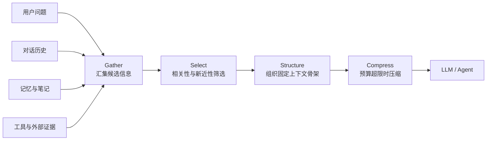
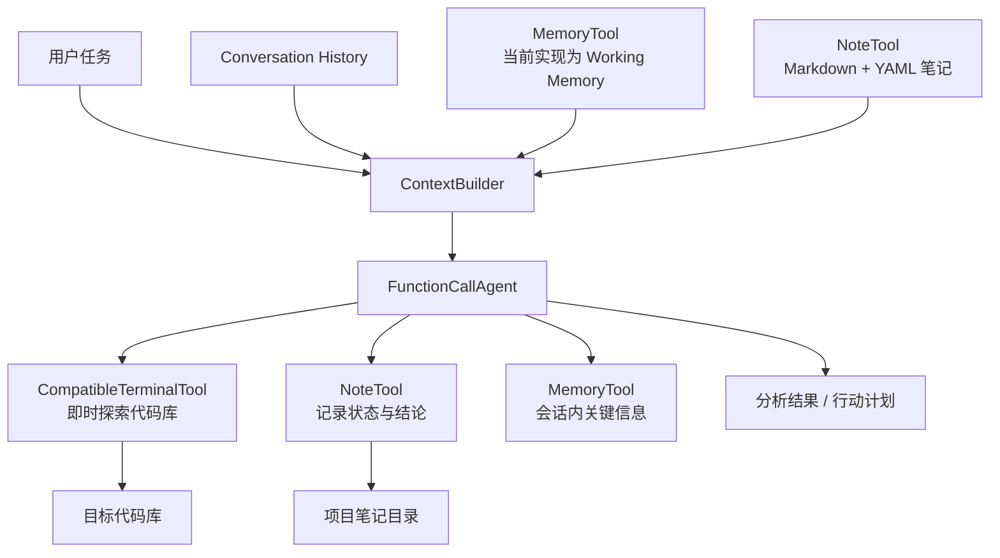
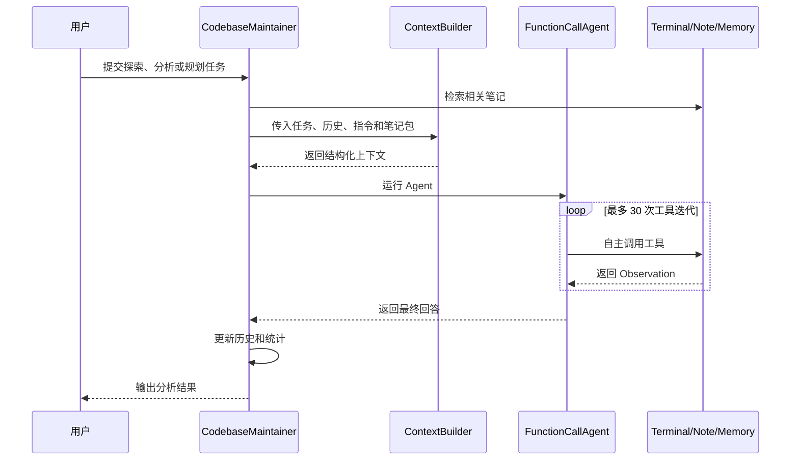

# 项目 09：上下文工程与长程代码库维护助手


本项目对应 Datawhale Hello-Agents 第九章“上下文工程”，围绕“如何在每次模型调用前选择、
组织和压缩高价值信息”展开实践。项目从 `ContextBuilder` 的基础用法出发，逐步完成上下文
感知 Agent、结构化项目笔记，以及融合 `ContextBuilder`、`NoteTool`、`TerminalTool` 和
`MemoryTool` 的代码库维护助手。

与单纯优化提示词不同，上下文工程管理的是模型在当前推理轮次能够看到的完整信息集合，
包括系统指令、用户任务、对话历史、外部笔记、记忆和即时工具结果。本项目使用 GSSC
流水线控制这些信息进入有限上下文窗口的方式。

> [返回仓库总览](../README.md) ·
> [参考第九章原文](https://github.com/datawhalechina/hello-agents/blob/main/docs/chapter9/%E7%AC%AC%E4%B9%9D%E7%AB%A0%20%E4%B8%8A%E4%B8%8B%E6%96%87%E5%B7%A5%E7%A8%8B.md)

## 目录

- [学习目标](#学习目标)
- [核心概念](#核心概念)
- [实现内容](#实现内容)
- [系统架构](#系统架构)
- [项目结构](#项目结构)
- [核心模块](#核心模块)
- [安装与配置](#安装与配置)
- [运行方法](#运行方法)
- [运行流程](#运行流程)
- [验证状态](#验证状态)
- [已知限制与安全边界](#已知限制与安全边界)
- [常见问题](#常见问题)
- [上传 GitHub](#上传-github)
- [参考与许可](#参考与许可)

## 学习目标

- 区分提示工程与上下文工程的作用边界。
- 理解上下文窗口、注意力预算和上下文腐蚀问题。
- 掌握 Gather–Select–Structure–Compress（GSSC）流水线。
- 使用 `ContextPacket` 描述带有内容、时间、相关性和元数据的信息单元。
- 使用 `ContextConfig` 管理 Token 预算、保留比例、相关性阈值和压缩开关。
- 将 `ContextBuilder` 集成到多轮对话 Agent 中。
- 使用 `NoteTool` 记录项目状态、结论、阻塞问题和行动计划。
- 使用 `TerminalTool` 按需探索代码，而不是一次性加载整个代码库。
- 理解长程任务中的即时检索、结构化笔记和上下文压缩策略。

## 核心概念

### 提示工程与上下文工程

| 维度 | 提示工程 | 上下文工程 |
| --- | --- | --- |
| 关注对象 | 指令措辞、示例和输出约束 | 每次调用中模型可见的完整信息集合 |
| 典型输入 | System Prompt、Few-shot 示例 | 提示、历史、记忆、检索证据、工具结果和任务状态 |
| 主要目标 | 让模型理解“如何回答” | 让模型同时获得“回答所需的最小充分信息” |
| 主要风险 | 指令模糊或过度硬编码 | 上下文污染、信息遗漏、Token 超限和相关性下降 |

### GSSC 流水线



四个阶段的职责如下：

1. **Gather**：汇集系统指令、用户任务、对话历史、记忆、笔记和其他候选信息。
2. **Select**：根据相关性、新近性与 Token 预算筛选高价值信息。
3. **Structure**：整理为 `[Role & Policies]`、`[Task]`、`[State]`、`[Evidence]`、
   `[Context]` 和 `[Output]` 等稳定分区。
4. **Compress**：当上下文超过预算时执行截断或压缩，避免请求超出模型窗口。

上下文不是越长越好。项目的设计目标是在信息充分性与注意力成本之间取得平衡，使模型
优先看到与当前任务直接相关、时间上较新且能够支撑结论的信息。

## 实现内容

| 模块 | 当前实现 | 主要文件 | 状态 |
| --- | --- | --- | --- |
| ContextBuilder 基础示例 | 构造历史、系统指令和结构化上下文，并传给 LLM | `context_builder_base.py` | ✅ 已实现 |
| 上下文感知 Agent | 每轮调用前自动构建上下文并维护最近对话 | `context_builder_agent.py` | ✅ 已实现 |
| 长期项目助手 | 创建项目笔记、尝试检索笔记并转换为 `ContextPacket` | `notetoll_builder.py` | 🟡 存在返回格式兼容限制 |
| 代码库维护助手 | Agent 自主选择终端、笔记和记忆工具 | `CodebaseMaintainer.py` | ✅ 主流程已实现 |
| Windows 编码兼容 | 兼容 UTF-8、系统编码与 GB18030 子进程输出 | `CodebaseMaintainer.py` | ✅ 离线验证通过 |
| 路径保护 | 使用绝对路径，拒绝不存在或非目录的代码库路径 | `CodebaseMaintainer.py` | ✅ 离线验证通过 |

## 系统架构

综合示例采用“上下文管理层—Agent 决策层—工具与外部状态层”三层结构：



在代码库维护场景中，终端工具提供 Just-in-time 信息获取：Agent 先查看目录和关键文件，
再根据观察结果继续搜索，不需要预先把所有源码塞入上下文。NoteTool 则将阶段性发现保存到
上下文窗口之外，减少长程任务中重复探索的成本。

## 项目结构

建议上传并维护的核心结构如下：

```text
helloagent_09/
├── README.md                    # 项目 09 独立文档
├── context_builder_base.py      # ContextBuilder 基础示例
├── context_builder_agent.py     # 上下文感知 Agent
├── notetoll_builder.py          # NoteTool + ContextBuilder 项目助手
└── CodebaseMaintainer.py        # 长程代码库维护综合示例
```

本地运行后还可能出现：

```text
.env                              # 本地模型配置，不上传
__pycache__/                      # Python 缓存
*_notes/                          # NoteTool 生成的项目笔记
maintainer_report_session_*.json  # 会话统计报告
quality_report.txt                # 本地分析结果
my_flask_app/                     # 旧演示路径产生的空目录
analyze2.py / analyze3.py         # 临时诊断脚本，不属于核心示例
```

实际文件名为 `notetoll_builder.py`。其中 `notetoll` 是当前项目沿用的命名；如果后续重命名
为 `notetool_builder.py`，需要同步更新本文档和运行命令。

## 核心模块

### `context_builder_base.py`

该文件展示 ContextBuilder 的最小使用流程：

1. 创建 `ContextConfig`。
2. 准备带时间戳的 `Message` 对话历史。
3. 调用 `builder.build()` 生成结构化字符串。
4. 将该字符串作为 System Message 传给 `HelloAgentsLLM`。

当前示例将 `min_relevance` 设置为 `0`，便于完整观察历史信息如何进入结构化上下文。生产
环境应根据检索质量提高阈值，避免无关信息占用 Token。

### `context_builder_agent.py`

`ContextAwareAgent` 继承 `SimpleAgent`，在每次 `run()` 中执行：

```text
当前问题 + 最近历史 + 系统指令
              ↓
       ContextBuilder.build
              ↓
       结构化 System Message
              ↓
       HelloAgentsLLM.invoke
              ↓
          更新对话历史
```

当前代码已经按照 `hello-agents` 的实际接口处理返回值：`invoke()` 直接返回字符串，不再
访问不存在的 `.content` 属性。

### `notetoll_builder.py`

`ProjectAssistant` 将项目交互保存为结构化笔记，并根据用户输入把笔记划分为：

| 类型 | 用途 |
| --- | --- |
| `blocker` | 阻塞问题、依赖冲突和未解决故障 |
| `action` | 下一步任务和行动计划 |
| `conclusion` | 阶段性结论与一般交互摘要 |

当 `note_as_action=True` 时，当前问题和回答会写入 NoteTool 工作目录。笔记适合纳入 Git
版本控制前由人工审核，但本项目默认把运行产生的笔记视为本地状态，不建议直接上传。

### `CodebaseMaintainer.py`

综合助手使用 `FunctionCallAgent` 注册三个工具：

- `CompatibleTerminalTool`：查看目录、搜索文本和读取代码；增加 Windows 编码兼容。
- `NoteTool`：记录任务状态、阻塞问题、结论和行动计划。
- `MemoryTool`：保存当前进程中的工作记忆。

对外提供四类调用方式：

```python
maintainer.explore()                  # 探索代码结构
maintainer.analyze("异常处理")        # 聚焦分析某类质量问题
maintainer.plan_next_steps()          # 基于已有上下文规划后续任务
maintainer.generate_report()          # 生成会话统计报告
```

程序默认分析 `CodebaseMaintainer.py` 所在的 `helloagent_09` 目录。构造函数会把路径解析为
绝对路径，并在路径不存在或不是目录时立即报错，从而避免静默创建空项目后得到错误分析。

## 安装与配置

### 1. Python 环境

第九章给出的推荐安装版本为：

```powershell
cd G:\AI\hello-agent\helloagent_09
G:\conda_envs\agent\python.exe -m pip install --upgrade pip
G:\conda_envs\agent\python.exe -m pip install "hello-agents[all]==0.2.8" "python-dotenv>=1.0.0"
```

检查版本：

```powershell
G:\conda_envs\agent\python.exe -m pip show hello-agents python-dotenv
```

本地检查时检测到的 `hello-agents` 为 `0.2.2`，低于章节推荐的 `0.2.8`。不同版本的工具
返回格式和 Agent 接口可能存在差异；复现本项目时建议统一到 `0.2.8`，升级后重新进行
语法和运行验证。

### 2. 模型配置

在 `helloagent_09/.env` 中填写模型配置：

```dotenv
LLM_MODEL_ID=你的模型ID
LLM_API_KEY=你的API密钥
LLM_BASE_URL=模型服务的OpenAI兼容地址
```

例如使用 DashScope OpenAI 兼容接口时，可配置：

```dotenv
LLM_MODEL_ID=qwen-plus
LLM_API_KEY=你的DashScope_API_Key
LLM_BASE_URL=https://dashscope.aliyuncs.com/compatible-mode/v1
```

也可以使用框架支持的 `DASHSCOPE_API_KEY`、`MODELSCOPE_API_KEY` 等提供商变量，但不要
同时保留多个过期密钥，以免自动检测到错误的服务配置。

> [!CAUTION]
> `.env` 只能保存在本地。不要把真实 API Key 写进 README、源码、截图或 Git 历史。

### 3. 环境加载差异

- `context_builder_agent.py` 会按脚本位置加载同目录 `.env`，并使用 `override=True`。
- `context_builder_base.py` 和 `notetoll_builder.py` 使用普通 `load_dotenv()`，建议从项目目录运行。
- `CodebaseMaintainer.py` 当前直接读取进程环境；可在 PyCharm Run Configuration 中配置
  变量，或在 PowerShell 中先设置环境变量再运行。

PowerShell 当前会话配置示例：

```powershell
$env:LLM_MODEL_ID = "你的模型ID"
$env:LLM_API_KEY = "你的API密钥"
$env:LLM_BASE_URL = "OpenAI兼容接口地址"
```

## 运行方法

进入项目目录：

```powershell
cd G:\AI\hello-agent\helloagent_09
```

### 1. ContextBuilder 基础示例

```powershell
G:\conda_envs\agent\python.exe .\context_builder_base.py
```

输出包括 GSSC 生成的结构化上下文和模型回答。

### 2. 上下文感知 Agent

```powershell
G:\conda_envs\agent\python.exe .\context_builder_agent.py
```

程序连续询问“如何优化 Pandas 内存占用”和“能否给出代码示例”，用于观察第二轮回答如何
利用第一轮历史。

### 3. NoteTool 项目助手

```powershell
G:\conda_envs\agent\python.exe .\notetoll_builder.py
```

程序模拟数据管道重构任务，并在 `data_pipeline_refactoring_notes/` 中生成笔记文件。

### 4. 代码库维护助手

```powershell
G:\conda_envs\agent\python.exe .\CodebaseMaintainer.py
```

默认执行“探索代码库 → 分析代码质量 → 规划下一步 → 生成报告”四个阶段。由于这一脚本会
让模型自主调用终端工具，应先阅读[安全边界](#已知限制与安全边界)，并仅在可恢复的测试
目录或版本控制工作区中运行。

## 运行流程

综合示例的单轮处理流程如下：



## 验证状态

已完成以下本地离线检查：

- `CodebaseMaintainer.py`、`context_builder_agent.py`、`context_builder_base.py` 和
  `notetoll_builder.py` 均通过 Python 语法编译。
- `CodebaseMaintainer.py` 可以正常导入。
- `CompatibleTerminalTool` 的 UTF-8 和 GB18030 解码断言通过。
- 子进程输出 UTF-8 中文内容的离线测试通过。
- 代码库路径已经改为脚本所在目录，不再默认分析旧的空 `my_flask_app/`。

尚未自动验证的部分：

- 不同模型服务的在线回答质量和 Token 消耗。
- NoteTool 自动检索结果能否在不同 `hello-agents` 版本间保持统一结构。
- 长时间、多会话代码维护任务的持续稳定性。
- TerminalTool 面对不可信仓库内容时的安全性。

`analyze2.py` 是一次临时诊断产生的无效脚本，当前存在语法错误，不属于本项目核心代码，
不应作为项目实现上传或运行。

## 已知限制与安全边界

### 1. 笔记自动注入存在版本兼容问题

当前安装版本的 NoteTool 可能返回面向终端展示的普通字符串，而 `_ensure_list_of_dicts()`
和 `_normalize_note_results()` 主要按字典、列表或 JSON 字符串解析。遇到非 JSON 文本时，
自动检索结果会退化为空列表。NoteTool 的创建、摘要和 Agent 直接工具调用仍可工作，但不能
据此认定每轮上下文已经成功注入历史笔记。

### 2. 工作记忆不是跨进程持久化

`CodebaseMaintainer` 当前只启用：

```python
memory_types=["working"]
```

Working Memory 是会话级内存，程序结束后不会保留。当前跨进程状态主要由 NoteTool 的
Markdown 文件承担，不能把工作记忆描述为完整的跨会话记忆系统。

### 3. TerminalTool 不是安全沙箱

`CompatibleTerminalTool` 修复的是输出编码，不代表命令执行已经被隔离。底层工具仍使用
Shell 执行命令，且允许 `python`、`node`、`bash` 或 `sh` 等解释器；命令参数也可能访问
工作目录之外的路径。因此：

- 只对可信代码库和可信任务运行综合助手。
- 不要使用管理员权限启动脚本。
- 运行前提交或备份重要修改。
- 不要把密钥、私人数据和生产凭据放在 Agent 可读取的目录中。
- 对生产应用应改为无 Shell 的参数化执行，并实施路径边界、只读权限和命令审计。

### 4. 统计信息仍属于教学实现

当前工具统计逻辑读取 `message_history`，而不同版本的 `FunctionCallAgent` 可能使用
`_history` 或不持久化工具消息。因此报告中的工具调用次数、命令次数和问题数量可能不完整，
不能作为审计数据或性能指标。

### 5. 中文相关性计算较粗糙

当前 ContextBuilder 主要基于空格分词后的关键词重叠计算相关性。中文文本通常没有显式
空格，可能导致相关性估计不稳定。生产系统应使用中文分词、BM25、Embedding 相似度或
混合检索，并通过评估集确定阈值。

## 常见问题

### 1. `AttributeError: 'str' object has no attribute 'content'`

当前版本的 `HelloAgentsLLM.invoke()` 直接返回字符串。应当使用：

```python
response = llm.invoke(messages)
```

而不是：

```python
response = llm.invoke(messages).content
```

项目中的 `context_builder_agent.py` 已经按字符串返回值修复。

### 2. `UnicodeDecodeError: 'gbk' codec can't decode byte...`

这是 Windows 父进程按 GBK 解码 UTF-8 子进程输出导致的。项目中的
`CompatibleTerminalTool` 已改为字节读取，并依次尝试 UTF-8、系统编码和 GB18030。

### 3. 为什么分析结果显示项目目录为空？

旧示例使用 `./my_flask_app`，当目录不存在时 TerminalTool 会创建空目录。当前综合示例已
改为分析脚本所在的 `helloagent_09` 目录，并在构造阶段校验路径。

如果要分析其他项目，请传入明确的绝对路径：

```python
maintainer = CodebaseMaintainer(
    project_name="your_project",
    codebase_path=r"G:\AI\your_project",
    llm=HelloAgentsLLM(),
)
```

### 4. 模型返回 401 `invalid_api_key`

检查以下项目：

1. `.env` 或 PyCharm Run Configuration 中的密钥是否属于当前服务商。
2. `LLM_BASE_URL` 是否与密钥和模型服务一致。
3. `LLM_MODEL_ID` 是否为接口支持的精确模型 ID。
4. 系统环境中是否还残留旧的 `LLM_API_KEY`、`DASHSCOPE_API_KEY` 等变量。
5. 修改配置后是否重新启动了 PyCharm 或终端进程。

### 5. 为什么笔记已经创建，下一轮却没有引用？

首先检查 `*_notes/notes_index.json` 和对应 Markdown 文件是否存在。若笔记存在但回答未引用，
通常是 NoteTool 返回格式未被解析，或者笔记包在相关性筛选/结构化阶段被过滤。该问题属于
当前实现限制，不是 API Key 故障。

### 6. 为什么运行结束后生成很多目录和报告？

NoteTool 会生成 `*_notes/`，综合助手会生成 `maintainer_report_session_*.json`，Python 会
生成 `__pycache__/`。这些都是本地状态或运行产物，可按需保留，但通常不上传 GitHub。

## 上传 GitHub

### 建议上传

```text
helloagent_09/README.md
helloagent_09/context_builder_base.py
helloagent_09/context_builder_agent.py
helloagent_09/notetoll_builder.py
helloagent_09/CodebaseMaintainer.py
README.md
.gitignore
```

### 不要上传

```text
helloagent_09/.env
helloagent_09/__pycache__/
helloagent_09/*_notes/
helloagent_09/maintainer_report_session_*.json
helloagent_09/quality_report.txt
helloagent_09/my_flask_app/
helloagent_09/analyze2.py
helloagent_09/analyze3.py
```

提交前检查：

```powershell
cd G:\AI\hello-agent
git status
git diff -- README.md helloagent_09\README.md
```

如果通过 GitHub 网页上传，请只选择“建议上传”中的源码和 Markdown 文件，避免把整个本地
目录直接拖入网页。

## 参考与许可

- [Datawhale / Hello-Agents](https://github.com/datawhalechina/hello-agents)
- [第九章：上下文工程](https://github.com/datawhalechina/hello-agents/blob/main/docs/chapter9/%E7%AC%AC%E4%B9%9D%E7%AB%A0%20%E4%B8%8A%E4%B8%8B%E6%96%87%E5%B7%A5%E7%A8%8B.md)
- [Hello-Agents LICENSE](https://github.com/datawhalechina/hello-agents/blob/main/LICENSE.txt)

本项目是对上游教程的个人学习、复现与工程化整理，不是 Hello-Agents 官方实现。引用、
修改或再发布相关内容时，请保留对 Datawhale Hello-Agents 项目及原作者的署名，并遵守
上游项目的许可协议。
