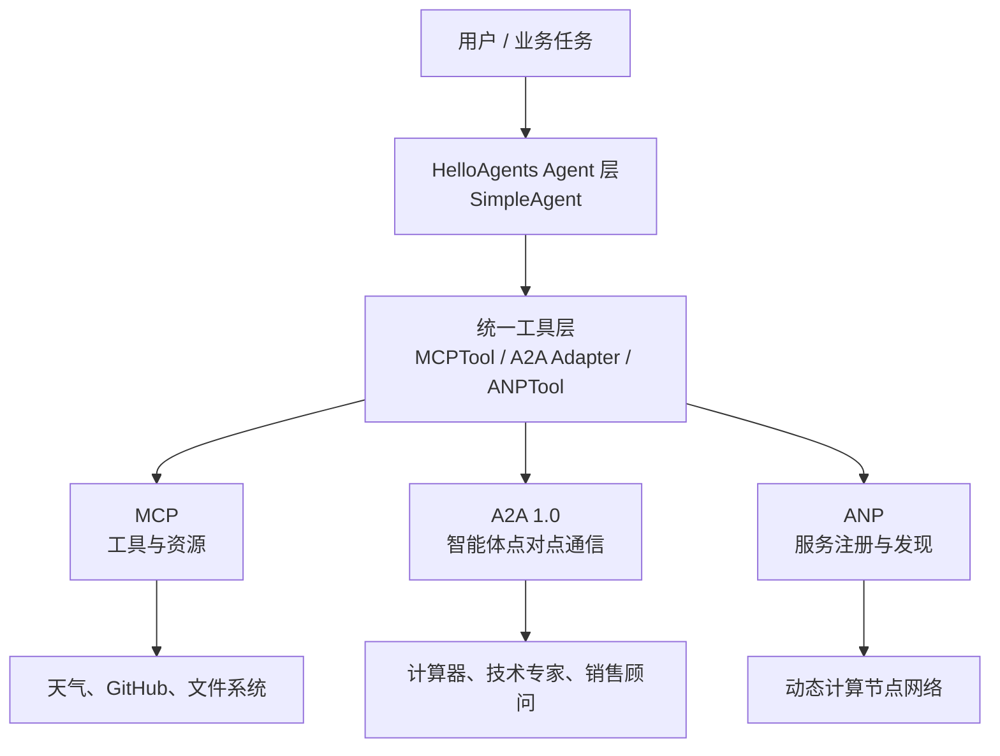
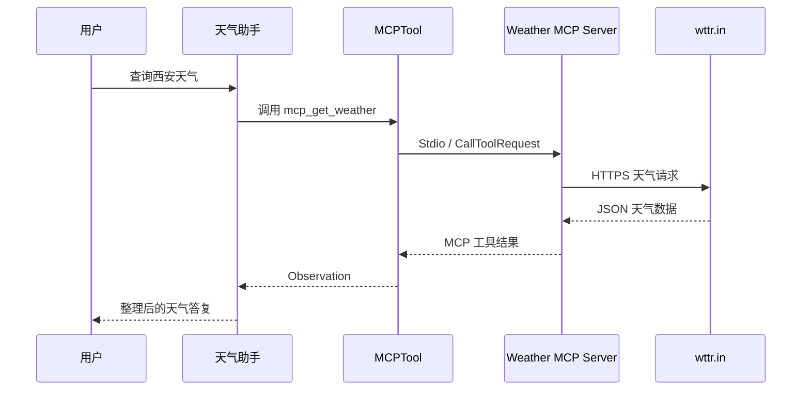
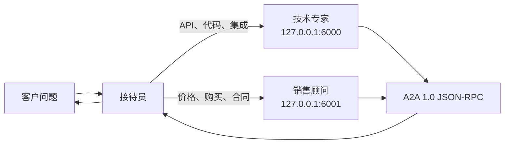

# 项目 10：智能体通信协议——MCP、A2A 与 ANP


本项目对应 Datawhale Hello-Agents 第十章“智能体通信协议”，围绕 MCP、A2A 和 ANP
三种协议完成从工具接入、智能体点对点通信到服务发现与任务调度的递进式实践。

项目不仅保留了 HelloAgents 的统一工具抽象，还针对新版 `a2a-sdk 1.1.2` 重写了计算器
智能体和多智能体客服案例。新版 A2A 示例通过 Agent Card 公开能力，使用 JSON-RPC
传递消息，并以 Starlette 和 Uvicorn 提供 HTTP 服务，不再依赖旧版 Flask 兼容层。

> [返回仓库总览](../README.md) ·
> [参考第十章原文](https://github.com/datawhalechina/hello-agents/blob/main/docs/chapter10/%E7%AC%AC%E5%8D%81%E7%AB%A0%20%E6%99%BA%E8%83%BD%E4%BD%93%E9%80%9A%E4%BF%A1%E5%8D%8F%E8%AE%AE.md)

## 目录

- [学习目标](#学习目标)
- [三种协议的定位](#三种协议的定位)
- [实现内容](#实现内容)
- [系统架构](#系统架构)
- [项目结构](#项目结构)
- [核心模块](#核心模块)
- [安装与配置](#安装与配置)
- [运行方法](#运行方法)
- [验证状态](#验证状态)
- [已知限制](#已知限制)
- [常见问题](#常见问题)
- [上传 GitHub](#上传-github)
- [参考与许可](#参考与许可)

## 学习目标

- 理解智能体系统为什么需要标准化通信协议。
- 区分工具调用、智能体协作和大规模服务发现三个通信层级。
- 使用 MCP Server 暴露工具，并通过 MCP Client 或 `MCPTool` 调用。
- 将一个 MCP Server 的工具自动展开并注册给 `SimpleAgent`。
- 理解 Stdio 传输中的客户端、子进程和标准输入输出通道。
- 使用 A2A 1.0 Agent Card 描述智能体身份、能力、技能和服务端点。
- 使用 A2A JSON-RPC 完成请求发现、消息发送和结果解析。
- 将 A2A 专家服务适配为 HelloAgents 工具，构建多智能体客服系统。
- 使用 ANP 的服务注册、发现和元数据实现计算节点调度。
- 理解协议选择、依赖兼容、密钥管理和网络故障等工程问题。

## 三种协议的定位

| 协议 | 主要连接对象 | 核心能力 | 本项目示例 | 典型场景 |
| --- | --- | --- | --- | --- |
| MCP | Agent ↔ Tool/Resource | 工具发现、参数描述、统一调用和资源访问 | 天气服务、GitHub 搜索、文件系统 | 为单个 Agent 扩展外部能力 |
| A2A | Agent ↔ Agent | Agent Card、消息传递、任务协作和结果返回 | 计算器服务、多专家客服 | 小规模智能体点对点协作 |
| ANP | Agent ↔ Agent Network | 服务注册、发现、路由和节点元数据 | 计算节点发现与调度 | 大规模、动态的智能体网络 |

可以用三个问题快速选择协议：

```text
需要调用外部工具或数据源？      → MCP
需要把任务委托给另一个智能体？  → A2A
需要发现并选择大量动态服务？    → ANP
```

三者不是互斥关系。复杂系统可以先通过 ANP 发现合适的 Agent，再通过 A2A 委托任务，
目标 Agent 内部继续通过 MCP 调用数据库、搜索引擎或业务工具。

## 实现内容

| 模块 | 主要内容 | 文件 | 状态 |
| --- | --- | --- | --- |
| 协议统一入口 | 创建 MCP、A2A、ANP 三类工具并展示基本接口 | `mcp_a2a_anp.py` | 🟡 A2A 部分为兼容层演示 |
| GitHub MCP | 通过外部 MCP Server 搜索 GitHub 仓库 | `github_mcp.py` | 🟡 需要 Node.js、Token 和网络 |
| MCP 天气服务 | 暴露天气查询、城市列表和服务信息三个工具 | `mcp_weather_server.py` | ✅ 已实现 |
| MCP 客户端测试 | 通过 Stdio 发现并调用天气工具 | `test_weather.py` | ✅ 端到端验证通过 |
| MCP 天气 Agent | 将天气 MCP 子工具注册给 `SimpleAgent` | `weather_agent.py` | ✅ 工具链路验证通过 |
| A2A 计算器 | 基于 A2A 1.0 构建 Agent Card 和 JSON-RPC 服务 | `simpleA2AAgent.py` | ✅ 端到端验证通过 |
| A2A 多专家客服 | 接待员在技术专家与销售顾问之间动态路由 | `customer.py` | ✅ 默认模式验证通过 |
| ANP 任务调度 | 注册十个计算节点，由 Agent 根据元数据选择节点 | `ANPtask.py` | 🟡 需要有效 LLM 配置 |
| 多 Agent 文档助手 | GitHub 搜索 Agent 与文档生成 Agent 串联 | `Documentassist.py` | 🟡 需要 Node.js、Token 和 LLM |

## 系统架构

### 协议分层



### 天气 MCP 调用链



### A2A 多专家客服



`customer.py` 默认使用确定性关键词路由，不调用外部模型；使用 `--mode llm` 后，
`SimpleAgent` 会根据系统提示选择 `tech_expert` 或 `sales_advisor` 工具。

## 项目结构

```text
helloagent_10/
├── README.md                 # 项目 10 独立文档
├── mcp_a2a_anp.py            # 三种协议的统一接口示例
├── github_mcp.py             # GitHub MCP 搜索示例
├── mcp_weather_server.py     # 天气 MCP Server
├── test_weather.py           # 天气 MCP 客户端测试
├── weather_agent.py          # MCP 天气 Agent
├── simpleA2AAgent.py         # A2A 1.0 计算器 Agent
├── customer.py               # A2A 1.0 多专家客服
├── ANPtask.py                # ANP 计算节点调度
├── Documentassist.py         # GitHub 搜索与文档生成协作
├── report.md                 # Documentassist 生成的示例报告
└── .env                      # 本地密钥配置，不上传 GitHub
```

运行后还可能生成 `__pycache__/`。该目录属于 Python 缓存，不应提交。

## 核心模块

### `mcp_weather_server.py`

该文件创建名为 `weather-server` 的 MCP Server，并注册三个工具：

| 工具 | 参数 | 返回内容 |
| --- | --- | --- |
| `get_weather` | `city: str` | 温度、体感温度、湿度、天气、风速、能见度和时间 |
| `list_supported_cities` | 无 | 内置中文城市列表 |
| `get_server_info` | 无 | 服务名称、版本和工具列表 |

天气数据来自 `wttr.in`。服务端会把异常转换为包含 `error` 和 `city` 的 JSON，避免网络
异常直接导致 MCP 进程退出。

### `test_weather.py`

该文件不依赖 LLM，适合优先验证 MCP 基础设施：

1. 根据当前文件位置定位 `mcp_weather_server.py`。
2. 使用当前 Python 解释器启动 Stdio MCP Server。
3. 查询服务器信息与支持城市。
4. 查询两个城市的实时天气。
5. 退出上下文时断开 MCP 连接。

### `weather_agent.py`

`MCPTool` 会先发现服务端工具，再将它们展开为：

```text
mcp_get_weather
mcp_list_supported_cities
mcp_get_server_info
```

这些工具被注册到 `SimpleAgent`。模型根据用户问题输出工具调用，再结合 MCP 返回的数据
生成自然语言答复。代码使用 `sys.executable` 启动服务器，避免 Windows 系统中存在多个
Python 解释器时安装环境与运行环境不一致。

### `simpleA2AAgent.py`

该文件使用新版 `a2a-sdk 1.1.2`，核心组件包括：

- `CalculatorAgent`：加法、乘法和能力说明业务逻辑。
- `CalculatorAgentExecutor`：把 A2A 请求转换为业务调用。
- `AgentCard`：公布名称、版本、协议接口和三项技能。
- `DefaultRequestHandler`：处理 A2A 请求并维护任务状态。
- `create_agent_card_routes()`：提供 Agent Card 发现端点。
- `create_jsonrpc_routes()`：提供 A2A 1.0 JSON-RPC 端点。
- `InMemoryTaskStore`：保存当前进程中的任务状态。

业务逻辑与网络传输层分离，因此默认模式可以先离线测试计算技能，再使用 `--serve` 启动
完整 A2A 服务。

### `customer.py`

该文件同时启动两个 A2A Agent：

| Agent | 端口 | 职责 |
| --- | --- | --- |
| `tech-expert` | `6000` | API、代码、集成与技术问题 |
| `sales-advisor` | `6001` | 价格、购买、套餐与合同问题 |

每个服务都提供独立 Agent Card。客户端先发现服务能力，再使用 `SendMessageRequest` 发送
问题。程序支持两种接待模式：

- `rule`：确定性关键词路由，适合验证 A2A 链路，不消耗模型额度。
- `llm`：由 `HelloAgentsLLM` 选择专家，再通过本地 A2A 工具适配器完成调用。

### `github_mcp.py` 与 `Documentassist.py`

这两个文件通过 `npx` 启动外部 MCP Server：

```text
@modelcontextprotocol/server-github
@modelcontextprotocol/server-filesystem
```

`github_mcp.py` 展示工具列表与仓库搜索；`Documentassist.py` 将 GitHub 搜索结果传给文档
生成 Agent，并将最终 Markdown 保存为 `report.md`。

### `ANPtask.py`

该示例向发现中心注册十个计算节点，每个节点包含负载、CPU、内存和 GPU 等元数据。
任务调度 Agent 根据训练、文本处理或轻量分析任务的需求调用 `ANPTool`，完成节点发现与
选择。节点端点是教学用模拟地址，代码不会真正向这些地址提交计算任务。

## 安装与配置

### 1. Python 环境

当前代码验证环境：

```text
Python 3.10.20
hello-agents 0.2.2
fastmcp 2.12.5
mcp 1.16.0
a2a-sdk 1.1.2
uvicorn 0.52.0
starlette 1.3.1
requests 2.34.2
python-dotenv 1.2.2
```

使用当前 Conda 环境安装：

```powershell
G:\conda_envs\agent\python.exe -m pip install `
  "hello-agents==0.2.2" `
  "fastmcp==2.12.5" `
  "mcp==1.16.0" `
  "a2a-sdk[http-server]>=1.0,<2" `
  "uvicorn>=0.30" `
  "starlette>=0.37" `
  "requests>=2.31" `
  "python-dotenv>=1.0"
```

新版 `simpleA2AAgent.py` 和 `customer.py` 直接使用 `a2a-sdk 1.x`，不会调用
`hello-agents 0.2.2` 中旧版 `A2ATool` 的兼容检查。

### 2. Node.js 与 npx

`github_mcp.py` 和 `Documentassist.py` 需要额外安装 Node.js，并确保以下命令在运行脚本的
终端中可用：

```powershell
node --version
npm --version
npx --version
```

如果出现 `[WinError 2] 系统找不到指定的文件`，通常不是 Python 包问题，而是 Node.js
尚未安装，或者 Node.js 安装目录没有进入当前进程的 `PATH`。安装或修改环境变量后，需要
完全重启 PyCharm 和终端。

### 3. `.env` 配置

在 `helloagent_10/.env` 中保存本地配置：

```dotenv
LLM_MODEL_ID=你的模型ID
LLM_API_KEY=你的模型API密钥
LLM_BASE_URL=OpenAI兼容接口地址
GITHUB_PERSONAL_ACCESS_TOKEN=你的GitHub访问令牌
```

只运行 `test_weather.py`、`simpleA2AAgent.py` 默认测试或 `customer.py` 默认模式时，不需要
LLM 密钥。GitHub MCP 相关示例需要 Token；所有调用 `HelloAgentsLLM` 的示例均需要模型
ID、API Key 和匹配的 Base URL。

> [!CAUTION]
> `.env` 只能保存在本地，不要上传到 GitHub，也不要把真实密钥写入 README、截图或日志。

## 运行方法

进入项目目录：

```powershell
cd G:\AI\hello-agent\helloagent_10
```

### 1. 三种协议基础示例

```powershell
G:\conda_envs\agent\python.exe .\mcp_a2a_anp.py
```

该文件中的 A2A 对象仅展示接口创建；可工作的 A2A 1.0 服务请使用后面的两个新版示例。

### 2. 天气 MCP 客户端测试

```powershell
G:\conda_envs\agent\python.exe .\test_weather.py
```

该测试不调用 LLM，但需要能够访问 `https://wttr.in`。

### 3. 交互式天气 Agent

```powershell
G:\conda_envs\agent\python.exe .\weather_agent.py
```

示例输入：

```text
查询西安天气
查询大连天气
exit
```

运行单次演示：

```powershell
G:\conda_envs\agent\python.exe .\weather_agent.py demo
```

### 4. A2A 计算器

执行本地技能测试：

```powershell
G:\conda_envs\agent\python.exe .\simpleA2AAgent.py
```

启动 A2A 1.0 服务：

```powershell
G:\conda_envs\agent\python.exe .\simpleA2AAgent.py --serve
```

服务启动后可访问：

```text
Agent Card: http://127.0.0.1:5000/.well-known/agent-card.json
JSON-RPC:    http://127.0.0.1:5000/
```

按 `Ctrl+C` 停止服务。

### 5. A2A 多专家客服

默认规则路由模式：

```powershell
G:\conda_envs\agent\python.exe .\customer.py
```

LLM 接待员模式：

```powershell
G:\conda_envs\agent\python.exe .\customer.py --mode llm
```

默认模式会自动启动 `6000`、`6001` 两个服务，完成三条测试后安全关闭。

### 6. GitHub MCP

```powershell
G:\conda_envs\agent\python.exe .\github_mcp.py
```

运行前确认 `npx --version` 成功，并配置 `GITHUB_PERSONAL_ACCESS_TOKEN`。

### 7. ANP 计算节点调度

```powershell
G:\conda_envs\agent\python.exe .\ANPtask.py
```

### 8. 多 Agent 文档助手

```powershell
G:\conda_envs\agent\python.exe .\Documentassist.py
```

该程序会调用模型和 GitHub MCP，并在当前工作目录生成或覆盖 `report.md`。

## 验证状态

已完成：

- 9 个 Python 文件通过 `py_compile` 语法检查。
- 天气 MCP Server 可通过 Stdio 连接并列出三个工具。
- `test_weather.py` 已成功查询支持城市和实时天气。
- `weather_agent.py` 已成功发现并注册三个 MCP 子工具。
- `simpleA2AAgent.py` 的本地计算、Agent Card 和 JSON-RPC 请求已验证。
- `customer.py` 默认模式已完成技术专家与销售顾问的端到端路由。
- `customer.py` 的两个 LLM 模式工具适配器已分别完成直接调用验证。
- A2A 后台服务能够在测试结束后正常关闭，退出代码为 `0`。

未在本次文档整理环境中完整执行：

- 当前终端无法识别 `node`、`npm` 和 `npx`，因此没有重新运行 GitHub MCP 与文件系统
  MCP 示例。
- 未调用外部 LLM 完成 `ANPtask.py`、`Documentassist.py` 和 `customer.py --mode llm`
  的在线行为验证。
- 未对协议并发、鉴权、持久化、重试和生产部署性能进行测试。

因此，该项目定位为经过核心链路验证的教学实现，而不是可直接上线的生产服务。

## 已知限制

- `mcp_weather_server.py` 依赖公开天气服务，网络、代理、限流或 TLS 断连会影响结果。
- Stdio MCP 示例可能在工具发现和每次调用时分别启动子进程，因此会重复显示 FastMCP
  启动画面。
- `simpleA2AAgent.py` 使用内存任务存储，进程退出后任务状态不会保留。
- `customer.py` 中专家答复是教学用确定性模板，不代表真实企业知识库。
- A2A 服务没有实现认证、访问控制、限流或 HTTPS，默认只应绑定本机地址。
- ANP 计算节点及其负载为随机生成，端点不是真实可执行服务。
- GitHub 搜索结果与 LLM 生成报告可能随时间变化，也可能包含模型幻觉，需要人工核验。
- `report.md` 是生成产物，不应被视为经过事实审查的固定研究结论。

## 常见问题

### 1. `Script not found: ...14_weather_mcp_server.py`

服务器真实文件名是 `mcp_weather_server.py`。当前 `test_weather.py` 与 `weather_agent.py`
已经通过脚本自身路径定位该文件，不依赖启动时的工作目录。

### 2. `未发现天气 MCP 子工具`

依次检查：

1. `mcp_weather_server.py` 是否与 `weather_agent.py` 位于同一目录；
2. `hello-agents`、`fastmcp` 和 `mcp` 是否安装在当前解释器；
3. PyCharm 是否选择 `G:\conda_envs\agent\python.exe`；
4. MCP Server 启动日志中是否出现更早的导入错误。

### 3. `No module named 'flask'`

这是旧版 HelloAgents A2A Server 的依赖错误。本项目的 `simpleA2AAgent.py` 和
`customer.py` 已迁移到 A2A 1.0、Starlette 与 Uvicorn，不需要安装 Flask。确认运行的是
当前文件，而不是旧副本。

### 4. `A2A SDK 未安装`，但已经安装 `a2a-sdk 1.1.2`

`hello-agents 0.2.2` 的旧兼容层检查 `a2a.client.A2AClient`，而新版 SDK 已调整客户端接口，
因此可能误判为未安装。新版示例直接使用 `create_client`、`ClientConfig`、Agent Card 和
JSON-RPC 路由，避免该兼容问题。

### 5. `[WinError 2] 系统找不到指定的文件`

如果日志中的命令以 `npx` 开头，检查 Node.js 与 `PATH`，而不是重复安装 Python MCP 包：

```powershell
Get-Command npx
npx --version
```

### 6. `AuthlibDeprecationWarning`

该信息来自 FastMCP 的间接依赖，表示 `authlib.jose` 将来会迁移到 `joserfc`。当前运行结果
不受影响，不要为了隐藏警告直接修改 `site-packages`。

### 7. FastMCP 图案为什么重复出现？

天气 Agent 通过 Stdio 启动 MCP 子进程。工具发现和后续调用会建立独立连接，因此服务启动
信息可能重复打印。这不表示工具被重复注册，也不是死循环。

### 8. 日志文字与回答交叉显示

主程序输出和 MCP 子进程日志分别写入标准输出与标准错误，控制台可能把二者交错显示。
只要工具返回正确且退出代码为 `0`，通常不影响业务结果。

### 9. LLM 返回 401

401 表示认证失败，与 MCP/A2A 协议本身无关。确认模型 ID、API Key 和 Base URL 来自同一
服务，并检查系统环境变量是否残留旧密钥。`load_dotenv()` 默认不一定覆盖已经存在的同名
系统变量。

### 10. 天气查询出现 SSL、超时或限流错误

这是访问 `wttr.in` 的外部网络错误。可以稍后重试，并检查代理、HTTPS 证书和网络策略。
服务器会返回结构化 `error`，不会把网络异常误认为有效天气数据。

### 11. `端口 5000/6000/6001 已被占用`

关闭之前启动但尚未退出的服务，或为 `simpleA2AAgent.py` 指定其他端口：

```powershell
G:\conda_envs\agent\python.exe .\simpleA2AAgent.py --serve --port 5050
```

## 上传 GitHub

### 建议上传

```text
README.md
helloagent_10/README.md
helloagent_10/mcp_a2a_anp.py
helloagent_10/github_mcp.py
helloagent_10/mcp_weather_server.py
helloagent_10/test_weather.py
helloagent_10/weather_agent.py
helloagent_10/simpleA2AAgent.py
helloagent_10/customer.py
helloagent_10/ANPtask.py
helloagent_10/Documentassist.py
```

`report.md` 是运行生成的示例报告。只有在人工核验其中的项目名称、描述和链接后才建议
上传；否则可以留在本地重新生成。

### 不要上传

```text
helloagent_10/.env
helloagent_10/__pycache__/
*.pyc
.idea/
包含 Token、API Key 或请求头的日志和截图
```

仓库根目录 `.gitignore` 已包含：

```gitignore
**/__pycache__/
**/*.py[cod]
**/.env
**/.env.*
**/.idea/
```

提交前检查：

```powershell
git status
git check-ignore -v .\helloagent_10\.env
git diff --check
```

如果密钥曾经上传或进入 Git 历史，应立即在对应平台撤销并重新生成；仅删除当前文件不能
清除历史提交中的密钥。

## 参考与许可

- [Datawhale / Hello-Agents](https://github.com/datawhalechina/hello-agents)
- [第十章：智能体通信协议](https://github.com/datawhalechina/hello-agents/blob/main/docs/chapter10/%E7%AC%AC%E5%8D%81%E7%AB%A0%20%E6%99%BA%E8%83%BD%E4%BD%93%E9%80%9A%E4%BF%A1%E5%8D%8F%E8%AE%AE.md)
- [Model Context Protocol](https://modelcontextprotocol.io/)
- [FastMCP Documentation](https://gofastmcp.com/)
- [A2A Protocol](https://github.com/a2aproject/A2A)
- [A2A Python SDK](https://github.com/a2aproject/a2a-python)
- [GitHub MCP Server](https://github.com/github/github-mcp-server)

本项目用于学习与复现。源自或改编自 Hello-Agents 的内容应遵守上游仓库许可协议，并保留
对 Datawhale Hello-Agents 项目及原作者的署名。
